- Computer vision  task: classification、classification + Localization、Object Detection 、Segmentation

  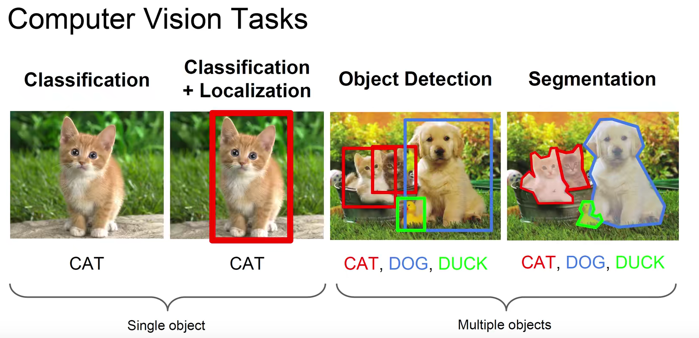

  - 分割有分为语义分割和实例分割，语义分割不区分同一类物体的像素，而实例分割要区分同一类物体不同实例的像素

    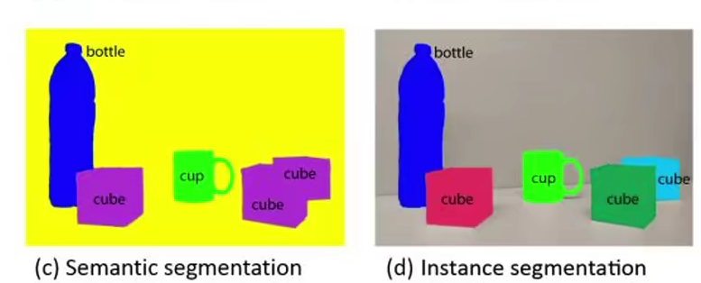

- 著名的数据集

  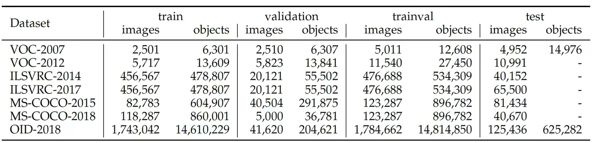

- YOLO和RCNN的区别

  RCNN是双阶段检测，RCNN先在图片中提取候选框，然后再把候选框喂给CNN，这是两个阶段，这种比较慢，而且模型每次只能处理一张图片的一部分；

  YOLO则是直接把图片喂给模型，是单阶段检测，比较快。

- YOLOv1的特点：
  - 速度快但准确度比较低
  - 定位性能比较差
  - 把全部目标都检出的能力比较差
  - YOLOv1对小目标和密集目标的预测比较差
  
- YOLOv2

  v2在v1上的基础上做了一些改进，v2的特点是：Better，Faster，Stronger，那么它是如何实现这三个特点的呢？

  - 实现Better方面：

    - Batch  Normalization

      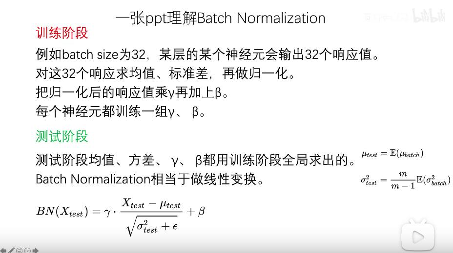

    - High Resolution Classifier(高分辨率的分类器)

      - YOLOV1预训练的时候使用的输入，检测的时候采用的是的输入，这会导致分类切换到检测的时候，模型需要适应图像分辨率的改变。
      - YOLOV2中将预训练分成两步：先用的输入来训练大概160个,然后再把输入调整到再训练10个，然后再在训练好的模型上进行fine-tuning，检测的时候用就可以顺利过渡了。

    - Anchor（锚）、 Dimension Clusters、Direct location prediction

    - Fine-Grained Features（细粒度特征）

    - Multi-scale training

  - 实现Faster方面

    - 在这一方面v2主要是更换的骨干网络，采用Darknet19作为骨干网络

  - 实现stronger方面

    

  - v2 的 损失函数

    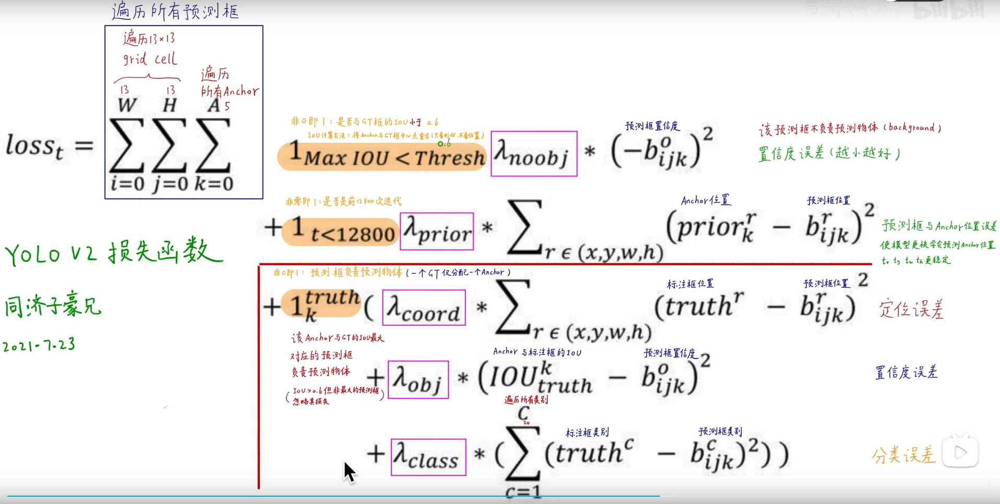
  
- 目标检测之评价指标：mAP

  - - 在了解mAP之前我们先看一下什么是TP、FP、FN、TN

      - True Positive (TP): IoU>![[公式]](https://www.zhihu.com/equation?tex=IOU_%7Bthreshold%7D) (![[公式]](https://www.zhihu.com/equation?tex=IOU_%7Bthreshold%7D) 一般取 0.5 ) 的检测框数量（同一 Ground Truth 只计算一次)  ps: 什么是Ground Truth？它指的是一个训练数据的人工标记的部分，比如在一张图中，人为地把图片中的物体标记出来，即人工标注，每一个标记就是一个Ground Truth.
      - False Positive (FP): IoU<=![[公式]](https://www.zhihu.com/equation?tex=IOU_%7Bthreshold%7D) 的检测框数量，或者是检测到同一个 GT 的多余检测框的数量
      - False Negative (FN): 没有检测到的 GT 的数量
      - True Negative (TN): 在 mAP 评价指标中不会使用到

    - 什么是查准率，什么是查全率

      - 查准率（Precision）: TP/(TP + FP)
      - 查全率（Recall）: TP/(TP + FN)

    - 什么是P-R曲线

      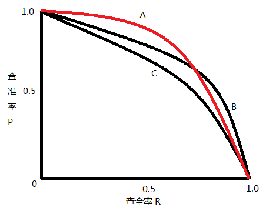

    - 交并比（IOU）

      交并比（IOU）是度量两个检测框（对于目标检测来说）的交叠程度，公式如下：

      ![[公式]](https://www.zhihu.com/equation?tex=%5Cmathrm%7BIOU%7D%3D%5Cfrac%7B%5Coperatorname%7Barea%7D%5Cleft%28B_%7Bp%7D+%5Ccap+B_%7Bg+t%7D%5Cright%29%7D%7B%5Coperatorname%7Barea%7D%5Cleft%28B_%7Bp%7D+%5Ccup+B_%7Bg+t%7D%5Cright%29%7D+%5C%5C)

      B_gt 代表的是目标实际的边框（Ground Truth，GT），B_p 代表的是预测的边框，通过计算这两者的 IOU，可以判断预测的检测框是否符合条件，IOU 用图片展示如下：

      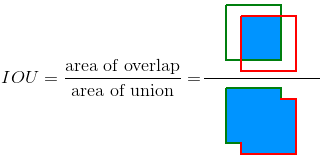

    - 下面用一个例子说明 AP 和 mAP 的计算

      先规定两个公式，一个是 Precision，一个是 Recall，这两个公式同上面的一样，我们把它们扩展开来，用另外一种形式进行展示，其中 `all detctions` 代表所有预测框的数量， `all ground truths` 代表所有 GT 的数量。

      ![[公式]](https://www.zhihu.com/equation?tex=%5Ctext+%7BRecall%7D%3D%5Cfrac%7BT+P%7D%7BT+P%2BF+N%7D%3D%5Cfrac%7BT+P%7D%7B%5Ctext+%7B+all+ground+truths+%7D%7D+%5C%5C)

      ![[公式]](https://www.zhihu.com/equation?tex=%5Ctext+%7B+Precision+%7D%3D%5Cfrac%7BT+P%7D%7BT+P%2BF+P%7D%3D%5Cfrac%7BT+P%7D%7B%5Ctext+%7B+all+detections+%7D%7D+%5C%5C)

      AP 是计算某一类 P-R 曲线下的面积，mAP 则是计算所有类别 P-R 曲线下面积的平均值。

      ​	假设我们有 7 张图片（Images1-Image7），这些图片有 15 个目标（绿色的框，GT 的数量，上文提及的 `all ground truths`）以及 24 个预测边框（红色的框，A-Y 编号表示，并且有一个置信度值）

      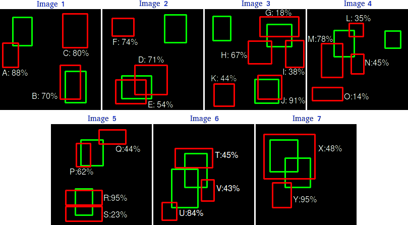

      根据上图以及说明，我们可以列出以下表格，其中 Images 代表图片的编号，Detections 代表[预测边框](https://www.zhihu.com/search?q=预测边框&search_source=Entity&hybrid_search_source=Entity&hybrid_search_extra={"sourceType"%3A"answer"%2C"sourceId"%3A993913699})的编号，Confidences 代表预测边框的置信度，TP or FP 代表预测的边框是标记为 TP 还是 FP（认为预测边框与 GT 的 IOU 值大于等于 0.3 就标记为 TP；若一个 GT 有多个预测边框，则认为 IOU 最大且大于等于 0.3 的预测框标记为 TP，其他的标记为 FP，即一个 GT 只能有一个预测框标记为 TP），**这里的 0.3 是随机取的一个值**。

  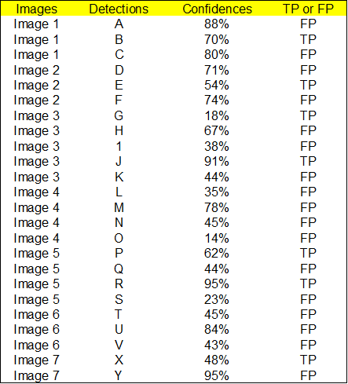

  ​				通过上表，我们可以绘制出 P-R 曲线（因为 AP 就是 P-R 曲线下面的面积），但是在此之前我们需要计算出 P-R 曲线上各个点的坐标，根据置信度从大到				小排序所有的预测框，然后就可以计算 Precision 和 Recall 的值，见下表。（需要记住一个叫**[累加](https://www.zhihu.com/search?q=累加&search_source=Entity&hybrid_search_source=Entity&hybrid_search_extra={"sourceType"%3A"answer"%2C"sourceId"%3A993913699})的概念，就是下图的 ACC TP 和 ACC FP**）

  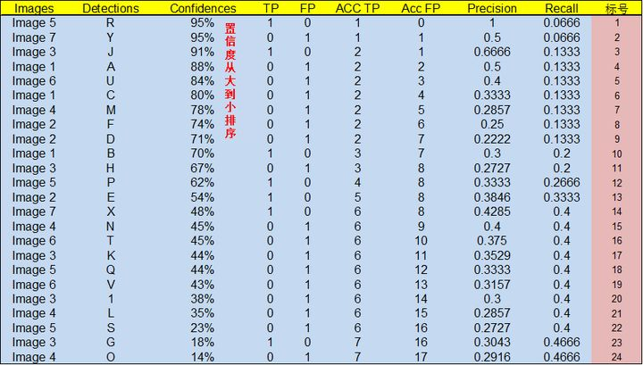

  标号为 1 的 Precision 和 Recall 的计算方式：Precision=TP/(TP+FP)=1/(1+0)=1，Recall=TP/(TP+FN)=TP/(`all ground truths`)=1/15=0.0666 （`all 					ground truths 上面有定义过了`）

  标号 2：Precision=TP/(TP+FP)=1/(1+1)=0.5，Recall=TP/(TP+FN)=TP/(`all ground truths`)=1/15=0.0666

   标号 3：[Precision=TP/(TP+FP)=2/(2+1)=0.6666](https://www.zhihu.com/search?q=Precision%3DTP%2F(TP%2BFP)%3D2%2F(2%2B1)%3D0.6666&search_source=Entity&hybrid_search_source=Entity&hybrid_search_extra={"sourceType"%3A"answer"%2C"sourceId"%3A993913699})，Recall=TP/(TP+FN)=TP/(`all ground truths`)=2/15=0.1333

   其他的依次类推

  然后就可以绘制出 P-R 曲线

  

  得到 P-R 曲线就可以计算 AP（P-R 曲线下的面积），要计算 P-R 下方的面积，一般使用的是[插值](https://www.zhihu.com/search?q=插值&search_source=Entity&hybrid_search_source=Entity&hybrid_search_extra={"sourceType"%3A"answer"%2C"sourceId"%3A993913699})的方法，取 11 个点 **[0, 0.1, 0.2, 0.3, 0.4, 0.5, 0.6, 0.7, 0.8, 0.9, 1]** 的插值所得

  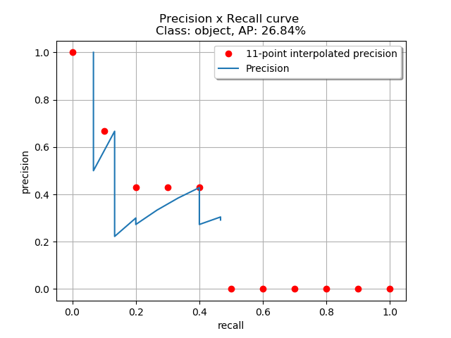

  得到一个类别的 AP 结果如下：

  ![[公式]](https://www.zhihu.com/equation?tex=%5Cbegin%7Baligned%7D+%26A+P%3D%5Cfrac%7B1%7D%7B11%7D+%5Csum_%7Br+%5Cin%5C%7B0%2C0%2C1%2C+%5Cldots%2C+1%5C%7D%7D+%5Crho_%7B%5Ctext+%7Binterp+%7D%28r%29%7D%5C%5C+%26A+P%3D%5Cfrac%7B1%7D%7B11%7D%281%2B0.6666%2B0.4285%2B0.4285%2B0.4285%2B0%2B0%2B0%2B0%2B0%2B0%29%5C%5C+%26A+P%3D26.84+%5C%25+%5Cend%7Baligned%7D%5C%5C)

  要计算 mAP，就把所有类别的 AP 计算出来，然后求取平均即可。

- YOLOv3 （参考文档：（https://blog.csdn.net/qq_37541097/article/details/81214953））

  - 主干网络：Darknet-53

  - 网络结构图：

    

  - 目标边界框预测：

     YOLOv3网络在三个特征图中分别通过(4+1+c) k个大小为11的卷积核进行卷积预测，k为预设边界框（bounding box prior）的个数（k默认取3），c为预测目标的类别数，其中4k个参数负责预测目标边界框的偏移量，k个参数负责预测目标边界框内包含目标的概率，ck个参数负责预测这k个预设边界框对应c个目标类别的概率。下图展示了目标边界框的预测过程（该图是博主重新绘制的，与论文中的示意图有些不同，更便于理解）。图中虚线矩形框为预设边界框，实线矩形框为通过网络预测的偏移量计算得到的预测边界框。其中$(c_x,c_y)$为预设边界框在特征图上的中心坐标，$(p_w,p_h)$为预设边界框在特征图上的宽和高，$(t_x,t_y,t_w,t_h)$分别为网络预测的边界框中心偏移量$(t_x,t_y)$以及宽高缩放比$(t_w,t_h)$，$(b_x,b_y,b_w,b_h)$为最终预测的目标边界框，从预设边界框到最终预测边界框的转换过程如图右侧公式所示，其中的$\sigma()$函数是sigmoid函数其目的是将预测偏移量缩放到0到1之间（这样能够将预设边界框的中心坐标固定在一个cell当中，作者说这样能够加快网络收敛）。

    - - 

    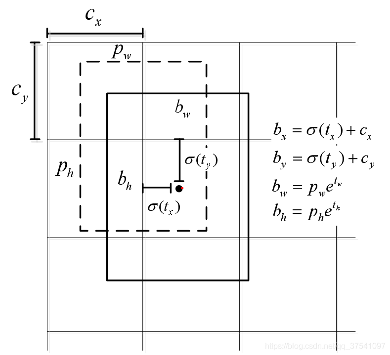

    下图给出了三个预测层的特征图大小以及每个特征图上预设边界框的尺寸（这些预设边界框尺寸都是作者根据COCO数据集聚类得到的）：

    

  - 正负样本的匹配：（参考文档：https://blog.csdn.net/qq_42800654/article/details/106428547）

    loss计算中，“负责预测目标”（即正样本）和背景（即负样本），以及不参与计算loss的部分是怎么选择的：
    正样本的选择：
    首先计算目标中心点落在哪个grid上，然后计算这个grid的9个先验框（anchor）和目标真实位置的IOU值（直接计算，不考虑二者的中心位置），取IOU值最大的先验框和目标匹配。于是，找到的 该grid中的 该anchor 负责预测这个目标，其余的网格、anchor都不负责。
    负样本的选择：
    计算各个先验框和所有的目标ground truth之间的IOU，如果某先验框和图像中所有物体最大的IOU都小于阈值（一般0.5），那么就认为该先验框不含目标，记作负样本，其置信度应当为0
    不参与计算部分
    这部分虽然不负责预测对象，但IOU较大，可以认为包含了目标的一部分，不可简单当作负样本，所以这部分不参与误差计算。
    综上，如下图所示：

    

  - 损失函数

    

- 

- 

  