### 第一节课

- #### 解释器和编译器的区别

二者都是把高级语言翻译成计算机能够识别的机器语言，但是解释器能完成实时翻译，假设有100行代码，解释器解释一句计算机执行一句；编译器则是整片翻译生成一个临时文件，然后把这个文件交给计算器再去执行。

### 第二节课

- #### 编码的概念

  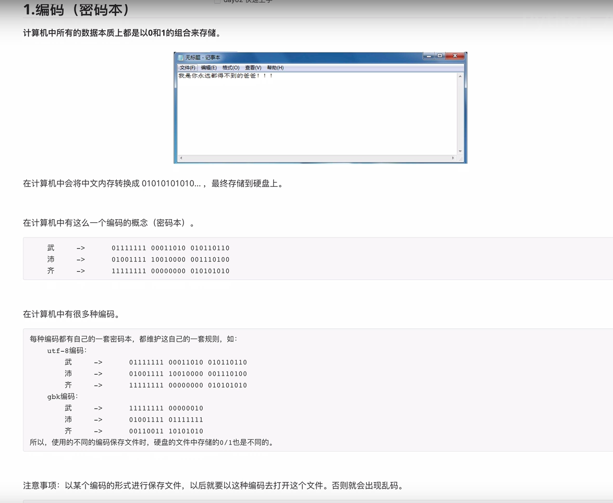

  - python解释器默认以utf-8编码打开文件。如果需要更改编码方式：在文件头加上  

    ```python
    # -*- coding:gbk -*-
    ```

- #### 基础语法

  - print函数默认会在尾部添加换行符，如果不想让print自动换行则需要这样写：

    ```
    print("内容", end="")//其实end的值默认是个换行符，改变end的值，该值就会加到输出语句的末尾
    ```

  - 在int运算中 ‘*’代表的是乘，‘**’代表的是次方。例如 2\*3 = 6 ;    2\*\*3 = 8

  - ```python
    print(5/2)#   /  这一点和java不一样
    print(int(5/2))
    
    结果：
    2.5
    2
    ```

  - 

  - 代码格式化：code->reformat code;  快捷键：<font color=red>ctrl + Alt + L</font>

  - 在python中单引号和双引号的作用是一样的。

  - 三引号可以写多行数据

    ```python
    print("""
    这里可以写多行数据
    **
    ***
    ***
    """)
    ```

  - 对于str（字符串）可以有两个数学运算符供其使用。

    - +（加）：两个字符串相加等于两个字符串拼接起来。

    - *（乘）：当一个数 n 乘以一个字符串时，相当于把这个字符串输出n遍，中间不换行。

      ```python
      print("hello," * 4)
      
      输出结果：
      hello,hello,hello,hello,
      ```

  - 对于bool（布尔型）的值：True 和 False，<font color = red>切记：True 和 False的首字母要大写，小写是错误的。</font>  

  - 整型和字符串之间可以比较是否相等，但是不能比较大小。

  - int转换str ：str(666)      ; str转int： int（“666”）；

  - bool转int  ：int（True）= 1； int(False) = 0;

  - bool转str：str(True) = "True";  str(False) = "False"

  - int 转 bool  ：<font color=red> bool（-10） = True； </font> bool（2） = True；bool（0） = False

  - str 转 bool：bool("abc") = True;   <font color=red>bool("  ") = True; bool("") = False;</font>

    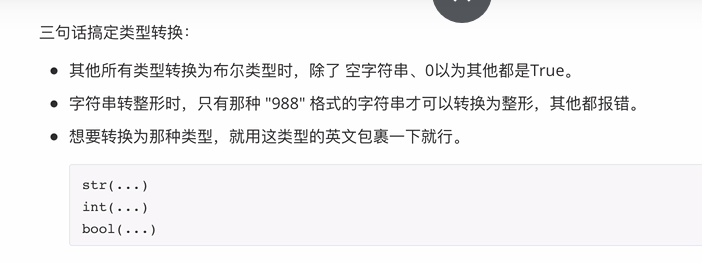

  - 变量命名规范：

    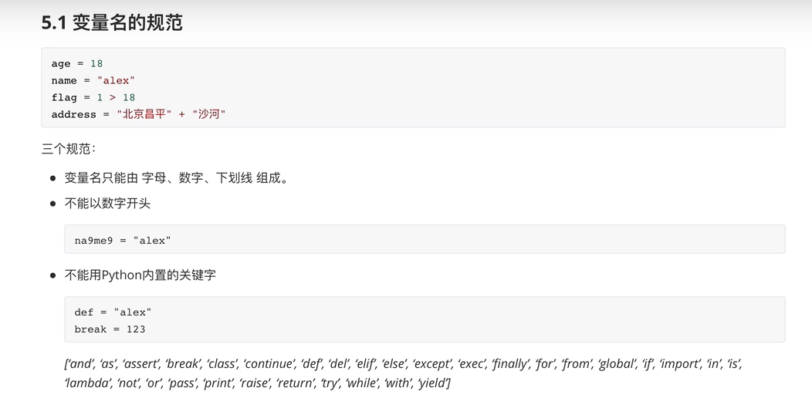

  - 变量命名建议：

    

  - 注释：

    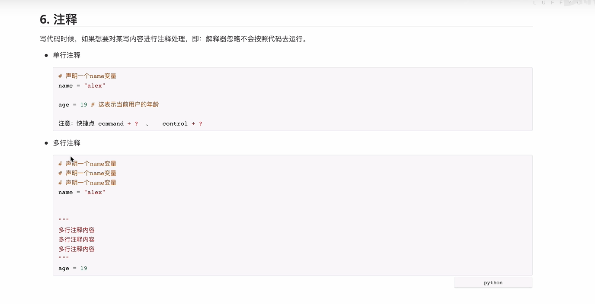

    - 注释快捷键：Ctrl+？（单行注释）

    - 输入函数：

      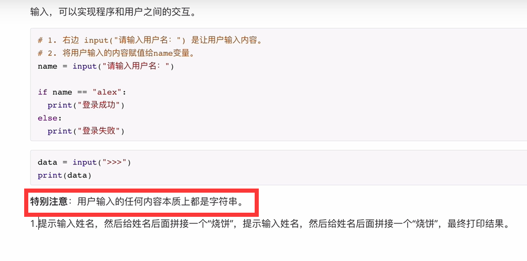

  - 条件语句

    ```python 
    name = input("请输入姓名：")
    if name == "aa":
        print("欢迎您，"+name)
    else:
        print("登录失败！")
    ```

    <font color=red> 特别注意：python的条件语句块是通过缩进来区分的，if或else下的语句要缩进且要一致，通常是4个空格（一个Tab）</font>

  - <font color=blue>多个判断语句并列使用 and 或  or</font>

  - 多个条件语句用elif

  - ```python
    name = input("请输入姓名：")
    if name == "aa":
        print("欢迎您，"+name)
    elif name == "bb":
        print("您是bb")
    else:
        print("登录失败！")
    ```

  - 在条件语句比大小的时候，可以简写条件

    <font color = red> age>40 and age<60   可以写成 40<age<60 </font>

### 第三节课

#### 循环语句

```python
while 条件:
    ...
    ...
    ...
```

- <font color=red>pass</font>关键字：经常用在if else 中 当某个条件发生时，假设我们不想让他执行任何东西，在java中通常空着就行，但是python中就不行，所以就有了pass这个关键字，但是如果pass后的语句还是会执行。

  ```python
  psd = input("请输入密码：")
  flag = True
  while flag:
      if psd == "111":
          flag = False
          pass
          print("pass 后的代码")
      else:
          psd = input("密码错误，请重新输入：")
  print("welcome")
  
  
  输入 111
  输出：
  请输入密码：111
  pass 后的代码
  welcome
  ```


- break 和 continue：和java中的功能基本类似。
- while ··· else ：当while中的条件不成立时会执行else中的代码，如果是break终止了循环则else中的代码也不会执行。（else是否执行的前提要进行while条件的判断，break后就不会再有条件判断了，所以else不会执行）

#### 字符串格式化

##### 	%

%s 为字符串的占位符，%d 为整型占位符，<font color=blue>该占位符与C语言类似，但是又比C语言灵活，注意其格式</font>

```python
name = "song"
age = 18
text = "My name is %s, %d" %(name, age)

print(text)
print("My name is %s, %d" %(name, age))

```

- 特殊情况：当一个字符串中使用了占位符，且在该字符串中还想使用“%”，则需要这样写 "%%".

  ```python
  name = "song"
  ch = "%s ,你的任务已经完成90%%了" % name
  print(ch)
  
  ```

  

##### format(推荐使用这种)

```python
name = "song"
age = 18
sex = "man"

#如果大括号占位符中什么都不写，那就按照顺序来
msg1 = "My name is {}，age is{}，sex is {}".format(name, age, sex)
#大括号中写上序号，代表的是相应的参数顺序
msg2 = "My name is {0}，age is{1}，sex is {2}".format(name, age, sex)
# 切记， 要写都写，要不写都不写，不能只写一部分
#msg3 = "My name is {}，age is{1}，sex is {2}".format(name, age, sex)

#一个参数可以多次利用
msg4 = "My name is {0}，age is{1}，name is {0}".format(name, age, sex)
#可以给占位符起别名，注意参数的格式（不加双引号）
msg5 = "My name is {name}，age is{age}，sex is {sex}".format(name=name, age=age, sex=sex)
#参数可以重复利用
msg6 = "My name is {name}，age is{age}，name is {name}".format(name=name, age=age)

template = "My name is {name}，age is{age}，sex is {sex}"

#可以先定义模板再进行格式化
msg7 = template.format(name=name, age=age, sex=sex)

print(msg1)
print(msg2)
#print(msg3)
print(msg4)
print(msg5)
print(msg6)
print(msg7)

```


##### f（python3.6 之后才能用）

```python
name = "song"
age = 18
sex = "man"

# 在字符串前加 f ，在需要占位符的地方用{}，{}里直接可以写变量、表达式
msg1 = f"My name is {name}，age is{age}，sex is {sex}"
msg2 = f"My name is {name}，age is{age + 1}，sex is {sex}"

# 进制转换：二进制
msg3 = f"My name is {name}，age is{age:#b}，sex is {sex}"
# 进制转换：8进制
msg4 = f"My name is {name}，age is{age:#o}，sex is {sex}"
# 进制转换：16进制
msg5 = f"My name is {name}，age is{age:#x}，sex is {sex}"

#在{}内可以调用函数
msg6 = f"My name is {name.upper()}，age is{age}，sex is {sex}"

print(msg1)
print(msg2)
print(msg3)
print(msg4)
print(msg5)
print(msg6)

```

#### 运算符

- 算术运算符：** 代表 求次方，2**3  = 8

  ​						// 代表 整除   9//2 = 4

  ​	  				  /   代表  除以  9/2 = 4.5

  ​						+   -     *   % 都和java一样

- 比较运算符：和java一样

- 赋值运算符：和java一样

  ​						特殊运算符   +=    -=     *=    /=     //=    **=    %=   (java中也有)

- <font color=red>成员运算</font>:    in  :

  ```python
  a = "ab"
  b = "abcd"
  # 判断b 中是否包含 a
  flag = a in b
  print(flag)
  
  结果：
  True
  ```

  ​			not in:

  ```pyth
  a = "ab"
  b = "abcd"
  # 判断b 中是否不包含 a
  flag = a not in b
  print(flag)
  
  结果：
  False
  ```

- <font color=red>逻辑运算：</font> and   or    not    相当于 java中的    &&   ||     ！

- 运算符优先级：算术运算符 > 比较运算符 >逻辑运算符    加减乘除 > 大小等不等于 > 且或非

  ​							逻辑运算符中的优先级：not  > and > or

- <font color=green>一个关于逻辑运算的问题（问题的答案表现出来的结果很特别）:</font>

  ```python
  #当第一个值为真时，结果取决于第二个值，第二个值是啥结果就是啥
  f1 = "abd" and "qwe"  
  #当第一个值为假时，结果取决于第一个值，第一个值是啥结果就是啥
  f2 = "" and "asd"
  #当第一个值为真时，结果取决于第一个值，第一个值是啥结果就是啥
  f3 = 3 or 5
  #当第一个值为假时，结果取决于第二个值，第二个值是啥结果就是啥
  f4 = 0 or 8
  print(f1)
  print(f2)
  print(f3)
  print(f4)
  
  结果：
  qwe
  
  3
  8
  
  ```

  

### 第四节课

- 在python中十进制是以int型展现的，而二进制、八进制、十六进制是以字符串的形式展现的。
- 十进制转换二进制：bin(num)  
- 十进制转换8进制：oct(num)  
- 十进制转换16进制：hex(num)
- 8 转 10  int("8进制"，base = 8)
- 2 转 10  int("2进制"，base =2)
- 16 转 10   int("16进制"，base = 16)
- ASCII编码：计算机创建初期产生的编码，只能表示256种字符，占用一个字节，不能表示全世界所有字符。
- GBK编码：中国为了表示汉字创造出来的编码，占用两个字节。
- unicode编码：也叫万国码，为了使全世界的编码统一儿创造出来的编码，分为两种，一是ucs2，占用两个字节；二是ucs4，占用四个字节。
- unicode编码因为它比较浪费空间，一般不用做网络传输和存储，但是经常会在内存中使用，因为它位数固定，比较方便。
- utf-8：本质是unicode编码的压缩版，一般用于文件存储和网络传输。 在utf-8中，汉字一般占用3个字节
- 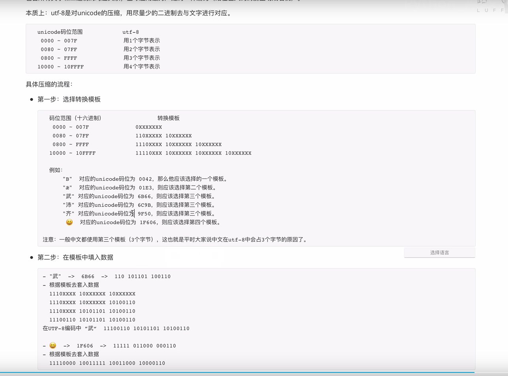
- python中有字符串和字节，一般在存储一个字符串时，先把字符串转换为字节，再传输到文件中去。

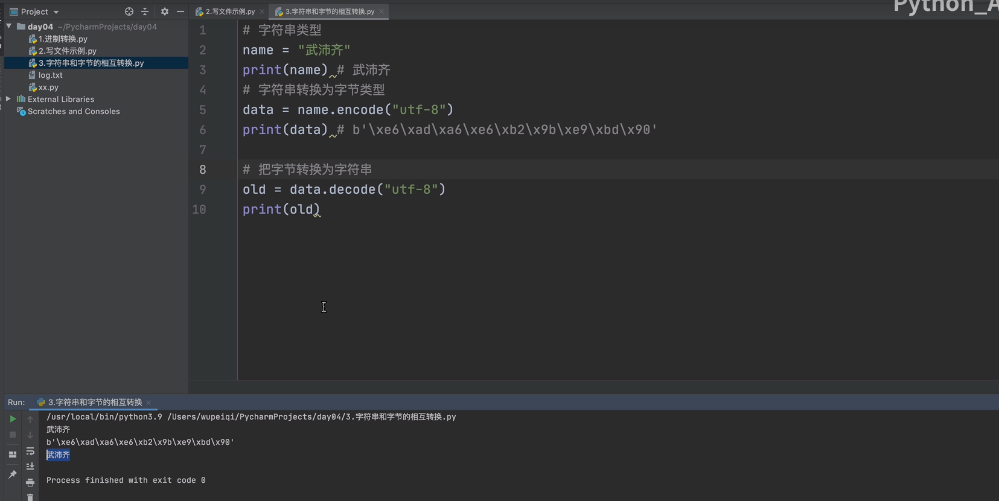

### 第五节课

- python中有 整型、布尔型、字符串、列表、元组、字典、集合、浮点型

  ​						int      bool        str         list     tuple     dict    set     float
  
- str的特性：

  


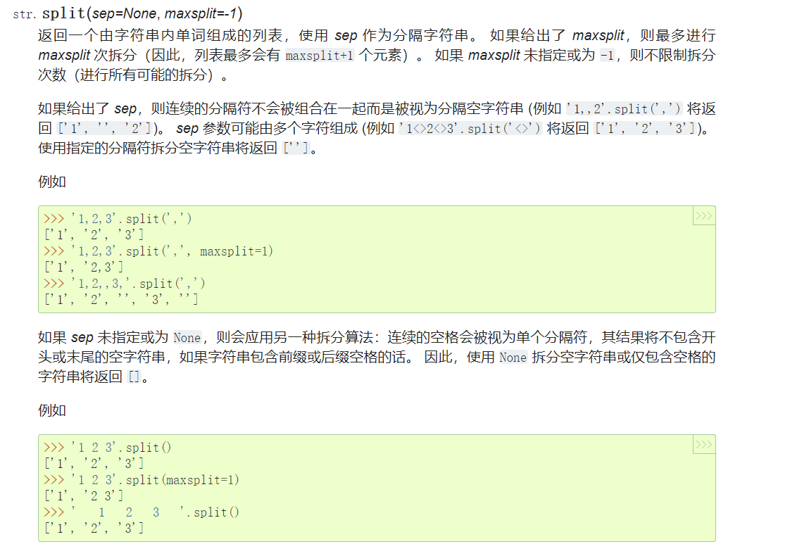

- <font color=red>python中提供了很多对str从右往左的操作，这一点就明显体现出了他的灵活性</font>


- str 拼接字符串功能 :join

  

- 将字符串转换为字节码，一般情况下，如果想把str进行网络传输或者保存在文件中，需要转换成字节码，比较节省空间。

  

- 字节转字符串

  

- 

- 


- 判断字符串是否可以转换为整型（浮点型会报错） decimal 十进制的
- 

- 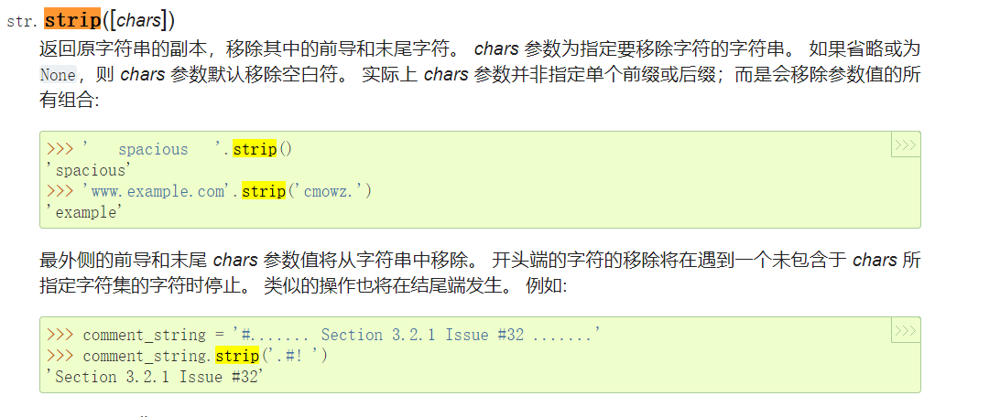

strip   v 脱去，剥开

- 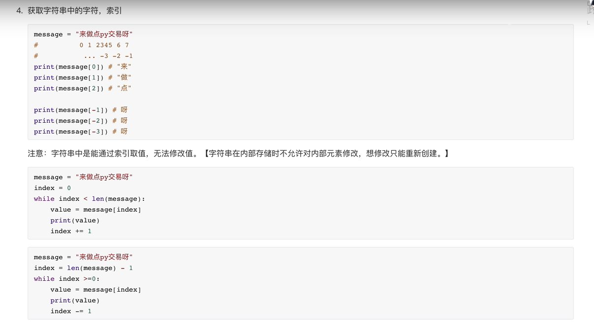

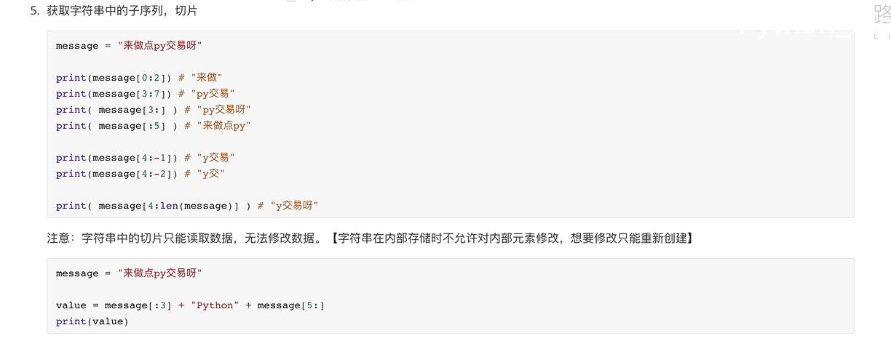


- 字符串创建之后不能被修改，如果需要修改一般就是删除重建。
- list:列表类型，用于存储一些数据的容器，有序，可修改，可放置不同类型的数据
- tuple：元组类型，用于存储一些数据的容器，有序，<font color=red>不可修改</font>，可放置不同类型的数据
- 可变类型(内部数据可修改)：list； 不可变类型（内部数据不可修改）：str、 bool、int
- 快捷键：如果你想print输出一个变量，可以输入    变量.print


- 什么是机器学习？

  计算机对一部分数据进行学习，然后对另外一部分数据进行预测。那计算机怎样学习呢？ 具体就是通过算法进行解析数据，然后得到一个模型（通俗地说就是一个数学公式，但是这不是一般的公式。）

  学习的方式有很多种。

  1. 监督学习

     就是利用已有的样本（样本包含因子和结果）,让因子和结果建立联系，从而得到特征值和映射关系，然后再对新的因子进行预测其结果。监督学习通常会应用在分类问题和回归问题，其困难之处就是获取样本的难度较高，这很依赖人工。

  2. 无监督学习

     无监督学习跟监督学习的区别就是选取的样本数据无需有目标值，我们无需分析这些数据对某些结果的影响，只是分析这些数据内在的规律。

  3. 半监督学习

     使用的数据，一部分是标记过的，而大部分是没有标记的。和监督学习相比较，半监督学习的成本较低，但是又能达到较高的准确度。

  4. 强化学习

      强化学习也是使用未标记的数据，但是可以通过一些方法知道你是离正确答案越来越近还是越来越远（奖惩函数）。可以把奖惩函数看作正确答案的一个延迟、稀疏的形式。可以得到一个延迟的反馈，并且只有提示你是离答案越来越近还是越来越远。

     参考资料：

     - https://baijiahao.baidu.com/s?id=1648513303243551939&wfr=spider&for=pc
     - https://www.cnblogs.com/PJQOOO/p/11724809.html
     - https://www.jianshu.com/p/56fe011d9bae

- 什么是深度学习？

  深度学习其实是机器学习的一个类别，它的灵感来源于人类大脑的工作方式，是利用深度神经网络来解决特征表达的一种学习过程。不过它不同于监督学习、半监督学习、无监督学习、强化学习的这种分类方法，它是另一种分类方法，基于算法神经网络的深度，可以分成浅层学习算法和深度学习算法。

  

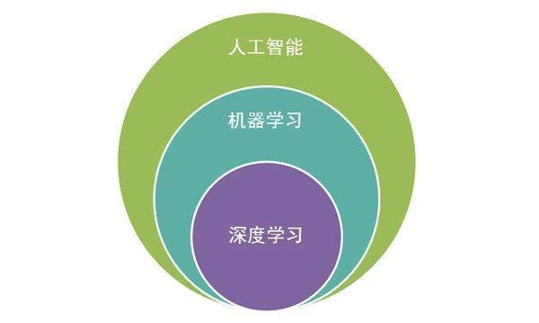

- 人工智能、机器学习和深度学习的区别和联系

  机器学习是一种实现人工智能的一种方法，而深度学习则是实现机器学习的一种技术。个人理解：深度学习是机器学习中的一个比较流行和高级的技术，而机器学习中还有很多传统学习的技术，深度学习并不适用于所有的问题，有时使用其他的机器学习的技术会有更好的效果。
