### matplotlib

#### 基本信息

- matplotlib是matrix + plot + library 的缩写，它是一个用作绘图的库。它包括三个绘图接口

  - pyplot
    - 简单易用
    - 面向当前的图
  - axes
    - 面向对象的
    - 丰富的接口配置
  - pylab
    - 沿用matlab的风格
    - 不建议使用

- 绘图步骤

  - 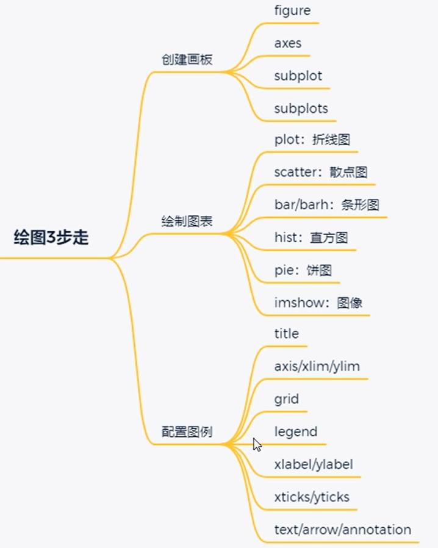

  

  

  

  #### scatter

  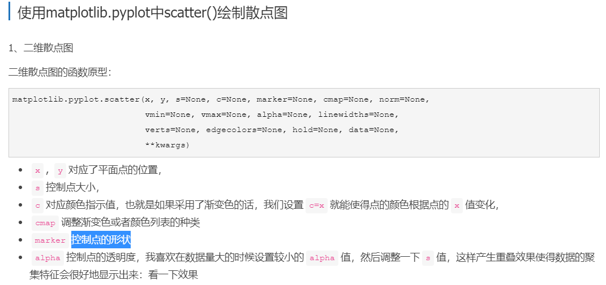
  
  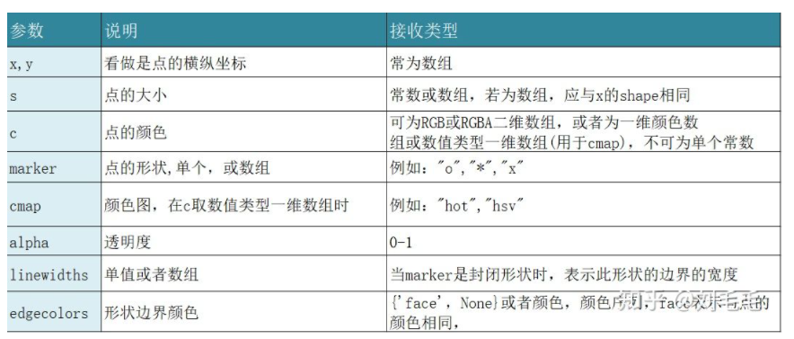

### numpy

####   zeros

- 

#### linspace

- 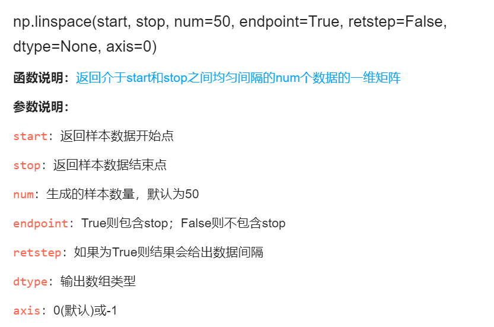

#### squeeze

- 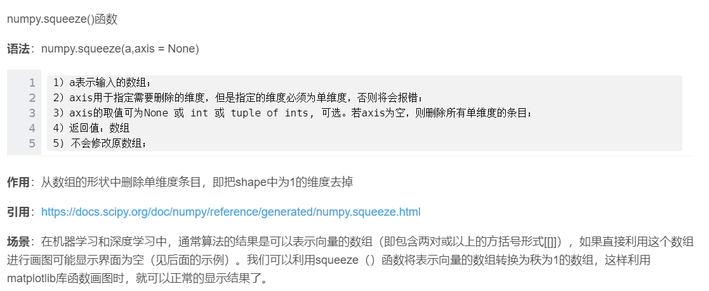

#### dot

- 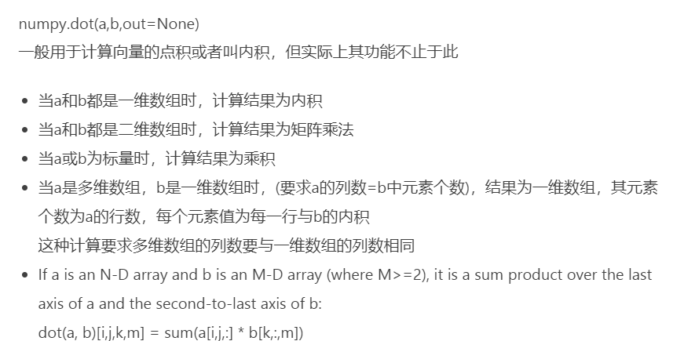

#### mean

- 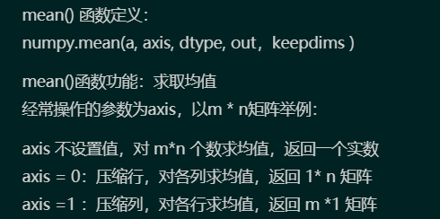

####  multiply

- 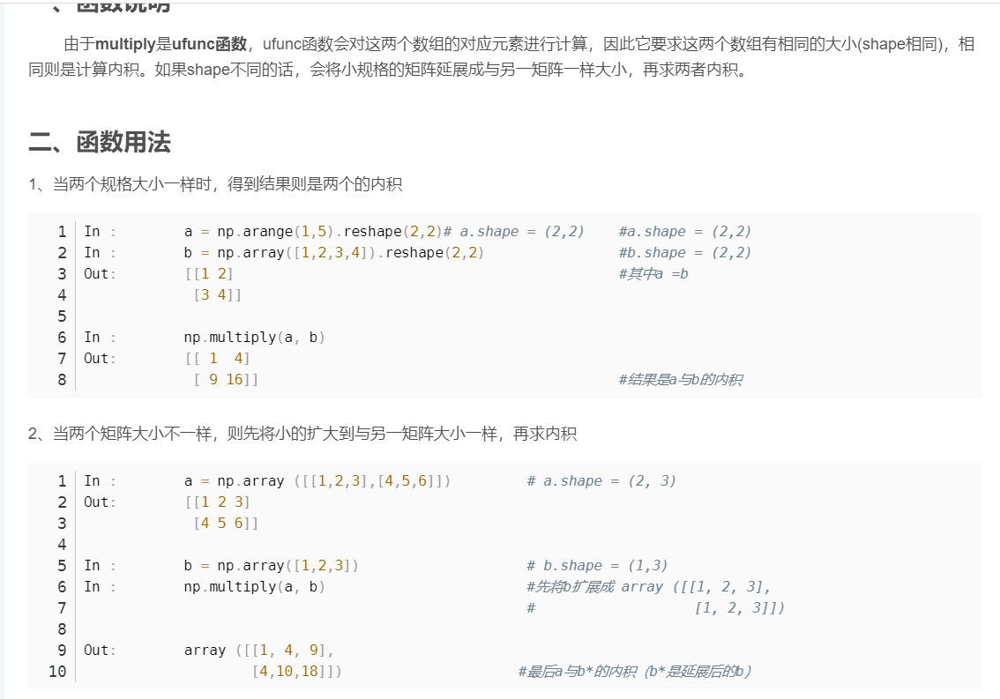

#### power

- 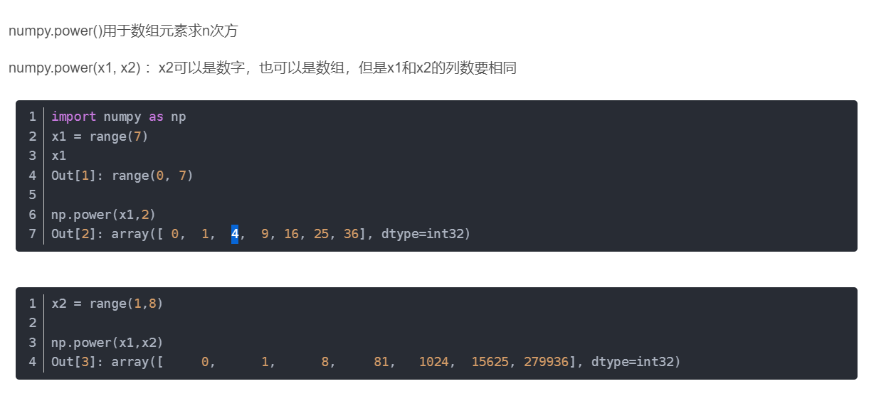

#### sum

- 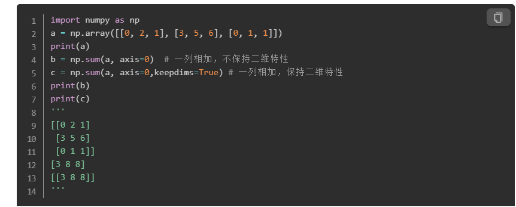

#### sqrt   exp   square

- 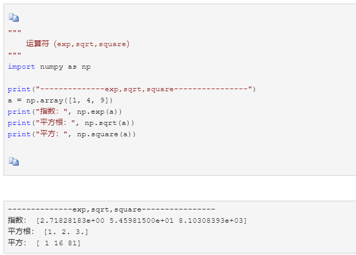

#### divide

- 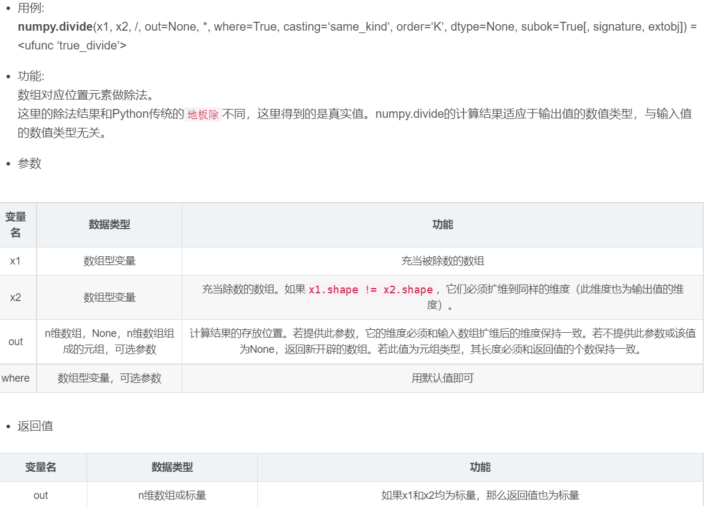

  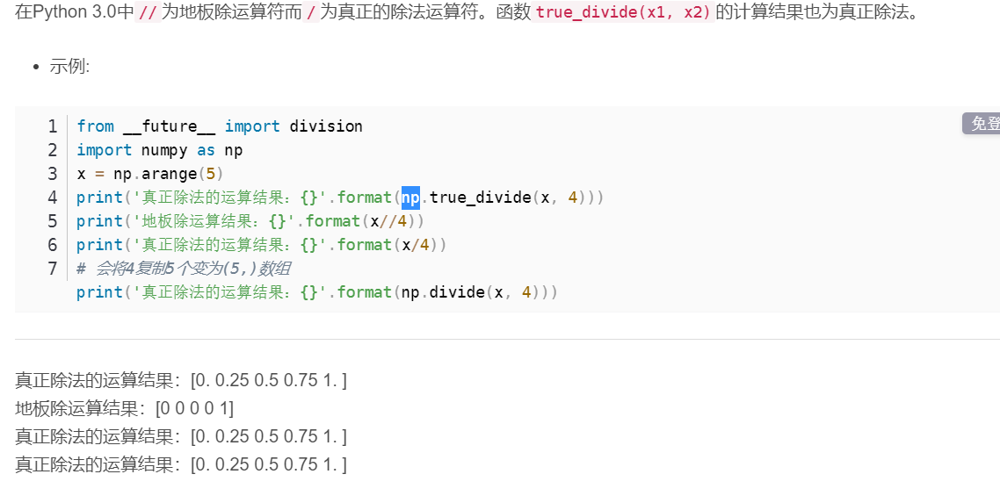

