1. 第一节课：学习神经网路的基础（4周）
   - 学习如何建立神经网络（包含一个深度神经网络）
   - 用深度神经网络辨认猫（猫的谜团运行）
2. 第二节课：深度学习方面的实践（3周）
   - 构建神经网络，学习超参数调整，正则化，诊断偏差和方差以及更高级的优化算法（ Momentum、Adam）让他表现更好
3. 第三节课：学习结构化你的机器学习工程
   - 建立并且改良许多的深度学习问题
4. 第四节课：
   - 卷积神经网络（CNN）
   - 如何搭建CNN模型
5. 第五节课：
   - 序列模型
   - 如何将序列模型应用于自然语言处理（NLP）
   - 序列模型包括循环神经网络（RNN）和 长短期记忆网络（Long Short- Term Memory）（LSTM）模型
   - 将这些模型应用于序列数据

## 2.第一节课

### 1.第一周

+ 修正线性单元  rectified linear unit  简称ReLU

+ 隐藏单元

+ 什么是[监督学习](https://www.zhihu.com/question/304499904/answer/551154375)

  ​    监督学习，是指通过让机器学习大量带有标签的样本数据，训练出一个模型，并使该模型可以根据输入得到相应输出的过程。

- 图像领域我们经常应用的是卷积神经网络(convolutional neural network)（CNN）
- 序列数据，例如时间序列经常使用循环神经网络（ recurrent  neural network）RNN
- 标准的CNN和RNN结构是什么

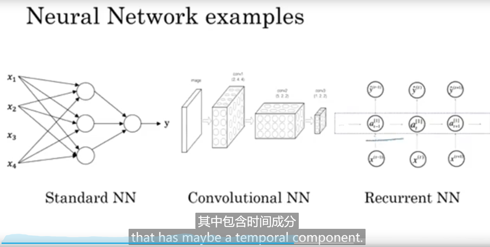

- 结构化数据：意味着每个特征比如说房屋大小、卧室数量，用户的年龄都有着清晰的定义。
- 非结构化数据：指的是像音频、图像，这里的特征可能是图像中的像素值或者是文本中的某个单词。
- 非结构化数据与结构化数据相比看似比较复杂，但是人类更擅长去理解非结构化数据
- 吴恩达的英文名叫Andrew
- 提升性能的两大条件：1. 训练一个规模足够大的神经网络，2. 需要一个有许多隐藏单元的神经网络。
- 课程约定：m代表训练集的规模（样本的数量）
- 当数据集小的时候，效果会取决于你手工设计的组件以及算法处理方面的一些细节
- 好的神经网络来源于大量的数据（Data），强大的计算能力（ compution），好的算法（ Algorithms）。

  

### 2.第二周

	- 正向过程（正向传播步骤）|| 反向步骤（反向传播步骤）
 - 神经网络的计算过程分为前向传播和反向传播
   	- logistic regression（逻辑回归） ：**逻辑回归（Logistic Regression）是一种用于解决二分类（0 or 1）问题的机器学习方法，用于估计某种事物的可能性**。比如某用户购买某商品的可能性，某病人患有某种疾病的可能性，以及某广告被用户点击的可能性等。
	- 计算机保存一张图片，要保存三个独立矩阵，分别对应图片中的红、绿、蓝 三个颜色通道
	- 假设要输入一张图片，这需要把该图片的所有像素值都输入进去，这时需要创建一个特征向量（x），该向量的维度就是所有像素值的个数，例如一张64*64的照片，则它的特征向量的维度（nx  有时会简写为n）为 64*\*64\*3，为什么要乘以3？ 因为一张图有三个颜色通道。

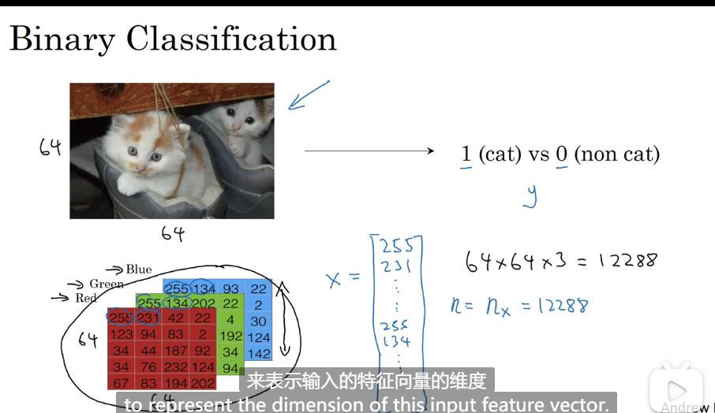

- （x, y）表示一个样本，x称为输入值，y称为输出标签

- m表示样本集，mtrain 表示训练集的样本，mtest 表示测试集样本

- 什么叫决策边界：**所谓决策边界就是能够把样本正确分类的一条边界，主要有线性决策边界(linear decision boundaries)和非线性决策边界(non-linear decision boundaries)。**

    

- 本节课中的例子

  ​	输入一张照片x（x是一个nx维的特征向量），判断该张图片中是否有猫，如果有猫则返回1，没猫则返回0.

  ​	则 x∈Rnx  (nx维的特征向量)， y∈{0,1} ,  m = {（x(1),y(1)）,（x(2),y(2)）,（x(3),y(3)）,...,（x(m),y(m) }

  ​	创建一个矩阵X， X = [x(1) x(2)  x(3) ... x(m)]，则X是一个  nx * m的矩阵 （在python中创建X 后，可以用X.shape得到 （nx ， m））

  ​	创建一个矩阵Y，Y =  [y(1) y(2)  y(3) ... y(m)]，则Y是一个  1 * m的矩阵

- 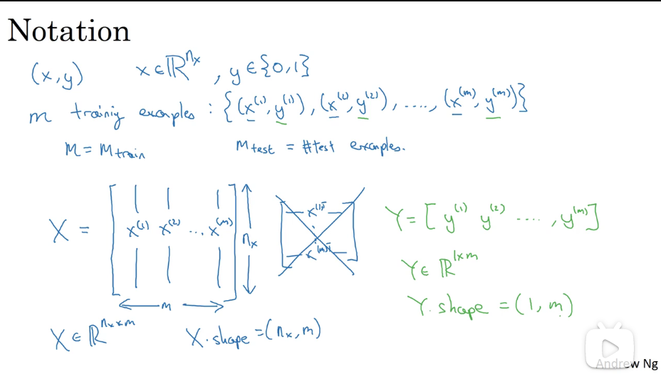

- T：transpose 转置，就是向量的转置

- sigmoid函数：机器学习中的比较常用的函数，其他先不说，先看表达式和图形

  NB]{U.png) 

  

   	sigmoid函数的值域是（0,1），图形平滑，当区域正无穷或负无穷时，函数趋于平滑状态，函数具有非常好的对称性。

- [线性回归](https://blog.csdn.net/alw_123/article/details/82193535)：

    1. 什么是回归？

       给出任意一组输入值，通过一些处理得到一个输出值，且输出值在坐标上的连续的，这个过程就是回归。（如果输出值是离散的，则这个过程叫做分类）

    		2. 什么是线性回归？

       假设在二维坐标上有一组数据，我们是不是可以找一条直线，尽可能地让各个数据坐标点靠近这条直线（这个过程叫做拟合数据）。找这条直线的过程就叫做线性回归。

    		3. 拓展：什么是损失函数？

       让一千个人对一组数据做线性回归，可能就会有一千个不同的线性函数，那么哪个线性函数最合适呢？我们要通过一些方法来判定。有一种方法就是求每个坐标点距直线的距离，然后把每个点的距离平方之后再相加，得到的结果值越小就说明该线性回归就越好。其实就是欧式距离加和，公式如下

       

       类似这种函数就叫做损失函数。

- 什么是logistic回归？

  - 公式：
    $$
    \hat{y}指代的是预测该图片为猫的概率
    $$
$$
  \hat{y} = \sigma(w^Tx+b)
$$

$$
\sigma(z) = \frac{1}{1+e^{-z}}
$$

​			其中w和b是参数 w是一个nx*1的矩阵，b∈R。目的就是利用样本集去找到一个合适的w和b。

- 损失函数：用于衡量算法运行的质量的情况，也叫作误差函数，就是验证在当前算法的情况下实际结果和真实结果的差距，差距越小说明算法越好。一般可以把损失函数定义为实际结果和正确结果的差的平方。但是在logistics回归下不宜使用这样的损失函数，因为找不到全局最优解，至于为什么现在先不用考虑，后期会讲。

  损失函数是在单个训练样本中定义的，它衡量了在单个训练样本上的表现，每一个样本通过损失函数都可以得到一个误差值

- logistics Regression 的损失函数（**交叉熵（Cross Entropy）**损失函数）：
  $$
  \zeta(\hat{y},y) = -(y*log\hat{y} + (1-y)*log(1-\hat{y}))
  $$

- 成本函数：与损失函数不同，损失函数讲的是单个样本的误差，而成本函数讲的是整体上的样本集的误差。他衡量的是在全体训练样本上的表现。

- Logistic 回归的成本函数：
  $$
  J(w,b) =\frac{1}{m}\sum_{i=1}^m \zeta(\hat{y}^{(i)},y^{(i)})
  $$

  $$
  其中参数 w和b 是为了求\hat{y}^{(i)}
  $$

  

- 对于损失函数和成本函数可以看：https://www.cnblogs.com/chay/articles/10574892.html 和https://www.csdn.net/tags/MtTaEg1sMjIyNzQtYmxvZwO0O0OO0O0O.html

- 梯度下降算法 （https://blog.csdn.net/qq_41800366/article/details/86583789）

  ​	梯度下降算法的用途主要是找到目标函数的最小值，例如在Logistics回归中，利用梯度算法找到成本函数 J 的最小值，从而也得到了最合适的w 和 b	

   	先不从专业的角度上分析梯度下降算法，假设你现在站在了一个高山上，站在哪里你也不知道，也许是山底下，也许上半山腰，也许是山顶，恰巧现在又起大雾，你仅能看见你周围的环境，那么这时你想下山，你会怎么做才能快速到山底下（山的最地点），当然是从你周围最陡峭的方向向下走，假如你有一步十万八千里的本领，那么在下山的过程中，你的步子能迈得太大吗？不能，因为迈步太大的话就会错过山底，从一个山顶到了另一个山顶，所以找准方向（最陡峭的方向），合适的步伐（水平距离的跨度别太大）能让你最快地找到山底。

  首先，我们有一个可微分的函数。这个函数就代表着一座山。我们的目标就是找到这个函数的最小值，也就是山底。根据之前的场景假设，最快的下山的方式就是找到当前位置最陡峭的方向，然后沿着此方向向下走，对应到函数中，就是找到给定点的梯度 ，然后朝着梯度相反的方向，就能让函数值下降的最快！因为梯度的方向就是函数之变化最快的方向(在后面会详细解释)
  所以，我们重复利用这个方法，反复求取梯度，最后就能到达局部的最小值，这就类似于我们下山的过程。而求取梯度就确定了最陡峭的方向，也就是场景中测量方向的手段。 	

- 向量化：向量化通常是消除代码中显式for循环的艺术，在处理大数据集上，向量化的效果远远优于显式for循环。
- SIMD指令 ：single instruction  multiple data，单指令流多数据流。 也就是说一次运算指令可以执行多个数据流，这样在很多时候可以提高程序的运算速度。
- 广播：python中的一个操作，当一个m\*n的矩阵，让它加减乘除一个1\*n的矩阵，该1\*n的矩阵会被复制m次，成为一个m\*n的矩阵，然后再逐元素地进行加减乘除操作。同样地对m*1的矩阵成立。由于python这种机制，不需要我们专门构建向量，这就减轻了代码量。

- 在python编程中尽量不要使用秩为1的数组。要善于使用n\*1或1\*n的矩阵.
- 要善于利用assert()函数验证自己的预期。要善于调用reshape()函数给自己的矩阵加保险

### 3. 第三周

- 隐藏层：在训练集中 这些中间节点的真正数值我们不会知道，在训练集你看不到它们的数值。你能看到输入值，也能看见输出值，但是隐藏层中的值在训练集中你是看不到的，这就是所谓的隐藏层。该层的输入值不一定是神经网络的输入值，该层的输出值一定不是神经网络的最终输出值。

- 激活值：个人理解的话，就是第i层的输入值称之为第i层的激活值，表示为 a[i], 第0层(输入层)的激活值 a[0]等于X。（从专业上来说输入层不能算作真正意义上的一层，例如下面图片中的神经网络是一个两层的神经网络）

  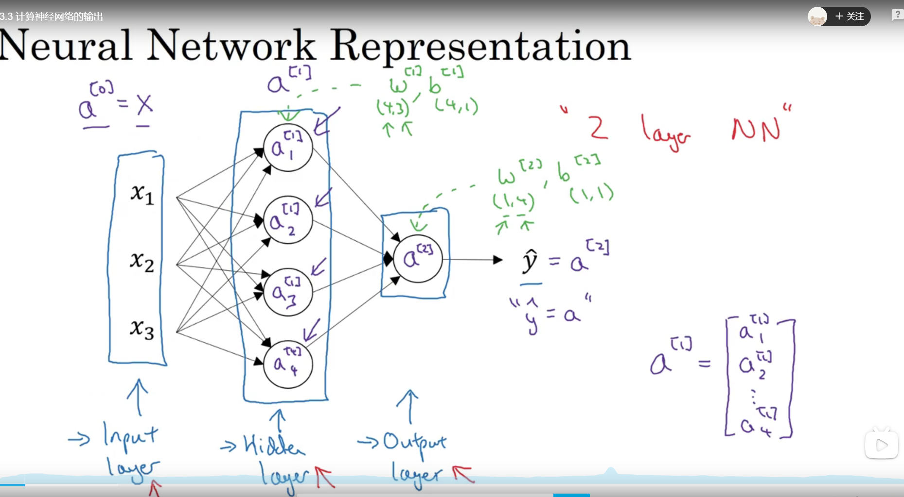

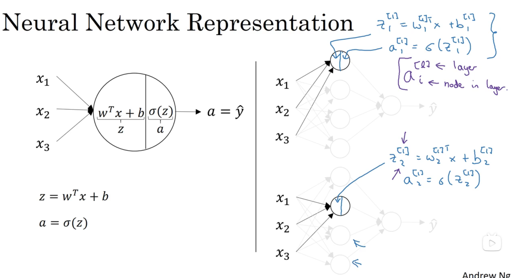

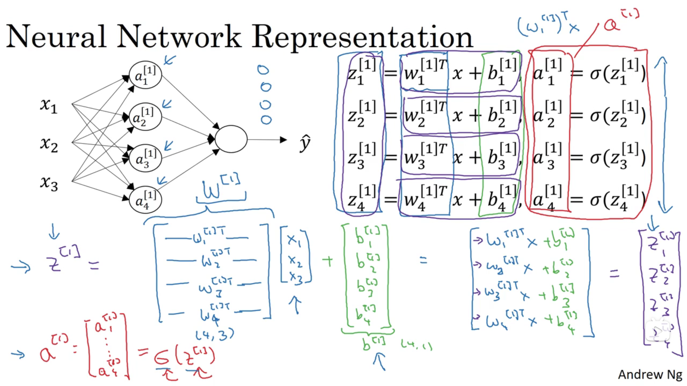

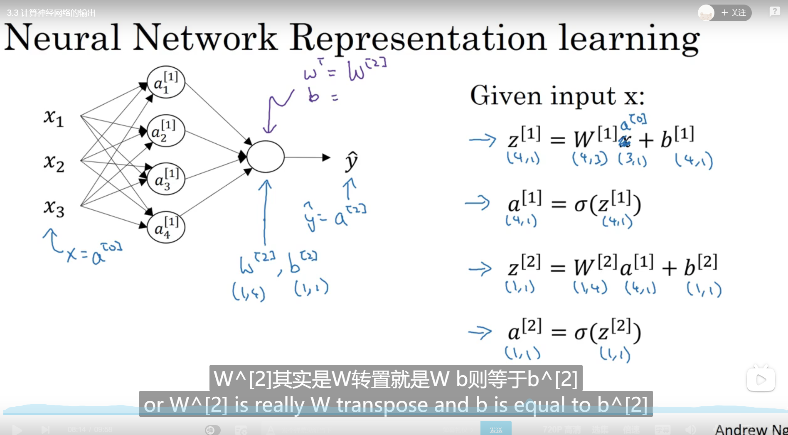

- 什么是激活函数，首先**激活函数是来向神经网络中引入非线性因素的，通过激活函数，神经网络就可以拟合各种曲线。** 例如 sigmoid函数就是例子中的激活函数。

- tanh函数(hyperbolic tangent function 双曲正切函数)(读作：tan   h)：一个比sigmoid变现更好的函数
  $$
  tanh(z) = \frac{e^z-e^{-z}}{e^z+e^{-z}}
  $$
  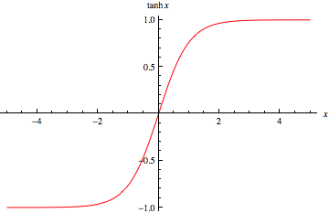

  隐藏层中，使用tanh函数作为激活函数要比sigmoid函数表现更好，至于为什么，我们暂时先记住结论：tanh函数可以使得数据的平均值接近于0，而使用sigmoid函数使得数据的平均值接近0.5，平均值接近于0可以让下一层的学习更方便一些。

  在输出层中，因为我们需要把输出值（ $\hat{y}$ ）控制在0~1之间，所以使用sigmoid函数较好。

- sigmoid函数和tanh函数都有一个共同的缺点：当输入值 z 比较大或者比较小时，函数的斜率（导数的梯度）可能会很小，所以当 z 很大或很小时，函数的斜率接近于0，这样会拖慢梯度下降算法。

- ReLU 函数（ Rectified Linear Unit  修正线性单元）：
  $$
  ReLU(z) = max(0,z) = \begin{cases}0,& z\leq0\\z,&\text{z > 0}\end{cases}
  $$

- 目前大多数人都在使用ReLU函数作为隐藏层的激活函数，如果你不知道选择哪个函数作为隐藏层的函数，那就默认选择ReLU函数。

- ReLU的一个缺点是：当 z 为负数时，函数的导数为0。（目前还不知道为什么这个特点是ReLU函数的缺点，先这样记着吧）

- ReLU函数的另一个版本：带泄漏单元的ReLU（Leaky ReLU）。当  z 为负数时，函数的导数不是0.
  $$
  f(z) = max(0,z)+leak*min(0,z)　　　　(leak是一个很小的常数a_i,通常令其为0.01)
  $$

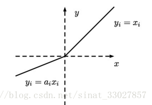

- ReLU函数和Leaky RLU函数的优点在于对于任意的 z ，函数的导数（函数的斜率）与0相差很大，所以使用该函数会使神经网络的学习速度快很多。（z等于0时是一个特殊点，需要特殊考虑，但是在实际应用中出现该点的几率很小）
- 总结一下上述几个激活函数：sigmoid函数只适合用在输出层，常用的默认激活函数是ReLU函数

- 为什么神经网络需要非线性激活函数？

  ​		如果我们使用的是线性激活函数或者没有激活函数，那么神经网络只是把线性输出组合再输出。这样做，那么有没有隐藏层都是一样的效果。（吴恩达这样说的，但是他没有给出证明，记住就行）

- 有一种情况可以用线性激活函数，比如预测房价，这也只是在输出层的激活函数可能会用到。

- sigmoid函数的导函数：

$$
a = \sigma(z) = \frac{1}{1+e^{-z}} 
 
$$

$$
\sigma^{'}(z) = a*(1-a)
$$

- tanh函数的导函数：
  $$
  a = tanh(z) = \frac{e^z-e^{-z}}{e^z+e^{-z}}
  $$

$$
tanh^{'}(z) = 1-a^2
$$

- ReLU函数的导函数：
  $$
  ReLU(z) = max(0,z) = \begin{cases}0,& z\leq0\\z,&\text{z > 0}\end{cases}
  $$

$$
ReLU^{'}(z) = \begin{cases}0,& z<0\\1,&\text{z > 0}\\1,&z=0\end{cases}　　　(当z = 0时，函数的导数实际上是不存在的，在实际操作中可以令这一点的导数为0或1，这里令它为1)
$$

- 带泄漏单元的ReLU函数的导函数：
  $$
  f(z) = max(0,z)+0.01*min(0,z)　　
  $$

  $$
  f^{'}(z) =\begin{cases}0.01,& z<0\\1,&\text{z > 0}\\1,&z=0\end{cases}　　　　(当z = 0时，函数的导数实际上是不存在的，在实际操作中可以令这一点的导数为0或1，这里令它为1)
  $$

  

- 神经网络的梯度下降算法：

  

  

  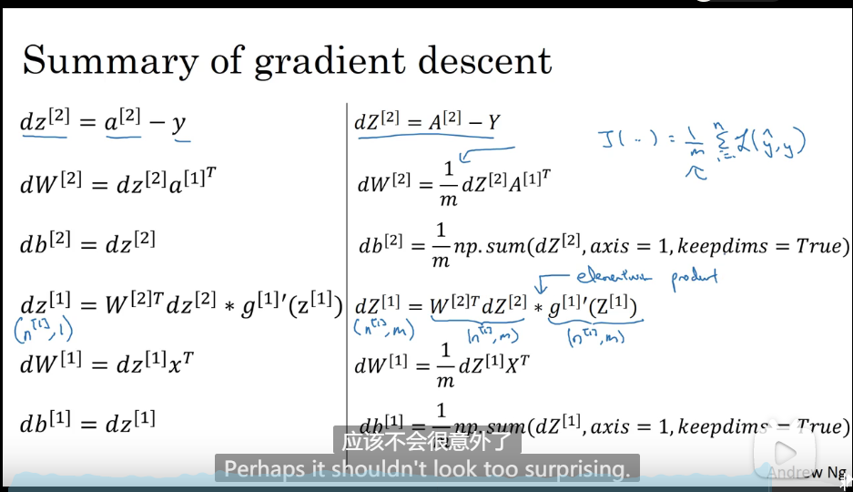

- 如何初始化参数：不要全为零，而是随机初始化。并且，通常情况下喜欢将权重矩阵（参数矩阵）初始化成非常非常小的随机值。比如当你使用了tanh或者sigmoid函数，如果参数值的权重太大，即w太大会导致z太大或太小，进而z会落在tanh或者sigmoid函数的平缓部分，平缓的部分斜率太小，这会导致梯度下降算法的效率降低，学习会很慢。所以通常使用np.random.randn(...) * 0.01  (当隐藏层特别多的情况下这里的0.01应该被考虑换成其他的数)初始化W，而d可以初始化为0：np.zeros(...)

### 4. 第四周

- 大写 L 表示神经网络的层数。$n^{[l]}$ 表示第 l 层的单元数量，$a^{[l]}$表示第l层中的激活函数，

- 向量化的正向传播算法步骤：
  $$
  \begin{align}
  & Z^{[l]} = W^{[l]}·A^{[l-1]} + b^{[l]}　　　　　（输入样本X = A^{[0]}）\\
  & A^{[l]} = g^{[l]}(Z^{[l]})
  \end{align}
  $$

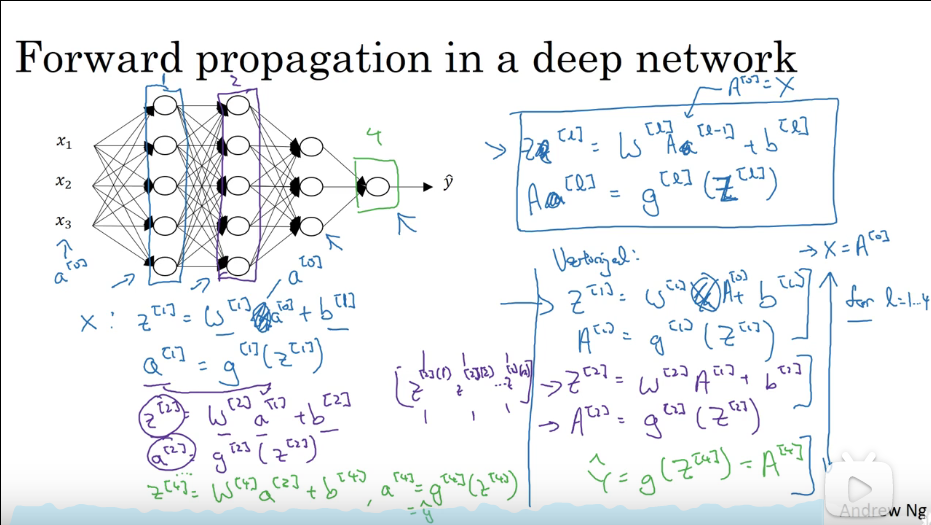

- 在实现深度神经网络的过程中，仔细且系统地思考矩阵的维数可以有效降低bug的概率

- 向量化正向传播的参数矩阵的维数：

  - $W^{[l]}$ : ($n^{[l]},n^{[l-1]}$). 
  - $b^{[l]}:(n^{[l]},1)$.
  - $dW^{[l]}$ : ($n^{[l]},n^{[l-1]}$). 
  - $db^{[l]}:(n^{[l]},1)$.
  - $Z^{[l]}$ : ($n^{[l]},m$). 
  - $A^{[l]}$ : ($n^{[l]},m)$. 
  - $dZ^{[l]}$ : ($n^{[l]},m$). 
  - $dA^{[l]}$ : ($n^{[l]},m)$. 

- 为什么有深度的神经网络会好用？

  ​	首先深度学习，比如人脸识别，是一个从简单到复杂的过程， 所以在深度神经网络的许多隐层中靠前的前几层能学习一些低层次的简单特征（比如图像的边缘，声音的音调等等），后几层就能把简单的特征组合起来去探测更加复杂的东西（比如图像中人脸的鼻子。眼睛；声音中的一个单词等等）。同时我们所计算的之前的几层也就是相对简单的输入函数，到网络的深层时，就能做一些相对复杂的事情。

- 深度神经网络为何有效？

  深度学习的另一种叫法是 有很多隐层的神经网络，事实证明，如果使用很浅的神经网络，那么想要得到满意的结果则需要指数级的神经单元，所以说深度的神经网络是相对高效的方式。但是也并不是说越深越好，正确的做法就是先从logistic回归开始，然后再逐渐增加隐藏的数量，把隐层数量当做参数去调试，这样去找比较合适的深度。

  

- 反向传播步骤

  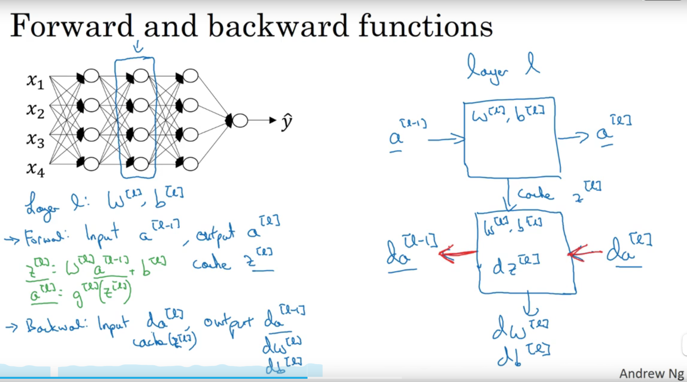

- 神经网络一个梯度下降循环

  1. 正向传播，把X = $A^{[0]}$, 作为输入值，进行正向传播，依次得到$A^{[1]}$，$A^{[2]}$，……，$A^{[l]}$，$A^{[l]}$ 也就是最终结果$\hat{Y}$ 。同时要记录各个隐层$Z^{[l]}$ 的值，以供反向传播时使用。备注：正向传播每一层都会用到参数W和b

  2. 进行反向传播，利用$A^{[l]}$计算出$dA^{[l]}$  ，把$dA^{[l]}$作为输入参数，依次求出$dA^{[l-1]}$，$dA^{[l-2]}$，……，$dA^{[l]}$，用$dA^{[l]}$计算$dA^{[l-1]}$的过程中会使用到$W^{[l]}、b^{[l]}、dZ^{[l]}(使用正向传播时得到的Z^{[l]}求出)$，同时也会得到$dW^{[l]}和db^{[l]}$的值。
     $$
     \begin{align}
     & da^{[l]} = -\frac{y}{a} + \frac{1-y}{1-a}\\
     & dA^{[l]} = -\frac{y^{(1)}}{a^{(1)}} + \frac{1-y^{(1)}}{1-a^{(1)}} -\frac{y^{(2)}}{a^{(2)}} + \frac{1-y^{(2)}}{1-a^{(2)}}-··· -\frac{y^{(m)}}{a^{(m)}} + \frac{1-y^{(m)}}{1-a^{(m)}}　　(m是样本数量)
     \end{align}
     $$
3. 利用$dW^{[l]}和db^{[l]}$的值更新相应每一层的W和b，$W^{[l]} = W^{[l]}- \alpha * dW^{[l]} 　　b^{[l]} = b^{[l]}- \alpha * db^{[l]}$  ($\alpha$代表学习率)
  
   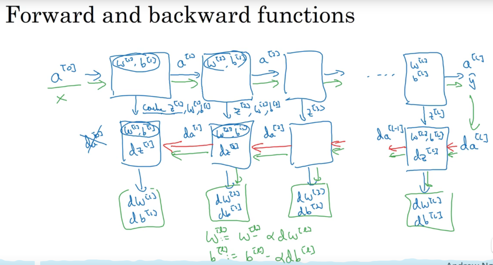
  
4. ps： 在进行正向传播时，需要缓存的参数有：Z  、 W 、  b

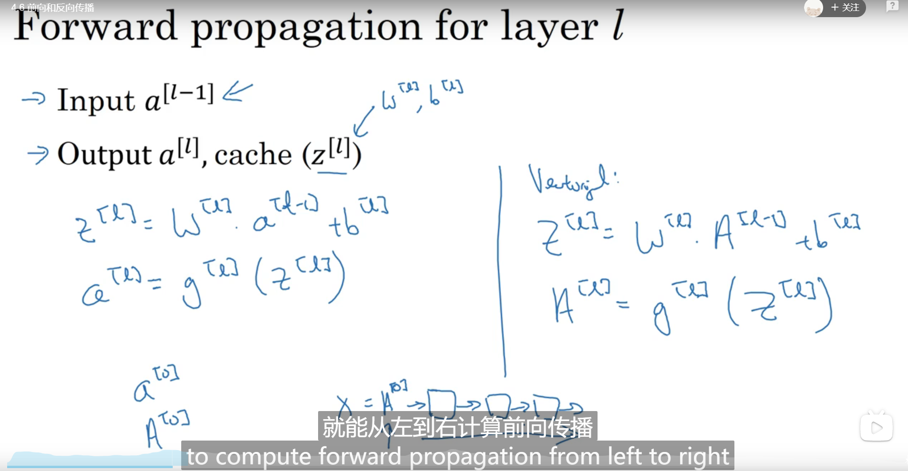

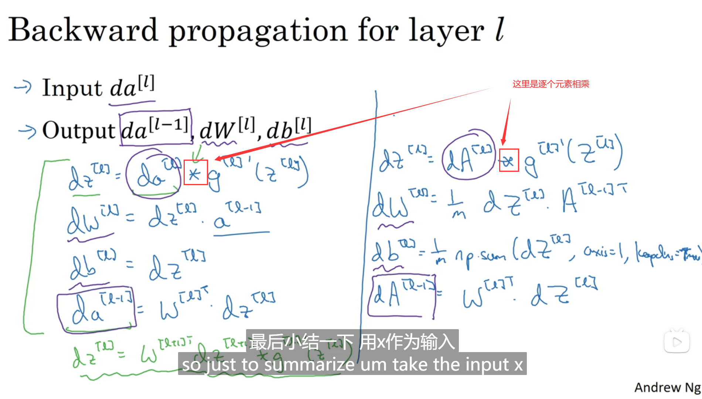

- 参数和超参数

  1. 参数：W和b

  2. 超参数：例如学习率$\alpha$, 隐层数量L，隐层中神经单元的数量$n^{[l]}$ 等等，这些参数值的选择决定了W和b的结果。

     ​				当训练自己的深度神经网络时，你会发现超参数的选择有很多可能性，所以得尝试不同的值。

     ​				当开始一个新项目时，很难一开始就知道超参数的最优值应该是什么，所以必须不断地试。

     ​				并且最优值会随着时间而变化，有可能今年使用的最优值明年就不是最优了。因为计算机的基础设施例如CPU或GPU可				能变化很大。

###  5. 构建单隐层神经网络

- 构建过程

  1. 准备数据集：样本集X，标签集Y

     注意使用np.random.seed()来保证每次运行生成的随机数一致，从而保证结果一致

  2. 定义神经网络的结构

     - n_x：输入层数量
     - n_h：隐藏层节点数量
     - n_y：输出层数量

  3. 初始化参数

     初始化参数要确保参数的大小合适

     - W：一般随机初始化，使用np.random.randn(a, b)*0.01  (W = [$w_{1}^{T}$  $w_{2}^{T}$  $w_{3}^{T}$  ......$w_{n}^{T}$ ] )
     - b:  通常初始化为0，使用np.zeros((a, b))

  4. 正向传播

     - 选择合适的激活函数，通常输出层使用sigmoid函数，其他层则不使用
     - 记得保存A和Z的值，以备反向传播时使用

  5. 构建成本函数，计算损失

     - 成本函数公式是重点

  6. 反向传播

     - 主要是使用课上讲解的六个公式

  7. 更新参数

     - 选择一个良好的学习速率是提高梯度下降算法效率的关键

- 增加隐藏层节点数量可以提高效率，但是当增加到一定数量时，并不能很好地提高正确率，所以隐藏层的节点不是越多越好。

- 参考资料：https://blog.csdn.net/u013733326/article/details/79702148
