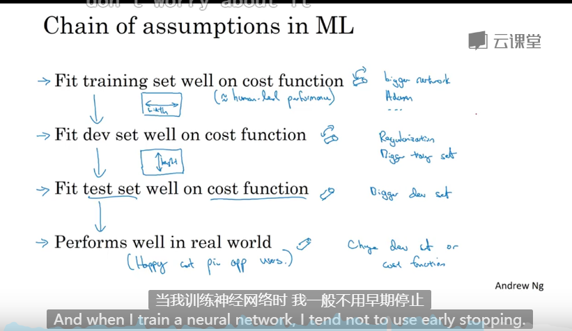
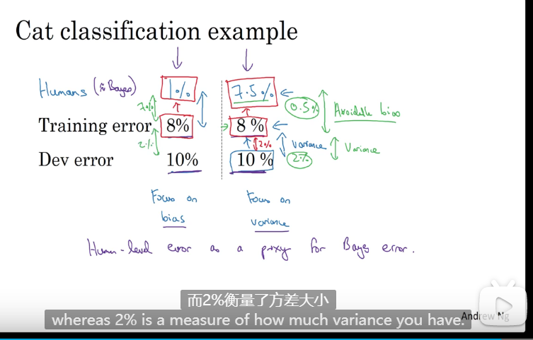
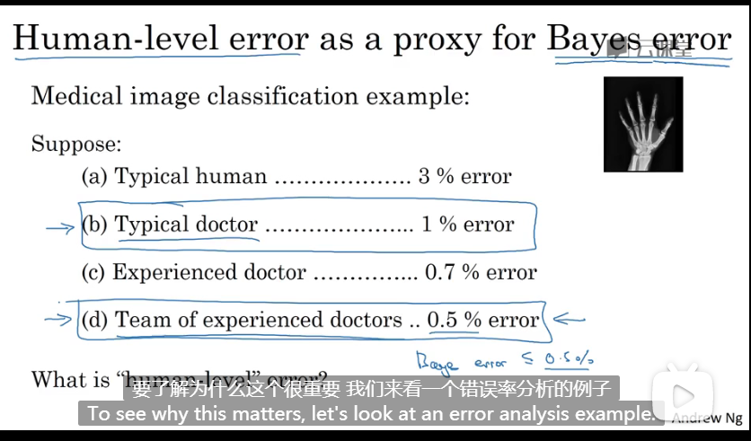
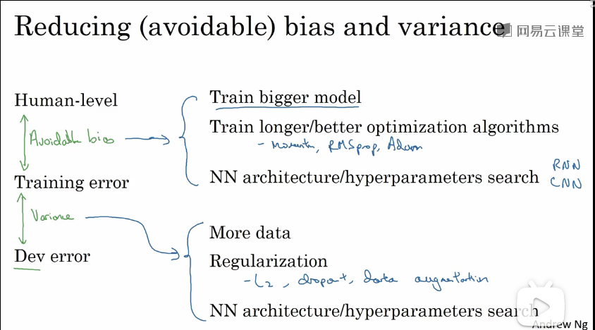

### 第一周

- 如何构建机器学习项目

- 什么是机器学习的策略

- 高效优化机器学习系统

- 当我们的机器学习系统出现问题时，我们有很多种调试方法去修改该系统，但是并不是每种方法都是有效的，本节课的目的是让我学会当问题出现时，我们如何选择解决问题的方法朝着最有希望的方向前进，更快速地解决问题。

- 正交化：就是一个参数尽量只控制一个性质，正交就意味着每个参数呈90度，就意味着互不干扰。

- 训练神经网络是我们需要关注的四个问题

  1. 模型在训练集上的表现
     - 加大神经网络
     - 更换更好的优化算法
     - ……
  2. 在开发集上的表现
     - 增大训练集
     - ……
  3. 在测试集上的表现
     - 增大开发集
     - ……
  4. 生产环境中的表现
     - 改变开发集
     - 改变成本函数

  

- 单一数字评估指标

  就是把多个指标通过某种方式组合到一起形成一个数字，这样就比较容易选择最优秀的一个。

- 评估你的分类器的一个合理方式：观察它的查准率和查全率。但是只观察这两个指标也是不太合理的，需要结合其他的指标一起来看。

- 如何有效地建立评估指标。

- 优化指标和满足指标（一般是一个优化指标，多个满足指标）

  在满足满足指标阀值的前提下，优化指标越优越好。

- 设立训练集、开发集（交叉验证集）和测试集的方式 

  - 开发集和测试集需来自同一分布，举个例子，如果整个数据集的数据来自六个不同的国家，那么我们在划分开发集和测试集时要保证这两个集合中都随机包含所有国家的数据。之所以这样做，就是在一个地区好用的模型，换到另一个地区就可能不好使了。
  - 开发集和测试集的规模应该有多大？原则是把大量数据分到训练集，少量数据分到开发集和测试集。具体比例是根据你的数据集的大小而定的。测试集的目的是评估你最终的成本偏差，你只需要保证测试集能够全面评估就可以了。

- 什么时候该改变开发集、测试集或评估指标。

- 贝叶斯最优错误率（ Bayes optimal error）: 指理论上可能达到最优的错误率，换句话说，如果错误率达到了贝叶斯最优错误率，那么这个模型很可能没有提升的空间了。

- 什么时候调整偏差，什么时候调整方差？

  如果训练出的模型的准确率距离人工的准确率还有很大的差距，那么就把重点放在偏差上，如果距离人工的准确率的差距不大，那么就把重点放在方差上。

- 可避免偏差

  你的错误率和贝叶斯最优错误率的差距就叫做可避免偏差，可避免偏差可以衡量你的改进空间还有多大。

  

- 什么叫人类水平错误率

  这个没有明确的定义，看图，图中每个数据都可以当做人类水平错误率。

  

- 改善你的模型的策略总结

  

### 第二周

- 错误分析：当发现自己训练的模型出现错误时，应进行错误分析，如何分析是决定纠错效率的关键，首先我们把判断错误的样本抽取出来，进行人工分类，比如，在错误标记的样本中，有很多狗狗的照片被识别为了猫，就可以把这些狗狗样本归为一类，分完类之后，我们就可以清楚地知道是哪些类型的样本导致了错误，然后选择占比最高的错误类别优先进行修改，这样就可以提高修复效率。

- incorrect label ，mislabeled examples 

- 如果你发现你的训练集里有一些标记错误的样本，What should you do?

  - 如果是标记人员因为粗心而标记错误，如果错误足够随机 ，这些错误样本不用处理影响也不大。因为深度学习算法对随机误差很健壮，但是对系统性的错误就没有那么健壮了。

- 如果开发集或测试集中存在标记错误的样本，那该怎么办呢？

  首先进行错误分析，在错误分析时再加一个错误类型，就是标记错误的样本，看看这个样本占据总的错误样本多少百分比，如果多的话就修正这些标记错误的样本，如果占比小的话可以不用处理。

- 设立开发集的目的：开发集的主要目的是当我们使用不同的的方法得到多个训练模型时，我们就可以使用开发集选择一个最优的。

- 手动修正开发集中错误标记的样本时需要考虑的原则：

  - 因为开发集和测试集要来自于同一分布，如果对开发集进行修正，那么最好也要对测试集进行修正。
  - 不仅要修复判断出错的样本中的被错误标记的样本，而且也要修正判断正确的样本中的被错误标记的样本。就是对整个数据集进行检查和修复。
  
-  搭建一个新的机器学习程序的第一步就是快速搭建好我的第一个系统，然后快速迭代。

  - 搭建第一个系统，训练出一个模型，这个系统不用很复杂，很简单的一个神经网络就行
  - 偏差、方差分析、错误分析，确定一下一步改进策略
  - 实现策略，训练模型
  - 回到第二步

- 当在训练模型时，我们的训练数据不足怎么办？举个例子，假设我们现在要做一个识别用户的图片里是否有猫的系统，我们只有5000张用户上传的照片，这些照片不是很专业，相对模糊。 而我们为了扩大数据量，从网上下载了200000张高清图片，那么现在我们有了205000张图片，但是200000张和5000张其实是来自不同分布，我们实际想要的结果是给一张相对模糊不专业的图片来预测图片中是否有猫。我们如何分割这205000张图片呢？给出的建议是：200000张高清图片作为训练集，5000张模糊图片作为开发集和测试集。

- 当我们在训练模型时真的使用到了以上这种数据集的方式，那么我们如何来判断我们训练数据集的性能呢？换句话说我们如何判断是偏差过高还是方差过高呢？特别是方差的问题，在之前，训练集和开发集都是来自同一分布，如果训练集的错误率和开发集的错误率相差过大，那就说明方差过高，但是现在如果出现相差过大的情况，就不一定是方差过大了，因为训练集和开发集没有来自同一分布，所以有可能是数据不匹配的问题，也就是训练集没有见过类似开发集那样的数据而造成的错误率差距过大的问题。

  ​	基于这种情况，现在我们有增加了一个训练-开发集，该集合的样本数据来源于训练集，不参与模型的训练，当模型训练完毕后，在训练开发集上进行测试，如果训练集的错误率和训练开发集的错误率相差过大，那就是方差过大的问题了，否则如果训练-开发集的错误率和训练集的错误率相差过大，那就是数据不匹配的问题了。

  ​	关于偏差的问题，就是观察贝叶斯最优错误率和训练集的错误率的差距是否过大。

  ​	如果在开发集上的错误率和在测试集上的错误率相差过大，那就很可能是模型对开发集过拟合了，也许我们需要一个更大的开发集。

- 如果发生了数据集不匹配的问题，该怎么办

  首先这个问题没有系统的解决方案，但是可以提供一些经验

  - 首先进行人工错误分析，尝试了解训练集和开发测试集的具体差异，可以用人工合成数据的方法，让训练集的数据更接近于开发集。

- 迁移学习

  首先说明一点，相似的问题训练出的模型可以做迁移，也就是用任务A的模型可以用来初始化任务B的模型，前提是任务A和B有相似的输入X，比如说都是图片或者都是音频，且当任务A的数据量比任务B的数据量要大的多时，这样的迁移是比较有意义的。为什么这样的迁移学习会有用的呢？就拿图像识别来说，识别一张图片肯定是从低层次的点、线、曲线等低层次的方面开始学习，而这些低层次的学习在任何一个图像识别系统中都是必须的且是相通的。

- 多任务学习

  之前我们学习的神经网络都是专注于一个任务，比如识别图片里是不是有猫。现在有一个场景，假设我们在做无人驾驶，汽车摄像头拍一张周围的照片，那汽车就得判断这张照片中是否有人、是否有其他的车、是否有信号灯，是否有交通标志等等，这一张图片要进行多个任务，这就是多任务学习，现在我们要建立一种神经网络，该神经网络输入一张照片，输出多个结果，那现在有个疑问，为什么不多做几个神经网络，让每个神经网络只做一个任务，之所以不这样做，原因是事实表明，让一个神经网络同时处理多个任务比让多个神经网络只处理一件事情要好得多。

- 多任务学习的特征

  - 一个样本的标签y应该有多个值
  - 预测值应该1*m的向量
  - 一个样本的y值允许不全面，也就是说，有些标记没有标出也没关系。
  - 成本函数相对于单任务而言也是有变化的，相当于把各个任务的成本函数加起来，如果一个样本中的某些特征没有标记，就忽略该样本的这些特征的损失值就行。

- 一个有意义的多任务学习具备以下三个条件：

  - 一组任务公用低层次特征，也就是说他们都在做类似的事情，比如都在判断照片上的东西。
  - 一组任务中的每一个任务都有差不多相等的样本数量，因为迁移学习的一个条件是任务A的样本数量要大于任务B的，把任务A的模型迁移到任务B才有意义，那在多任务学习中，要想任意一个任务都受益于其他任务，那么这个任务的样本数量要小于其他任务，这样环环相扣的话就是大家的样本数据量都一样。（这个条件不是绝对的）
  - 神经网络要足够大
  
- 端到端的深度学习

  以前机器学习一个模型，都是把一个问题分为几个步骤，然后每个问题对应一个神经网络模型，这样流水线似的工作。而如今如果我们的样本数据量足够大，那么我们可以省去中间的步骤，直接从问题到结果，这就是端对端的深度学习，事实证明，只要数据量够大，端对端的深度学习比流水线似的深度学习效果要好。如果我们没有足够多的数据量，那么之前流水线似的深度学习效果则更好。

- 段对端的深度学习虽然很好，但是它需要大量的数据来训练，在很多应用领域现在还无法获取那么大的数据量，所以端对端的深度学习在某些领域还不能应用。 

- 端到端的深度学习的优缺点

  - 优点
    - 让数据按照自己的方式完成任务（不是按照人类思维来完成任务，比如让机器学习听懂语言，人类的方式就是通过音节、音位来听懂语言，但音节、音位是人类自己发明的一种方式，还有其他很多方式可以听懂语言，只是人类目前不知道而已，也就是说人类的认为的好方法不一定是好方法，也许还有更好的人类理解不了的方法。）
    - 所需手工设计的组件更少
  - 缺点
    - 需要大量的数据
    - 他排除了可能有用的手工设计组件（在数据量不是很多的情况下，手工设计组件其实是一种快速得到结果的捷径）

