### 第一周

- 主要内容：超参数调优，如何构建数据，如何确保优化算法快速运行

- 应用深度学习是一个典型的迭代过程，很难一次就达到完美效果，需要多次 idea ---->code ------>experiment循环往复，循环该过程的效率是决定项目进展速度的一个关键因素

- 在机器学习中通常将样本分为训练集（训练模型）、验证集（验证和调整模型）、测试集（评估模型）三部分，要确保验证集合测试集来自同一个分布

- 偏差（Bias）：描述的是预测值的期望与真实值之间的差距，偏差越大，越偏离真实数据

- 方差（Variance）：描述的是预测值的变化范围，离散程度，方差越大，数据越分散。

- 偏差高 称为 欠拟合，方差高称为过度拟合

- 交叉验证：简单来说就是重复使用数据。除去测试集，把剩余数据进行划分，组合成不同的训练街和验证集，某次在训练集中出现的样本下次可能成为验证集中的样本，这就是所谓的“交叉”

- 一般来说最优误差也被称为基本误差

- 解决偏差和方差过高的方法（以下方法不一定有效，也仅限于这些方法，关键的一点就是多尝试）

  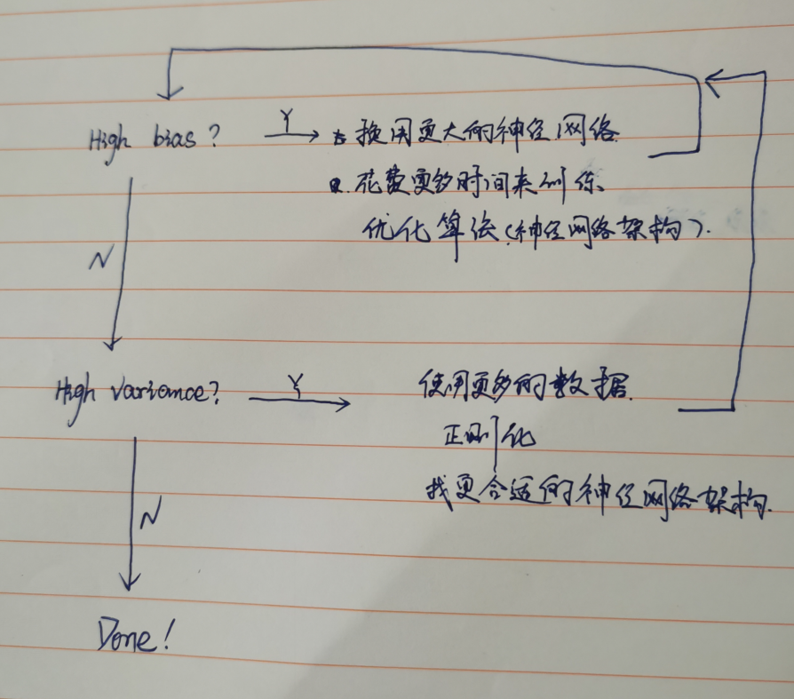

- 解决高方差的其中两个相对有效的方法：1、正则化，2、准备更多的数据

- 在深度学习中，如果数据集没有足够大的话，可能会导致一些过拟合的问题。过拟合导致的结果就是在训练集上有着很高的精确度，但是在遇到新的样本时，精确度下降会很严重。

- 向量范数：一个向量的n范数就是该向量各个维度值n次方后在开n次方。参考文档：https://www.jianshu.com/p/f0e41ebe5e4b

- L<sub>2</sub> 正则化：
  $$
  J(w,b) =\frac{1}{m}\sum_{i=1}^m \zeta(\hat{y}^{(i)},y^{(i)})+\frac{\lambda}{2m}||w||_{2}^{2}
  $$

$$
||w||_{2}^{2} =\sum_{j=1}^{n_x} w_j^2 = w^Tw
$$

​			$\lambda$  称为正则化参数，它属于超参数，$||w||_2^2$ 称为w范数的平方，L<sub>2</sub>正则化化就是把成本函数（logistic回归函数）加上w范数的平方

​		ps：在python中 lambda 是一个保留字段，所以通常用 lambd字段 表示	$\lambda$  （去掉了a）

- L<sub>1</sub> 正则化：
  $$
  J(w,b) =\frac{1}{m}\sum_{i=1}^m \zeta(\hat{y}^{(i)},y^{(i)})+\frac{\lambda}{m}||w||_{1}
  $$

- 人们在训练网络时，倾向于使用L<sub>2</sub>正则化

- 在多层神经网络中，把成本函数向量化：
  $$
  J(W,b) =\frac{1}{m}\sum_{i=1}^m \zeta(\hat{y}^{(i)},y^{(i)})+\frac{\lambda}{2m}\sum_{l=1}^{L}||w^{[l]}||_{F}^{2}
  $$

  $$
  ||w^{[l]}||_{F}^{2} =\sum_{i=1}^{n^{[l]}}\sum_{j=1}^{n^{[l-1]}} (w_{ij})^2 　　　ｗ：（n^{[l]}，n^{[l-1]})
  $$

  以三层神经网络为例：

   	在前向传播计算成本时，如果使用L2正则化，原本的J(W,b)要加上$||w^{[l]}||_{F}^{2}$ ,即：L2_regularization_cost

  ```python
   L2_regularization_cost = lambd * (np.sum(np.square(W1)) + np.sum(np.square(W2)) + np.sum(np.square(W3))) / (2 * m)
  ```

  ​	在反向传播时，如果也用L2正则化，那么，dW的计算方法也有变化

  ```python
   	dZ3 = A3 - Y
      dW3 = (1 / m) * np.dot(dZ3, A2.T) + ((lambd * W3) / m)
      db3 = (1 / m) * np.sum(dZ3, axis=1, keepdims=True)
  
      dA2 = np.dot(W3.T, dZ3)
      dZ2 = np.multiply(dA2, np.int64(A2 > 0))
      dW2 = (1 / m) * np.dot(dZ2, A1.T) + ((lambd * W2) / m)
      db2 = (1 / m) * np.sum(dZ2, axis=1, keepdims=True)
  
      dA1 = np.dot(W2.T, dZ2)
      dZ1 = np.multiply(dA1, np.int64(A1 > 0))
      dW1 = (1 / m) * np.dot(dZ1, X.T) + ((lambd * W1) / m)
      db1 = (1 / m) * np.sum(dZ1, axis=1, keepdims=True)
  ```

  

- $||w^{[l]}||_{F}^{2}$ 是矩阵范数，叫做Frobenius（弗罗贝尼乌斯范数）

- 如何使用带有该矩阵范数的成本函数实现梯度下降：

  dw会发生变化   $dW^{[l]} = dz^{[l]}{a^{[l-1]}}^{T}$  ====>>  $dW^{[l]} = dz^{[l]}{a^{[l-1]}}^{T} + \frac{\lambda}{m}W^{[l]}$ 

  所以 $W^{[l]} = W^{[l]} - \alpha dW^{[l]} = (1-\alpha*\frac{\lambda}{m})W^{[l]}-\alpha*dz^{[l]}{a^{[l-1]}}^{T}$

  $W^{[l]} $肯定是越来越小，所以L<sub>2</sub>正则化也被称为“权重衰减”

- 正则化为什么可以预防过度拟合？

  直观上来说，如果$\lambda$设置的足够大，则W就可以接近于0，也就是参数权重接近于零，那么这样会导致隐藏单元对整个神经网络的影响就非常小，几乎等于没有隐藏单元，这样神经网络的规模就相当于于一个规模很小的网络，这就会使神经网络变成高偏差状态，也就是欠拟合状态。当然这只是一个极端的状态，实际不会出现，$\lambda$的值肯定存在一个合适的值，使神经网络从过拟合状态变成刚刚好的一个状态。

  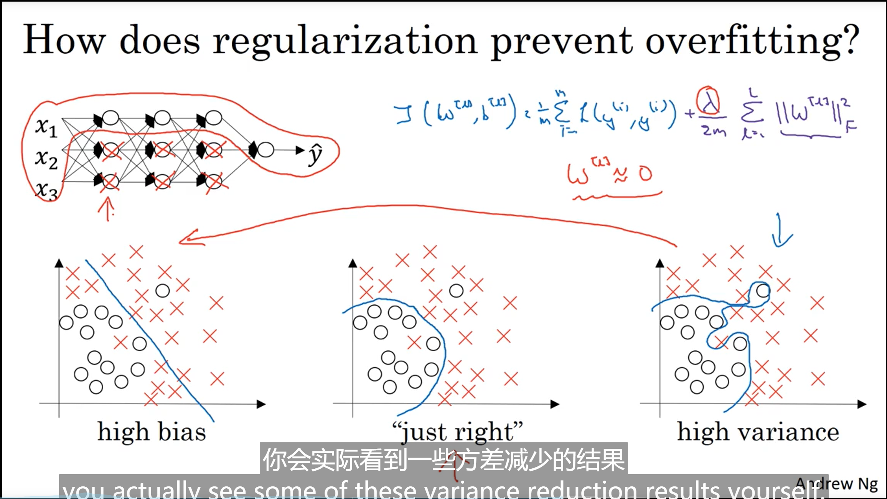

从激活函数方面讲，在神经网络中如果每层激活函数都是线性的，那么整个网络就是一个线性网络，既使这个网络非常深。


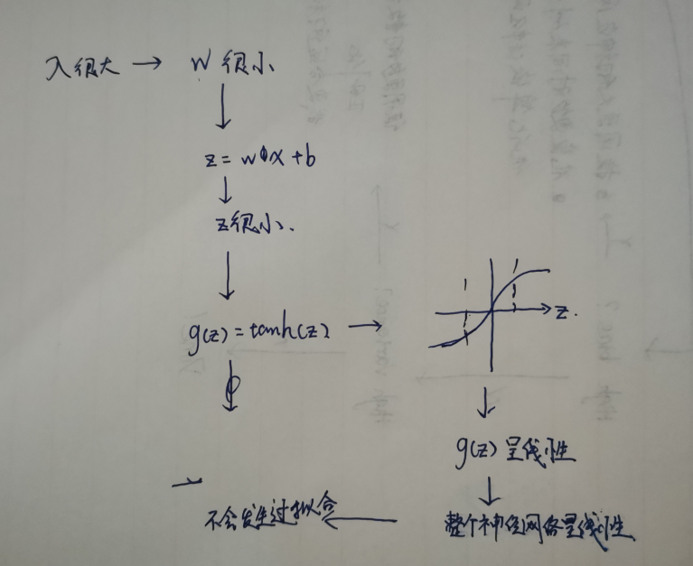

- dropout（随机失活）正则化：个人理解，就是对神经网络中的节点设置失效的概率，一个节点可能会被剔除，把一些节点剔除后，整个神经网络就会变得相对简单，则不容易出现过度拟合的情况

- 如何实施dropout呢？

  - inverted dropout（反向随机失活）

    1. 首先设置keep-prop参数，确定让隐藏节点失活的概率，例如keep-prop = 0.8，那么节点失活的概率就为0.2。

    2. 为每一层创建d，例如第3层就是d3 = np.random.rand(a3.shape[0],a3.shape[1]);  d 和 a 的维度相同，

    3. d中每一个元素与keep-prop比大小： d3 = d3<keep-prop,  此时d3 中的元素是True和False，

    4. 更新a的值：a3 *= d3,  此时a3 中有些元素没有变，有些元素变成了0， 这就相当于把一些节点失活。失活的概率也是20%

    5. 然后再次更新a ： a3 /= keep-prop   这一步的目的是为了不影响z的值，因为$z^{[4]} = w^{[4]}a^{[3]}+b^{[4]}$, a3发生变化，则z4也会跟着变，所以为了不让z4有那么大的波动，我们把a3变化的那么一部分给他找过来，于是就有了 a3 /= keep-prop

    6. 只需训练时正向和反向传播和反向传播时用到以上步骤，到测试阶段就不需要以上步骤

       ps: 不同层的keep-prop可以不同，对于可能出现过拟合且含有诸多参数的层，我们可以把keep-prop设置比较小的值，以便产生更好的dropout。

       ​		从技术上讲虽然也可以用dropout删除几个输入特征，但是在现实中通常不会这儿做，一般把输入层的keep-prop值设为1.

       ​	总结: 如果担心某些层比其它层更容易产生过度拟合，那么就把该层的keep-prop的值调小一些。dropout在计算机视觉方面用的比较多一些。最后，dropout是一种正则化方法，有助于预防过拟合，除非算法过拟合，否则不要使用dropout

    - dropout的缺点：代价函数 J 不能被明确定义， 因为每次迭代都会随机失去一些节点、

    还是以3层神经网络为例：

    在正向传播时

    ```python
     	# LINEAR -> RELU -> LINEAR -> RELU -> LINEAR -> SIGMOID
        Z1 = np.dot(W1, X) + b1
        A1 = reg_utils.relu(Z1)
    
        D1 = np.random.rand(A1.shape[0], A1.shape[1])  # 步骤1：初始化矩阵D1 = np.random.rand(..., ...)
        D1 = D1 < keep_prob  # 步骤2：将D1的值转换为0或1（使用keep_prob作为阈值）
        A1 = A1 * D1  # 步骤3：舍弃A1的一些节点（将它的值变为0或False）
        A1 = A1 / keep_prob  # 步骤4：缩放未舍弃的节点(不为0)的值
    
        Z2 = np.dot(W2, A1) + b2
        A2 = reg_utils.relu(Z2)
    
        D2 = np.random.rand(A2.shape[0], A2.shape[1])  # 步骤1：初始化矩阵D2 = np.random.rand(..., ...)
        D2 = D2 < keep_prob  # 步骤2：将D2的值转换为0或1（使用keep_prob作为阈值）
        A2 = A2 * D2  # 步骤3：舍弃A1的一些节点（将它的值变为0或False）
        A2 = A2 / keep_prob  # 步骤4：缩放未舍弃的节点(不为0)的值
    
        Z3 = np.dot(W3, A2) + b3
        A3 = reg_utils.sigmoid(Z3)
        
        #要保持D的值，在反向传播时使用
        cache = (Z1, D1, A1, W1, b1, Z2, D2, A2, W2, b2, Z3, A3, W3, b3)
    
    ```

    在反向传播时：

    ```python
     	dZ3 = A3 - Y
        dW3 = (1 / m) * np.dot(dZ3, A2.T)
        db3 = 1. / m * np.sum(dZ3, axis=1, keepdims=True)
        dA2 = np.dot(W3.T, dZ3)
        
    	# 步骤1：使用正向传播期间相同的节点，舍弃那些关闭的节点（因为任何数乘以0或者False都为0或者False）
        dA2 = dA2 * D2  
        dA2 = dA2 / keep_prob  # 步骤2：缩放未舍弃的节点(不为0)的值
    
        dZ2 = np.multiply(dA2, np.int64(A2 > 0))
        dW2 = 1. / m * np.dot(dZ2, A1.T)
        db2 = 1. / m * np.sum(dZ2, axis=1, keepdims=True)
    
        dA1 = np.dot(W2.T, dZ2)
    
        # 步骤1：使用正向传播期间相同的节点，舍弃那些关闭的节点（因为任何数乘以0或者False都为0或者False）
        dA1 = dA1 * D1  
        dA1 = dA1 / keep_prob  # 步骤2：缩放未舍弃的节点(不为0)的值
    
        dZ1 = np.multiply(dA1, np.int64(A1 > 0))
        dW1 = 1. / m * np.dot(dZ1, X.T)
        db1 = 1. / m * np.sum(dZ1, axis=1, keepdims=True)
    ```

    

    

- 增加数据集的方法：除了传统的增加样本的数量，例如在识别猫的照片中，我们不容易获得很多猫的照片，但是我们可以通过把现有照片翻转、裁剪从而生成假训练数据，和全新的、独立的照片相比这些假数据无法提供那么多信息但是获取代价比较低。

- early stopping：一种预防过拟合的方法。

  ​	提早停止训练神经网络

  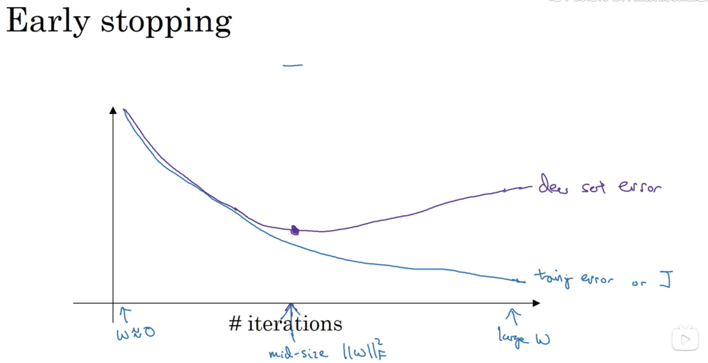

- L<sub>2</sub>正则化的缺点：找到合适的$\lambda$比较耗时；early shopping的缺点：不能兼顾损失函数J 的最小化和防止过度拟合两方面。

- 归一化（normalization）: 在神经网络训练时，一种加速训练的方法。使用场景：当训练样本的不同特征值的范围不同时，比如x1的范围是[0,1]，而x2的范围是[0,1000], x1和x2的范围差距过大，这时使用归一化来处理输入特征值后再训练，训练的用时会减少，效率会升高。

- 为什么要使用归一化：如果样本中不同的输入特征值的范围差距过大，则会导致成本函数 J  在坐标轴上呈现的是一个非常 扁长的图形，在梯度下降的过程会非常曲折，非常耗时。而归一化输入特征值后，不同的输入特征值的范围就类似了，成本函数 J 的图形是相对较圆滑的，进而在梯度下降时会相对平滑，很快就会找到最低点。

  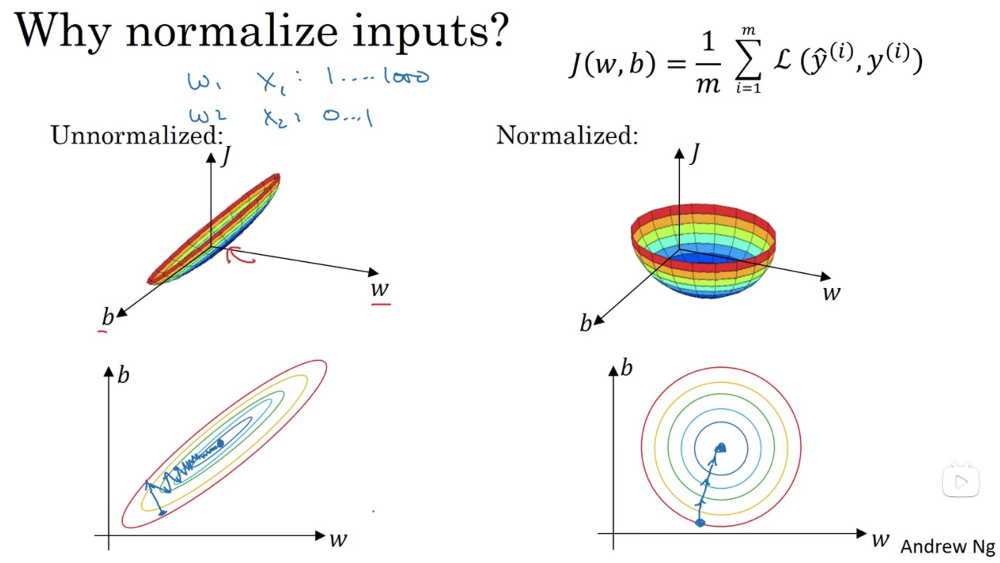

- 归一化的步骤：

  ​	步骤一：零均值化。目的是把所有样本都移动到原点周围  ($\mu$是一个向量，表示所有样本的平均值)
  $$
  \mu = \frac{1}{m}\sum_{i=1}^{m}X^{(i)}\\
  X = X - \mu
  $$

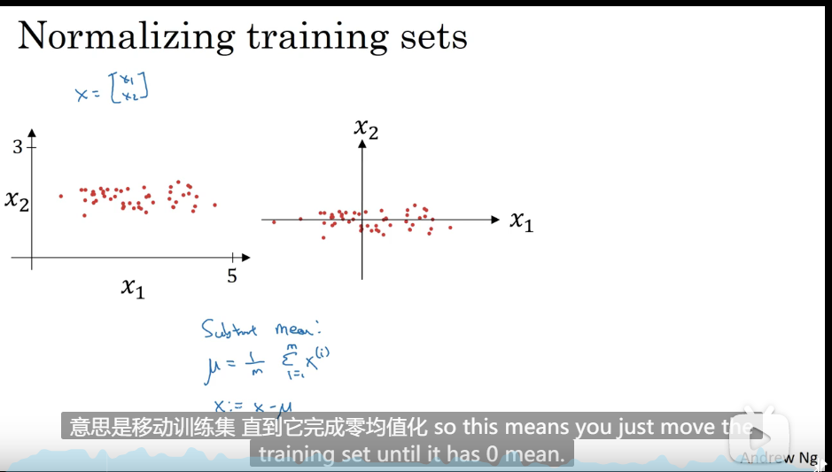

​		步骤二：归一化方差（normalize the variances）。目的是要让每一个特征值的方差都等于1。($\sigma^2$是一个向量，代表X方差的平均值)
$$
\sigma^2 = \frac{1}{m}\sum_{i=1}^{m}{X^{(i)}}^2\\
X = X/\sigma^2
$$
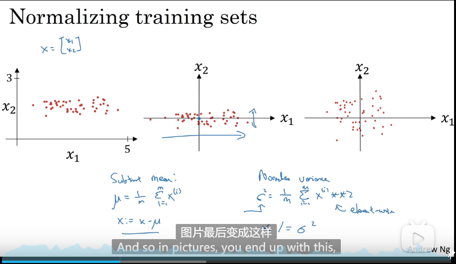

- <font color='red'>提示：如果在训练神经网络时使用了归一化，那么在测试数据时也要使用与训练时相等的$\mu$和$\sigma^2$来处理测试样本，而不是使用测试样本重新得到一个新的$\mu和\sigma^2$</font>

- 如果输入特征值处于不同的范围内，那么归一化特征值就非常重要了，相反，如果特征值处于相似范围内，那么归一化就不是很重要了，执行归一化不会产生什么危害，可以经常对特征值做归一化处理，不管你能不能确定它真的能提高速度。

- 提升神经网络训练速度的方法。

- 梯度消失和梯度爆炸：当W中的元素与1相比过大时容易发生梯度爆炸，比1相比过小时容易发生梯度消失。

- 为W选择一个合适的初始值有助于预防梯度消失和梯度爆炸，那如何设置W的初始值呢，现在有一个相对不正式但是有效的方案，该方案有助于我们更好地选择随机初始化参数来防止梯度消失或梯度爆炸：

  ​			假设现在要初始化第l层的W，第l-1层有n个输出，首先设置一个变量 var_w = $\frac{1}{n}$，

  ​			$W^{[l]}$ = np.random.randn(.....) * np.sqrt(var_w)

  ​	这样初始化W可以相对有效预防梯度消失和梯度爆炸(这叫做<font color='red'>抑梯度异常初始化</font>)，经验表明，当该层神经网络使用的激活函数是ReLU函数时，var_w = $\frac{2}{n}$效果会更好，而当激活函数是tanh时，var_w = $\frac{1}{n}$效果会更好，这没有一个明确的规定，这是给了一个相对合理的默认值，在训练的时候可以做出相应的调整，这也算是一个超参数，但是根据经验表明，虽然调整该超参数也有一定的效果，但是相比其他超参数，调优这个超参数的效果一般，通常把它的优先级放的较低。

- 对计算梯度做数值逼近:  在求一点的导数时，使用双边误差的方法比使用单边误差更逼近导数值，可以使用双边误差来判断别人给你的函数g($\theta$)是否正确实现了函数 f 的导数，

  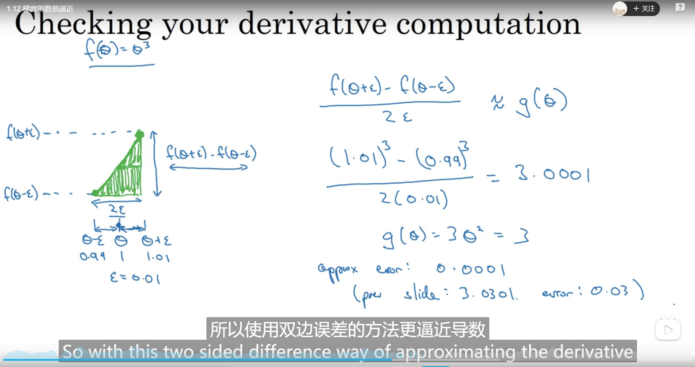

- 梯度检验(grad check)：一种用于检验在backprop过程中是否存在bug的方法，它的主要方法就是对计算梯度做数值逼近

  - 具体步骤：

    - 前提：神经网络中有很多层，每一层都有对应的W和b

    - 把每一层的W(矩阵) 转换成一个向量，b本来就是向量，然后把这些向量（W和b）做连接，形成一个巨形的向量$\theta$

    - 代价函函数J（W,b）变成了J($\theta$) ,

    - 然后把梯度下降得来的dW，db 以同样的方式转换成$d\theta$

      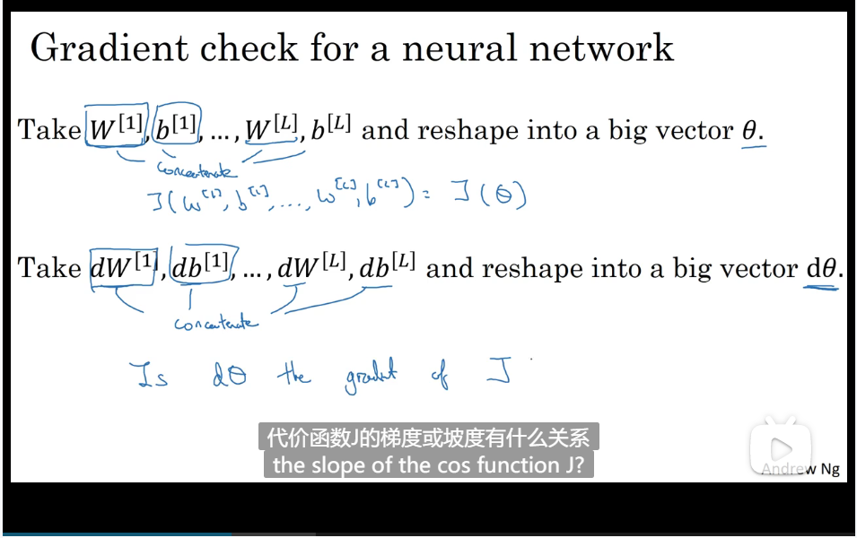

    - 从整体上看，现在代价函数已经变成$J(\theta) = J(\theta_1,\theta_2,\theta_3,...,\theta_i,...)$

    - 开始实施梯度检验，我们需要对一下步骤循环执行

    - 使用双边误差梯度检验求出大致的 $d\theta[i]$, 记为：$d\theta_{approx}[i] = \frac{J(\theta_1,\theta_2,\theta_3,...,\theta_i+\epsilon\,...)-J(\theta_1,\theta_2,\theta_3,...,\theta_i-\epsilon,...)}{2\epsilon}$;                    approx: 大约

    - 然后判断$d\theta_{approx}[i]$是否约等于$d\theta[i]$ ，判断方法如下：
      $$
      error[i] = \frac{||d\theta_{approx}[i]-d\theta[i]||_2}{||d\theta_{approx}[i]||_2+||d\theta[i]||_2}
      $$
      error[i]是误差，分子是$d\theta_{approx}[i]-d\theta[i]$的欧几里得范数，注意这里没有平方，这是一个欧式距离，分母的作用只是在预防这些向量太大或太小。

      在实际操作中可能$\epsilon$ = $10^{-7}$, 如果error[i]约等于或者小于$\epsilon$, 则一般都是正常的状态，否则就可能有问题，特别是相差很大时，大概率就是有bug了。

- 在神经网络中实施梯度检查的技巧和注意事项：

  - 不要在训练中使用梯度检查，它只用于调试。计算出所有的$d\theta_{approx}[i] $是一个漫长的过程。
  - 如果如果error[i]远大于$\epsilon$,我们要做的是找到对应的i值，定位到相应的层，看看是哪个导致的
  - 如果使用正则化，则需要注意J的正则项
  - 梯度检查不能和dropout同时使用，如果非要使用，请把dropout中的keep_prop设置为1

### 第二周

- 虽然使用了向量化，但是当在一个巨大的数据集基础上训练神经网络模型，其速度依然很慢，这就需要使用快速的好的优化算法来提高速度。

- mini- batch梯度下降算法就是一个优化算法。

  - 回顾之前的梯度下降算法：如果我们有500万条训练数据，那我们完成一遍梯度下降就要处理完500万条数据，这样的效率很低。

  - 我们把这500万条数据进行分割成一个个小块儿，一块儿中包含1000条数据，那就有了5000个块儿。一个块儿也被称为一个训练子集，这些子集也叫作mini-batch

    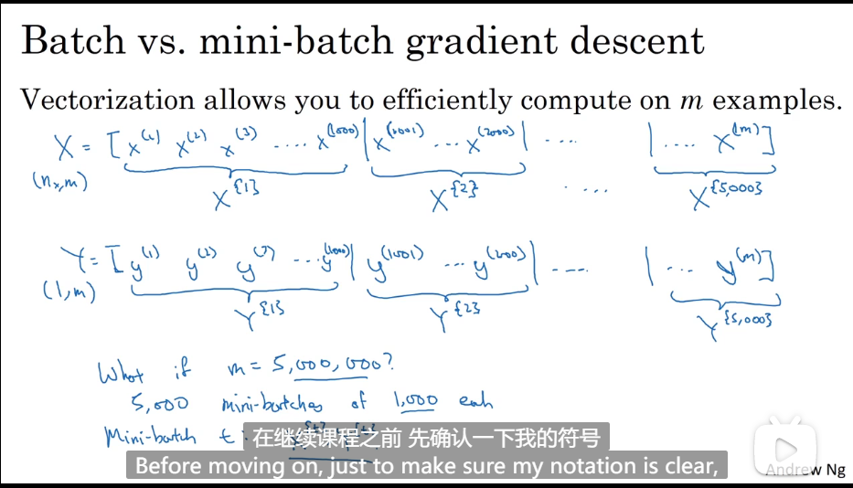

  - $X^{\{t\}},Y^{\{t\}}$ 代表第t个mini-batch。在这个例子中$X^{\{t\}},Y^{\{t\}}$ 的维度分别为（n<sub>x</sub> , 1000）,(1, 1000)

    - 举个例子：当输入从第八个mini-batch的第七个的例子的时候，你会用哪种符号表示第三层的激活？ 答案：$a^{[3]\{8\}(7)}$ ;

  - mini-batch算法的思路：

    - 之前我们的梯度下降算法是同时处理整个训练集，而mini-batch梯度下降算法一次梯度下降只处理一个训练子集的数据。
    - 使用for循环遍历整个mini-batch（本例中循环5000次），然后以一个训练子集作为训练集来进行梯度下降。使用这种方法一次遍历训练集（也叫进行一代的训练）就相当于进行了5000次梯度下降。
    - 当我们想要多次遍历训练集，那我们需要在for循环前加一个while循环，就这样操作，直到找到一个合适的精度

- 关于mini-batch的成本函数图：

  - 如果使用 之前的梯度下降算法，那么成本函数 J 的图形应该是一直下降的，如果出现了上升的情况，那很可能是出现了错误。

  - 在使用mini-batch梯度下降算法，那么成本函数 J 的图形很可能是上下波动的，但在大方向上是下降的，这是因为，每次梯度下降的训练数据都不一样，有可能第一个mini-batch比较简单，所以成本就低，而第二个mini-batch比较复杂，成本就高。

    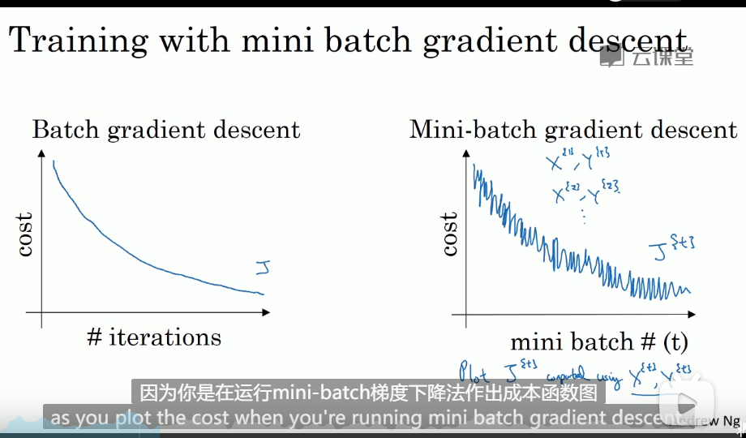

- 如何选择mini-batch的size呢？

  - 先探索一下两个极端情况size = m和size = 1的情况。

    - size = m是和以前传统的梯度下降一样，比较耗时
    - size = 1 是叫做随机梯度下降，这样的话会失去向量化带给我们的加速，一次处理一个样本，效率低下。

  - 正确的做法是取1~m之间的值

    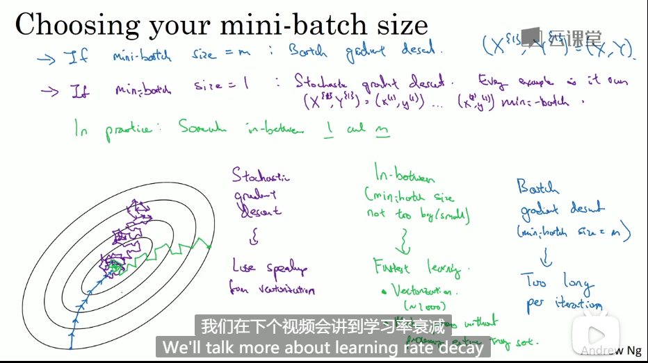

  - 当样本数据过少时（m<= 2000）, 通常之间使用传统的梯度下降算法（这里说的传统的梯度下降算法是之前学习的那种，叫做batch梯度下降算法。）

  - 一般size的值为2的n次方，例如，64, 128, 256, 512  这几个数字比较常见，1024就比较少见了。

  - size的大小要与GPU或CPU的大小相匹配，否则表现效果会极度下降。

- 之前我们学习的梯度下降没有任何优化，那叫做批量（batch）梯度下降，现在学习了小批量（mini-batch）梯度下降，还有一个当小批量足够小，只包含一个样本时，就叫做随机梯度下降

- 指数加权平均

  1. 为什么要学习指数加权平均？

      指数加权平均是深度学习众多优化算法的理论基础，包括Momentum、RMSprop、Adam等

  2. 什么是指数加权平均？

     介绍这个之前，我们先看一下普通的求平均数的算法，如果想求100天的气温平均值，那么我们可以把这100天的气温值加起来除以100就得到了这个平均值，这是我们之前的做法，现在我们分析一下这个算法，这就相当于把每天的气温值都乘以 1/100 然后相加，也就是每天的权重是1/100 ，但是按照实际来说，我们这样求得的平均值没有太大的实用意义。按照我们习惯的理解方法，如果我们想利用前100天的气温预测第101天的气温，哪一天的气温更具有参考价值呢，很显然是第100天的气温值更具有参考价值，其次是第99天的气温值。那么我们给 具有更多参考价值的数据 较大的权重，同时也不落下参考价值相对较小的数据（给一个相对较小的权重），用这样一种方法是不是可以更合理地预测第101天的数据了呢。这种算法就叫做加权平均。那什么是指数加权平均呢？看指数加权平均的公式：

     ​	                                  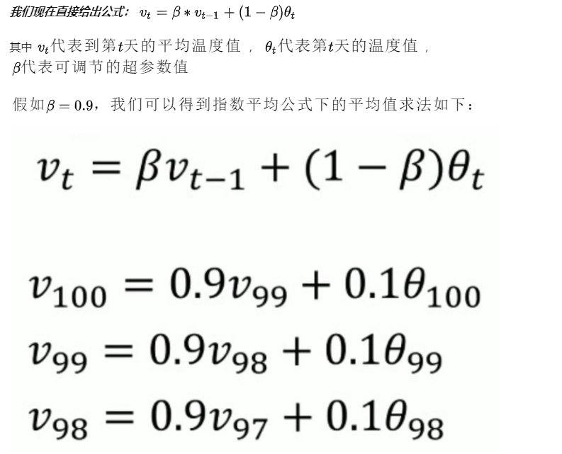

     ​    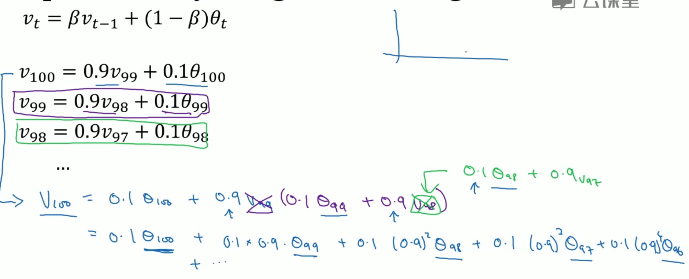

     在这个例子中，第一百天的指数加权平均值等于1~99天的数据乘以不同的权重，权重分别为0.1， 0.1*0.9, 0.1\*0.9<sup>2</sup>, 0.1\*0.9<sup>3</sup>, ...

     , 通过权重的变化你大致明白他为什么叫做指数权重平均了。对比我们普通的求平均值的方法，不一样之处就在于每一项的权重会根据其实际的作用而变化。

     

  3. 公式中的  $\beta$  如何选择：

     这里有一个小知识：

     ​	$v_t$的值相当于是$\frac{1}{1-\beta}$ 个值的加权平均值，因为 当一个数据的权重小于当日数据权重的1/3时，它就不会起到明显的作用了，因为$\frac{1}{e}\approx0.35\approx\frac{1}{3}$ ，而$\frac{1}{e} \approx \beta^{\frac{1}{1-\beta}}$ ，所以指数加权平均就相当于最近$\frac{1}{1-\beta}$ 的平均值。

     ​	例如 $\beta$ = 0.9 时，就相当于是最近10天的平均值，当 $\beta$ = 0.98 时，就相当于是最近50天的平均值。

     继续说$\beta$ 如何选择，看一下三种情况：

     ​	当$\beta$ = 0.9时，指数加权平均值的图形线（红色）：

     ​                                           		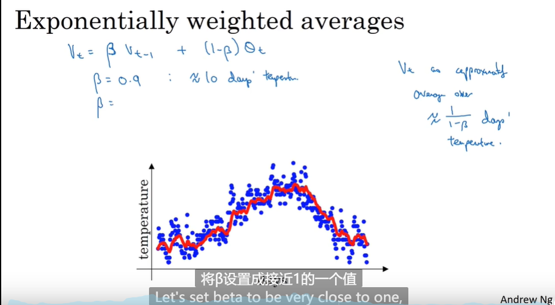

     ​	当$\beta$ = 0.98时，指数加权平均值的图形线（绿色）：

     

     ​	                                               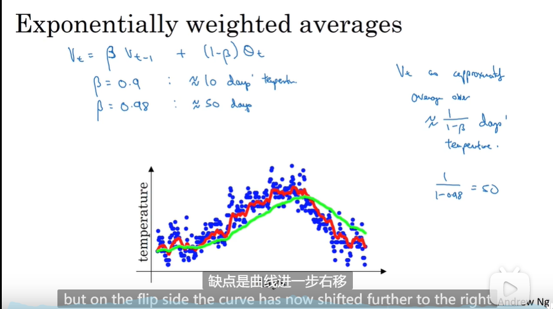

     当$\beta$ = 0.02时，指数加权平均值的图形线（黄色）：

     

     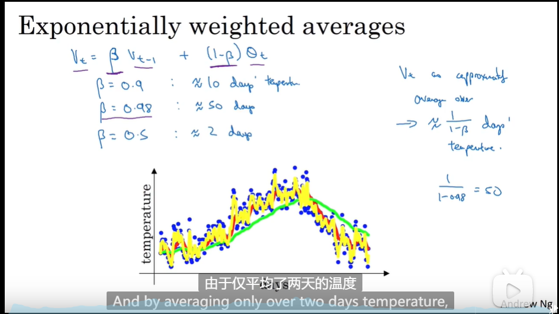

     当$\beta$ = 0.9时，似乎可以根据历史温度预测明天温度的最恰当的取值；

     当$\beta$ = 0.98时，指数加权平均减慢了对历史温度的衰减，因而纳入了更多的历史温度信息，导致绿线在上升阶段的值小于红线，且最高点滞后于红线，反应比较迟缓。

     当$\beta$ = 0.02时，历史温度信息几乎没有纳入指数加权平均的计算中，更注重最近几天的温度。时效性增强。

     

       通过上面的内容可知，β 也是一个很重要的超参数，不同的值有不同的效果，需要调节来达到最佳效果，**一般 0.9 的效果就很好**。

  4. 指数加权平均的好处：

     相比传统求平均数的方法，它只需保存上一天的加权平均数和今天的数据，就可计算今天的品均值，占用内存空间非常小；而传统的求平均数的方法，需要保存所有天的数据，占用空间较大。

- 偏差修正

  举个例子：当$\beta$ = 0.98 时，我们以为指数权重平均值的图形是绿色的，其实它是紫色的。

  ​                                           	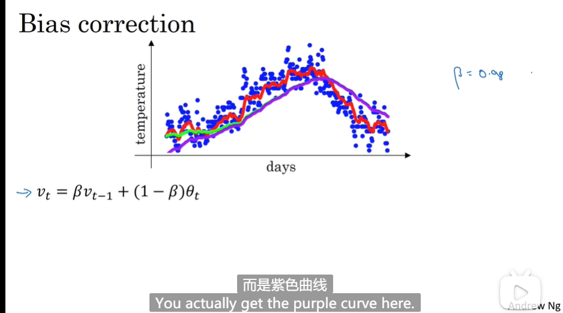

  

因为我们在初始化时，将$v_0$ = 0,  导致  $v_1 = 0.02*\theta_1$，  远小于当天的值（$\theta_1$）, $v_2 = 0.0196*\theta_1+0.02*\theta_2$ ，远小于当天的值（$\theta_2$）

但是随着数据的增多，这种偏差会逐渐消失，平均值也回归了正常。

偏差修正就是用于解决在刚开始计算指数权重平均值时出现偏差的问题的。怎样解决呢，通过公式：

第一步：$v_t = \beta*v_{t-1}+(1-\beta)*\theta_t$   （和之前一样）

第二步：$v_t = \frac{v_t}{1-\beta^t}$   ,  (t 代表 第t天)

按照这样的方式求出的$v_t$ 在初始值也不会有明显的偏差。

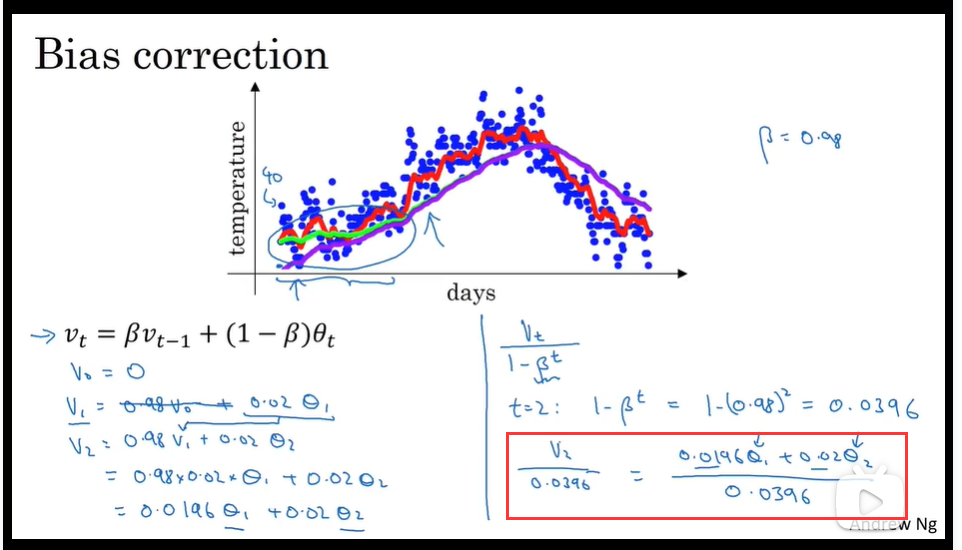

注意几点：

 	1. 在 t 较大时偏差修正并不起什么作用，做不做偏差修正都差不多；
 	2. 在机器学习过程中人们有时候不太在乎执行偏差修正，不进行偏差修正，只要熬过数据的初期阶段，同样也能得到正常的估测。
 	3. 偏差修正只是在帮助你在早期获得更好的估测。


- 鲁棒性：鲁棒是Robust的音译，也就是健壮和强壮的意思。它也是在异常和危险情况下系统生存的能力。比如说，计算机[软件](https://baike.baidu.com/item/软件)在输入错误、磁盘故障、网络过载或有意攻击情况下，能否不死机、不崩溃，就是该软件的鲁棒性。

-  Momentum梯度下降算法：一种运行速度快于标准的梯度下降算法的算法。基本的思路就是：计算梯度（dW，db）的指数加权平均数，并用该平均数更新参数（W,b)的值。

  

  - 具体做法：

    ​	在每一次梯度下降，求出dW和db后：

    第一步：$V_{dW} = \beta*V_{dW}+(1-\beta)*dW$    （dW和db的初始值是0矩阵（向量））

    ​				$V_{db} = \beta*V_{db}+(1-\beta)*db$

    第二步：$W = W-\alpha*V_{dW}$

    ​		        $b = b-\alpha*V_{db}$

  - 为什么要这样做呢？或者说这样做有什么好处吗？

    标准的梯度下降算法（batch梯度下降或mini-batch梯度下降）在每次迭代时都会上下波动地接近最小值（图中蓝色折线），这种上下波动减慢了梯度下降的速度，你也无法利用更大的的学习率来提升速度（因为一旦学习率增大，则每次迭代的波动就会更大，可能会偏离函数的范围，如图紫色折线）；所以我们认为在纵轴上学习慢一些（波动小一些），在横轴上加快学习。使用momentum梯度下降算法求得的$V_{dW}和V_{db}$ 它是最近10次（$\beta = 0.9$）梯度的平均值，而每一次梯度都是上下波动，在纵轴上有正有副，所以平均值在纵轴上接近0，而在横轴上都是朝着一个方向，所以横轴上的平均值仍然很大，所以这样做就达到了我们的目的（图中红色折线）

    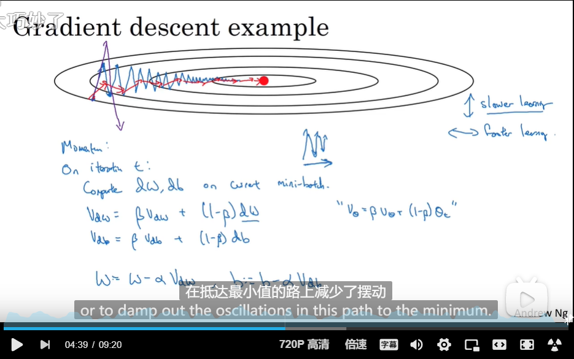

  - 在进行momentum梯度下降时往往不会使用偏差修正，因为10次迭代之后，已经过了初始阶段，不再是一个具有偏差的预测。

  - 注意事项：

    有时我们会见到这样的momentum梯度下降

    ​	$V_{dW} = \beta*V_{dW}+dW$    

    ​	$V_{db} = \beta*V_{db}+db$

    ​	这样也是正确的，和第一种的公式的效果差不多，只不过学习率$\alpha$会有变化，推荐使用第一种。

- RMSprop算法：全称叫root mean square prop(均方根)；它是通过改变学习率来来加速梯度下降。

  - 如果使用标准的梯度下降，每一次下降都伴随着震荡，假设纵轴上震荡幅度很大（如图蓝色折线），假设b代表纵轴，w代表横轴；那么我们就想减少b的震荡同时增加w的速度，为了达到目的，我们使用RMSprop会这样做：

    在计算出dW和db后，

    第一步：计算$S_{dW}和S_{db}$

    ​				$S_{dW} = \beta_2*S_{dW}+(1-\beta_2)*(dW)^2$

    ​				$S_{db} = \beta_2*S_{db}+(1-\beta_2)*(db)^2$

    第二步：更新W和b

    ​				$W = W- \alpha*\frac{dW}{\sqrt{S_{dW}+\varepsilon}}$

    ​				$b = b- \alpha*\frac{db}{\sqrt{S_{db}+\varepsilon}}$

  - 这样做会有什么效果呢？如果b的震荡较大，那么db就会很大，进而导致$S_{db}$会很大，进而导致$\frac{db}{\sqrt{S_{db}+\varepsilon}}$会很小，进而导致b的更新会很小，进而减缓b的波动，而如果W的波动较小，则会相反，会导致W的更新很大，进而加快了速度。这样的一套操作也就相当于改变了更新的速度，就像改变学习率一样。

  - 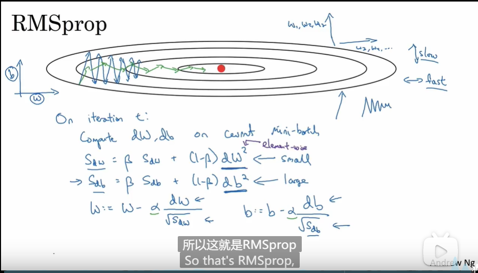

  

  - 注意事项：
    - $\varepsilon$ 是一个常数项，目的是为了防止当$S_{dW}$接近于0时，$\frac{dW}{\sqrt{S_{dW}}}$过大，通常$\varepsilon = 10^{-8}$;
    - $\beta_2$是为了与Momentum梯度下降中的$\beta$做区分而起的名字

- Adam算法：一种具有一般化，很常用，且效果较好的梯度下降算法，它是Momentum算法和RMSprop算法的结合体，全称： Adaptive Moment Estimation，也被称为Adam权威算法

  - 具体实现：

    在计算出dW和db后，

    第一步：初始化  $V_{dW} = 0,S_{dw} = 0,V_{db}=0,S_{db} = 0$

    第二步：$V_{dW} = \beta_1*V_{dW}+(1-\beta_1)*dW$    

    ​				$V_{db} = \beta_1*V_{db}+(1-\beta_1)*db$

    ​				$S_{dW} = \beta_2*S_{dW}+(1-\beta_2)*(dW)^2$

    ​				$S_{db} = \beta_2*S_{db}+(1-\beta_2)*(db)^2$

    第三步：偏差修正(t代表迭代次数)

    ​				$V_{dW}^{corrected} = \frac{V_{dW}}{1-\beta_1^t}$

    ​				$V_{db}^{corrected} = \frac{V_{db}}{1-\beta_1^t}$

    ​				$S_{dW}^{corrected} = \frac{S_{dW}}{1-\beta_2^t}$

    ​				$S_{db}^{corrected} = \frac{S_{db}}{1-\beta_2^t}$

    第四步：更新W和b

    ​					$W = W- \alpha*\frac{V_{dW}^{corrected}}{\sqrt{S_{dW}^{corrected}+\varepsilon}}$

    ​					$b = b- \alpha*\frac{V_{db}^{corrected}}{\sqrt{S_{db}^{corrected}+\varepsilon}}$

    超参数的取值：

    ​	$\alpha$  : 需要不断调试

    ​	$\beta_1$ = 0.9

    ​	$\beta_2$ = 0.999

    ​	$\varepsilon = 10^{-8}$

    一般超参数就是这个固定值，可以适用大部分场合。

- 学习率（$\alpha$）衰减

  - 为什么要让学习率衰减？我们先来看看学习率不衰减会有什么问题。

    我们使用mini-batch梯度下降，使用固定的$\alpha$ ,会出现图中蓝色折线，在快接近最小值时，由于学习率较大，它始终在最小值周围盘旋。

    如果我们让学习率衰减，在快接近最小值时，让$\alpha$逐渐减小，也就是让步伐放慢，他会出现图中绿色的折线，会无限接近最小值。

    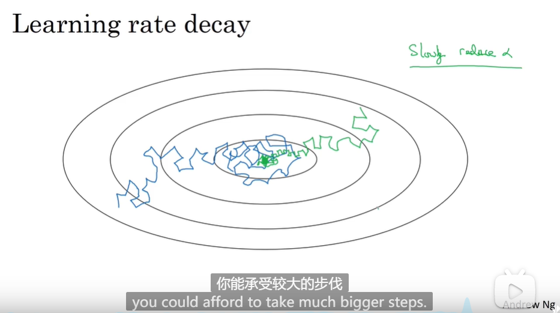

  - 在学习初期可以接受较大的学习率，而随着逐渐收敛，更小的学习率会让迭代的步伐变慢，从而表现更好。

  - 如何做到让学习率衰减呢？

    ​	前提：我们把整个训练集切分为小的mini-batch，使用mini-batch梯度下降，当全部的min-batch都遍历完，也就是所有的训练集都使用一遍，我们称之为1代（one epoch）

    让学习率衰减的方法有很多，我们介绍几种：

    第一种： $\alpha = \frac{1}{1+decay\_rate*epoch\_num}* \alpha_0$      $decay_rate:衰减率（这是一个超参数）， epoch_num: 第几代$

    第二种：$\alpha = 0.95^{epoch\_num}*\alpha_0$ (0.95是一个固定值，你也可以写成0.9、0.92等等)

    第三种：$\alpha = \frac{k}{\sqrt{epoch\_num}}*\alpha_0$  (k 是一个固定的常数)

- 局部最优解的问题

  - 我们直观上认为在梯度下降时很有可能会遇到局部最优解，那是因为我们仅仅是凭直觉和经验认为他会有局部最优解，而真相是在深度学习中我们可能从来都都没有遇到过具备最优解。

    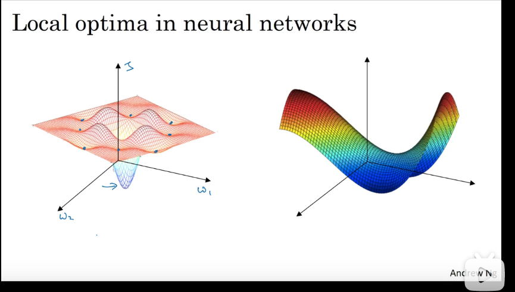

  - 我们往往会想象出图中左侧的立体图像，而这个图像只有两个参数，看，这个图像有很多局部最优解。但是我们的深度学习模型往往会有很多参数，甚至是上万个参数。我们来思考一下，产生局部最优解的条件是什么，就是在局部的区间内，各个维度都达到了最小值，二维很容易达到，三维很容易达到，但是在一个一万维的图形里，它还那么容易达到吗？如果要想达到，那在局部范围内一万个维度要同时达到最小值，这样的概率是很小的。所以局部最优解很难产生。

  - 我们所认为的局部最优解很有可能是一个鞍点（很像一个马鞍），就是一部分维度达到了局部最小，而另一部分维度则没有，如图中右侧，当遇到这样的情况时学习速度会变得很慢，所以我们要用到各种优化算法来提升学习速度，例如Adam算法。

### 第三周

- 不同超参数的重要性不同：学习率$\alpha$ 最为重要，Momentu中$\beta$ 、mini-batch中的size、隐藏单元的个数是第二重要的，层数、学习率衰减是第三重要的。

  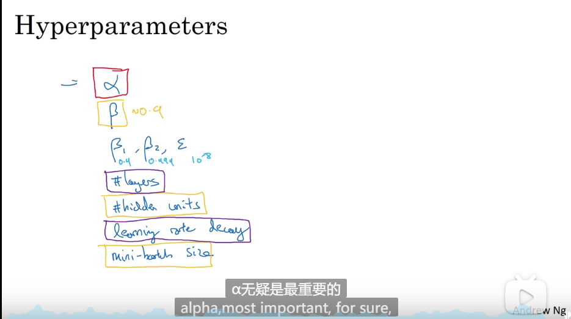

- 超参数调优的方法：在选择超参数的值时，往往随机选点，由粗糙到精细逐渐缩小范围的方式可以达到更好的效果。

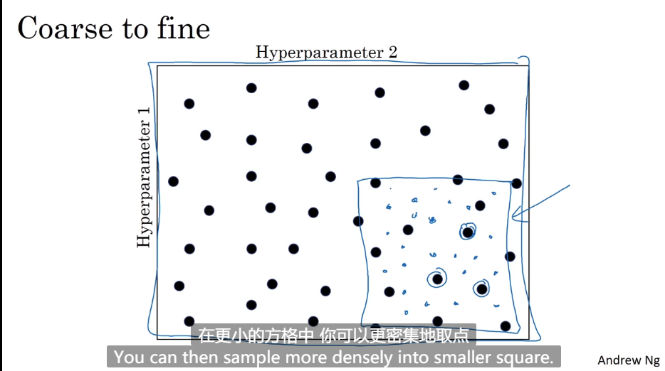

- 随机取值并不是随机均匀取值，而是选择合适的标尺，再随机选值。

  - 什么是随机均匀取值？ 例如你想在2~4之间取值，我们随机均匀取值的话可能去的是2,3,4；间隔比较均匀。这种方法虽然合理，但不适用于所有参数的取值。

  - 什么是选择合适的标尺，再随机选值？

    假设我们要给学习率$\alpha$ 随机选值，范围是0.00001~1之间，如果我们使用随机均匀取值，那么选择到0.00001-0.1之间的概率只有百分之十，而选择0.1-1的概率是百分之九十，根据经验知，$\alpha$ 的合理的取值范围很可能在0.00001~0.1之间，所以这样取值不合理。怎样做才合理呢？我们把这一段范围按照$10^-1$ 划分为0.00001,0.0001,0.001,0.01,0.1,1，然后再取值，这样取值就比较合理。

    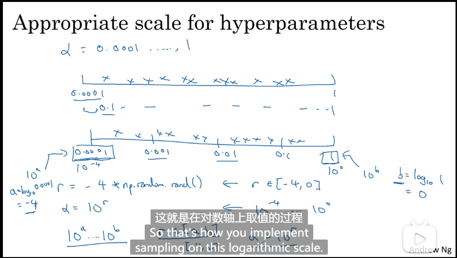

- 如果是在0.9~0.999之间取值，怎么划分合适的标尺呢？

  Momentum中的$\beta$ 可能合理的范围是0.9~0.999，我们可以令l = 1-$\beta$, 然后在利用上面的方法对l进行取值

  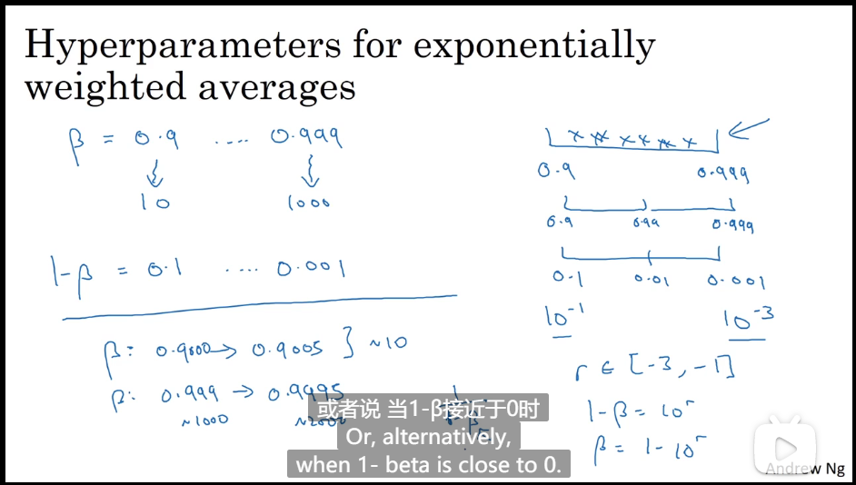

- 为什么要划分标尺再随机取值呢？

  以$\beta$ 为例，当$\beta$的值离1越近，对模型的影响就越大，可能0.9~0.9005之间的取值模型没有明显变化，但是0.9985-0.9990之间的取值模型的波动就非常大了。

- 对于超参数设定的几个建议
  - 不同领域的参数值（不止是参数值）有可能是通用的
  - 没个一段时间要重新评估已设定的超参数，超参数可能会因为服务器的改变等一些原因而改变

- 当我们按照以上方法选择了随机值，我们如何测试这些值，并选择一个最优值呢？ 这分为两种情况：一种是我们的计算机资源不是很充足的情况，和计算机资源很充足的情况

  - panda approach （熊猫方式，不是正式的名字）

    当我们计算机资源相对不是很充足，一次只能训练一个模型的时候。这种方式就是我们训练一个模型，每间隔一段时间（比如一天）观察该模型的学习曲线（损失函数），然后根据情况调整相应的参数继续训练（不是重新开始训练，而是接着继续训练），最后得到合适的参数。

  - Caviar approach(鱼子酱方式)

    当我们计算机资源很充足的时候我们就可以同时开启很多个模型的训练，最选择一个表现最好的模型。

    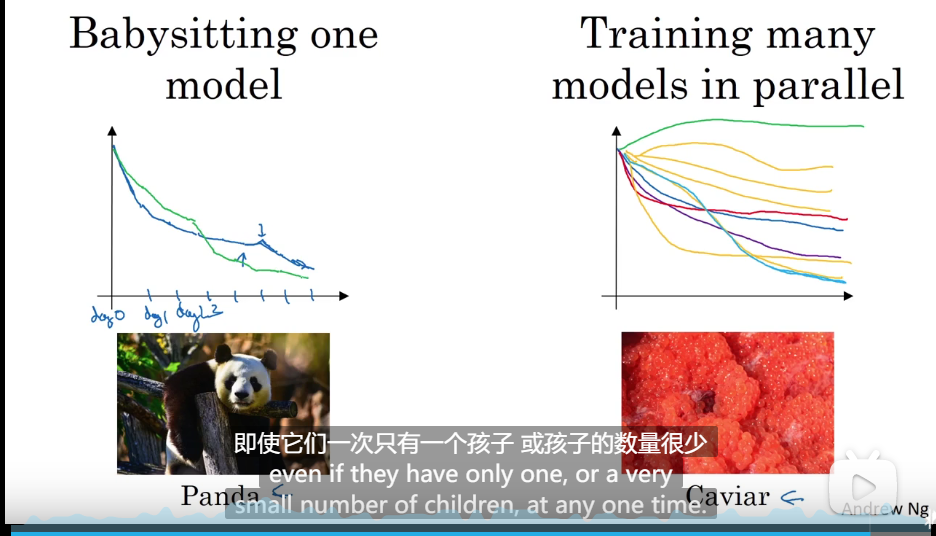

- Batch归一化

  - 首先回顾一下归一化输入特征，归一化可以让输入特征移动到原点周围和方差都等于1，这样有利于加快训练速度。同样地，Batch归一化也是具有同样的作用，它变现的更强大，不仅可以归一化输入特征，而且可以归一化隐藏层中的 激活函数值（实际上是通过归一化Z，间接归一化a），从而达到加快训练速度的效果。

  - 

  - - 如何实施Batch归一化呢？

      背景：在神经网络的某一层，有m个样本，$Z^{[i]}$ 表示第i个神经单元的z值。

      <font color='red'>切记：$\sum_{i=1}^{m}Z^{(i)}$是横向相加，不是纵向相加，每个样本得到一个Z，然后把所有样本的Z横向相加</font>

      公式：
      $$
      \mu = \frac{1}{m}\sum_{i=1}^{m}Z^{(i)}\\
      \sigma^2 = \frac{1}{m}\sum_{i=1}^{m}{(Z^{(i)}-\mu)}^2\\
      Z^{(i)}_{norm} = \frac{Z^{(i)}-\mu}{\sigma^2+\epsilon}\\
      \epsilon 的目的是为了防止\sigma^2等于0\\
      　　　　　　　　　　　　　　　　　　　　\widetilde{Z}^{(i)} = \gamma Z^{(i)}_{norm}+\beta　　　(\gamma和\beta 是模型的学习参数，需要使用梯度下降来更新这两个参数)
      $$

  - 最后一个公式正常的归一化没有，之所以求$\widetilde{Z}^{(i)}$,是因为我们不想让隐藏单元总是含有平均值0和方差1（归一化的结果），每个隐藏单元有不同的分布才会有意义。

  - $\gamma和\beta$（不是超参数）的作用是可以让我们根据需要改变$\widetilde{Z}$的平均值

    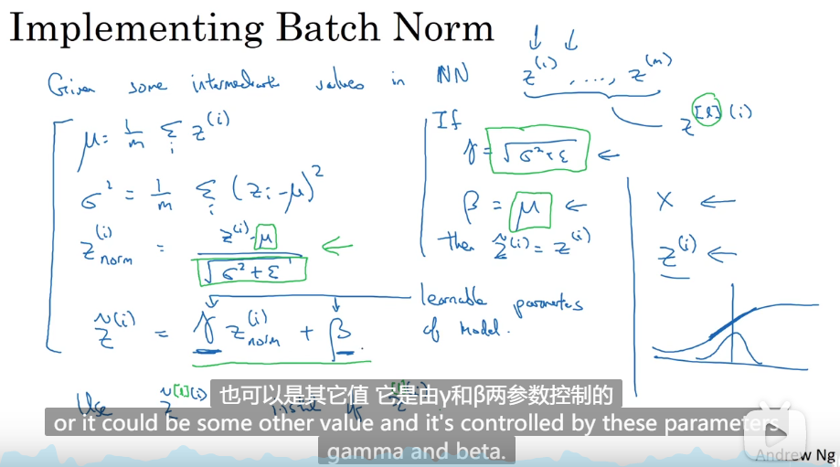

- 需要注意的一点是：batch归一化是发生在计算Z和a之间的，$\gamma和\beta$与W和b一样都是参数，也需要计算$d\beta$

ps：Batch归一化通畅简写为“BN”

- 当我们使用Batch归一化时，由于Z会被均值话化，所以Z = wx+b中，b无论去什么值都会被均值化，变得没有意义，所以我们可以在神经网络中去掉b这个参数，或者令其为0。（其实是$\beta$代替了b的功能）

  ​	                 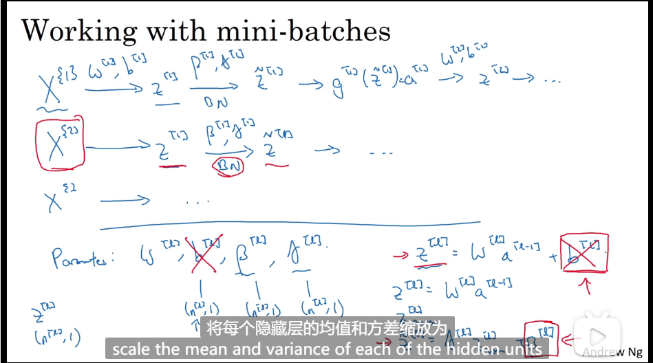

  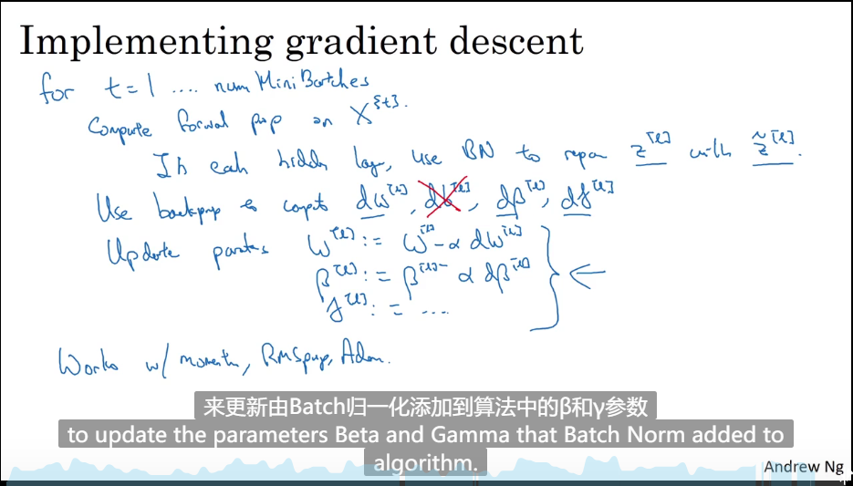

- Batch归一化看似复杂，到后期我们使用深度学习框架时，只需一行代码就可以实现batch归一化。

- Batch归一化为什么有效呢？

  - 输入特征值通过归一化获得类似的范围，可加速学习
  - 在不使用Batch归一化时，如果前一层神经网络的参数发生变化，那么后一层的神经网络也会相应地去适应前一层的变化而发生变化，就是后一层对前一层的依赖很大，这叫做Internal  Covariate Shift。这有什么问题呢？上层网络需要不停调整来适应输入数据分布的变化，导致网络学习速度的降低。而使用Batch归一化后，对于每一层来说，输入值具有相同的均值和方差，这就限制了输入值的变化不会太大，从而，对该层参数的影响也不会太大，所每一层的参数就会变得更加独立，是的学习更加稳定。
  - BN具有一定的正则化效果，在Batch Normal中，由于我们使用mini-batch的均值与方差作为对整体训练样本均值与方差的估计，尽管每一个batch中的数据都是从总体样本中抽样得到，但不同mini-batch的均值与方差会有所不同，这就为网络的学习过程中增加了随机噪音，与Dropout通过关闭神经元给网络训练带来噪音类似，Batch归一化在一定程度上对模型起到了正则化的效果。

- Batch归一化可以和dropout同时使用。

- 在测试时我们可能需要对每个样本进行逐一处理，这时获取Batch归一化公式中的$\sigma^2和\beta$ 就不方便了，因为就一个数据，所以没有意义。那我们如何获取测试用的$\sigma^2和\beta$呢？

  使用指数加权平均来计算$\sigma^2和\beta$，简单来说就是把训练样本时的每一个mini-batch中的$\sigma^2和\beta$进行指数加权平均来求得测试所用的$\sigma^2和\beta$。

  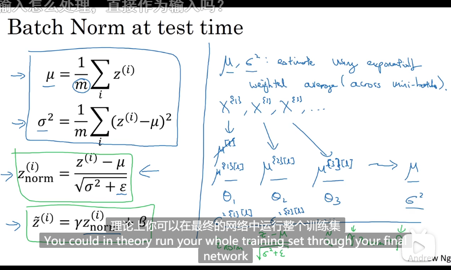

- softmax回归

  与logistics回归相类似，逻辑回归是将问题二分类，而softmax回归可以将问题进行多分类。

- softmax回归实现方式

  前提：令C = 分类的个数，例如我们想把一个事物分成四类，那么C = 4

  在神经网络的最后一层即L层，神经单元的个数是C = 4

  第一步：按照以前的方式计算出$Z^{[l]}$

  第二步：令临时变量 t = $e^{(z^{[l]})}$，t的shape为（4,1）

  第三步：$a^{[l]} = \frac{t}{\sum_{j=1}^{l}{t_i}}$

  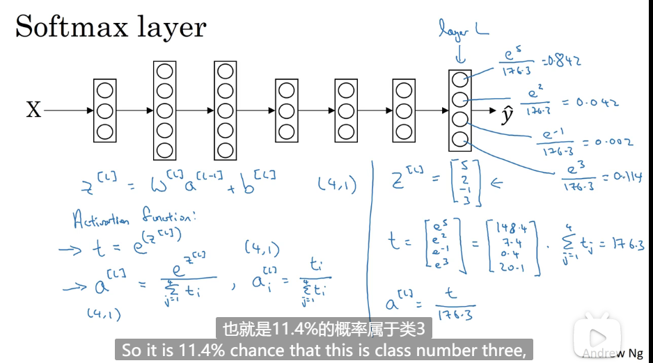

- softmax的名字来源：与hardmax相反，softmax对于结果显示的是具体的比例值，儿而hardmax是吧概率最高的显示为1，其余显示为0，显然，softmax表示的结果更为温和。

- 怎样训练带有softmax输出层的神经网络：

  单个样本的成本函数：
  $$
  \zeta(\hat{y},y) = -\sum_{j=1}^{C}{y_jlog\hat{y_j}}
  $$
  多个样本的损失函数：
  $$
  J(W,b) = \frac{1}{m}\sum_{i=1}^{m}\zeta(\hat{y}^{(i)},y^{(i)})
  $$
  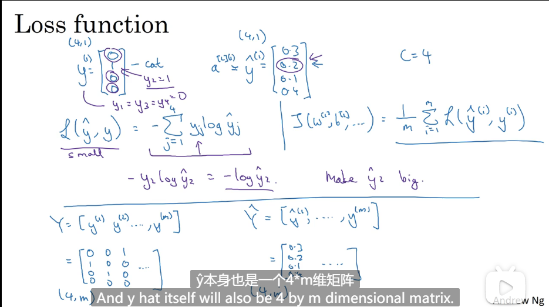

  backprop:
  $$
  dZ^{[L]} = y-\hat{y}
  $$
  

- 选择一个深度学习框架的标准

  - 易于编程
  - 运行速度快
  - 真的开源

- 

  