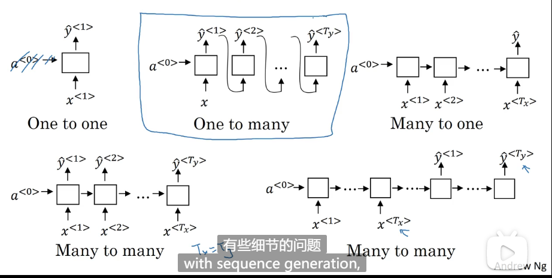
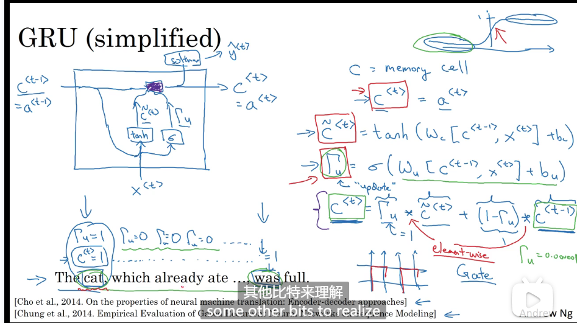
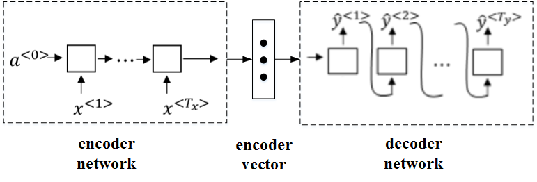
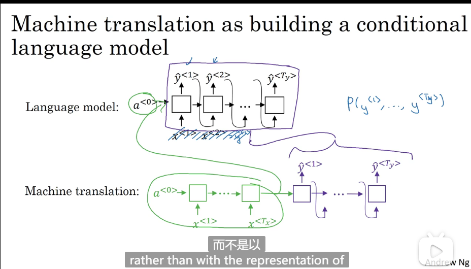
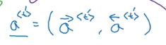

### 第一周

- 序列模型

  序列一词 实际上就是由论文中的英文单词sequence翻译过来，指的是比如语音数据、文本数据、视频数据等一系列具有连续关系的数据。一段语音， 一段文本数据这些都是序列模型（sequence models）

- 序列模型中所用的符号

  - 如果我们输入一段文字，我们使用$x^{<t>}$来表示文字中第t个单词

  - 使用$y^{<t>}$来表示输出值中第t个结果

  - 使用$T_x$来表示输入值单词的个数，使用$T_y$来表示输出单词的个数

  - 使用$x^{(i)<t>}$来表示样本集中第i个样本的输入值中的第t个单词，$y^{(i)<t>}$同理。

    

- 怎样表示一个句子里的单个词？

  我们如何具体地表示一个句子中的某个词，例如句子中有个词：and，我们如何表示and？方法是建立一个字典，字典中包含所有用到的单词，例如我们有10000个常用的单词作为一个字典，每个单词对应一个唯一的序号，例如 and 这个词对应的序号可能是367，于是我们可以使用一个10000*1的向量来表示and这个词，只有第367位是1，其余全是0，这样的表示方法也叫作one-hot表示法。

  如果遇到了一个不在词表中的单词，答案就是创建一个新的标记，也就是一个叫做**Unknow Word**的伪造单词，用<**UNK**>作为标记，来表示不在词表中的单词。

  

- 循环神经网络（RNN）

  - 为什么我们不用传统的标准神经网络来处理序列模型这样的问题呢？我们来看一下使用标准神经网络会有什么问题

    - 首先，输入和输出数据在不同的例子中可以有不同的长度，这一点使用标准神经网络就不好解决。
    - 这种标准的神经网络结果并不能共享从文本不同位置所学习到的特征。

  - 循环神经网络就可以解决以上两个问题，看看简单的RNN长什么样：

    

  - 循环神经网络会传递一个激活值到下一个时间步中，用于下一时间步的计算，每一层都会输出两个值，一个是对于$x^{<t>}$的结果$y^{<t>}$,另一个就是用于计算下一层结果的$a^{<t>}$.

  - 这里需要注意在零时刻($a^{<0>}$)，我们需要编造一个激活值，通常输入一个零向量，有的研究人员会使用随机的方法对该初始激活向量进行初始化。

  - 循环神经网络是从左到右扫描数据的，同时共享每个时间步的参数。

    

    - 循环神经网络的参数是共享的，也就是说在这么多层中的$W_{ax},W_{aa},W_{ay}$是一样的。

    - 公式如下：
      $$
      a^{<t>} = g(W_{aa}·a^{<t-1>} +W_{ax}·x^{<t>}+b_a)\\
      \hat{y}^{<t>} = g(W_{ya}·a^{<t>}+b_y)
      $$

      - 第一个g()一般使用tanh，也可以使用ReLU
      - 第二个g()一般使用sigmoid，如果是多分类问题也可以使用softmax
      - 其中$W_{ax}$表示，前面的a表示要得到一个a类型的量，x表示参数W要乘以一个x类型的量，$W_{aa},W_{ay}$同理；
      - 

- 对公式的简化，把上面两个公式化简为：
  $$
  a^{<t>} = g(W_{a}·[a^{<t-1>},x^{<t>}]+b_a)\\
  \hat{y}^{<t>} = g(W_{y}·a^{<t>}+b_y)
  $$
  其中,关系看图：

  

- 穿越时间的反向传播

  我们已经知道了RNN正向传播，那么它的方向传播无非就是倒着来一遍，因为RNN的正向传播是随着时间的推进从左往右一次递进，而反向传播则就是逆着时间进行，好像是从现在回到了以前的时间点，所以它RNN的反向传播又叫做穿越时间的反向传播。

- 

  - 单个元素的损失函数：
    $$
    L^{<t>}(\hat{y}^{<t>},{y}^{<t>}) = -{y}^{<t>}·log\hat{y}^{<t>} - (1-{y}^{<t>})log(1-\hat{y}^{<t>})
    $$

  - 成本函数：
    $$
    L(\hat{y},y) = \sum_{t=1}^{T_y}L^{<t>}(\hat{y}^{<t>},{y}^{<t>})
    $$

  - 损失函数使用logistic交叉熵损失函数

- 不同类型的RNN模型

  我们已经学习了一种基本的RNN模型，在这个模型中有多个输入和多个输出，且输入的数量和输出的数量是相同的，即：$T_x = T_y$，除了这个模型外，我们还有其他模型

  - 多对对模型（$T_x = T_y$）,这种情况下的输入和输出的长度相同，例如判断一个句子里的人名。

  - 一对多模型，如在音乐生成的例子中，输入一个音乐的类型或者空值，直接生成一段音乐序列或者音符序列。在这种情况下，就是输入是一个值，但输出是一个序列

  - 多对一模型，如在情感分类问题中，我们要对某个序列进行正负判别或者打星操作。在这种情况下，就是输入是一个序列，但输出只有一个值

  - 多对多模型（$T_x \neq T_y$）: 这是另一种多对多的模型，都是多个输入和输出，但是输出和输出的数量不一样，例如输入一个英文句子，输出一个中文句子。

  - 一对一模型，其实就是普通的神经网络模型，是前两课学习的内容。

    

  - 以上都是RNN的基本模型，把他们构建在一起就可以组建多种多样的模型。 

- 语言模型和序列生成
  在自然语言处理中，构建语言模型是最基础的也是最重要的工作之一，并且能用 RNN 很好地实现。那什么是语言模型呢？

  比如你在做一个语音识别系统，你听到一个句子，“the apple and pear （pair ） salad was delicious.”，所以我究竟说了什么？我说的是 “the apple and pair salad”，还是“the apple and pear salad”？（pear 和 pair 是近音词）。你可能觉得我说的应该更像第二种，而语言模型就是当出现多个不定的句子时，通过语言模型就可以选择出最正确的那一个句子，语言模型能计算出最终结果是每个句子的可能性。

  举 个 例 子 ， 一 个 语 音 识 别 模 型 可 能 算 出 第 一 句 话 的 概 率 是P(The apple and pair salad) = 3.2 × 10^ −13 ， 而 第 二 句 话 的 概 率 是P(The apple and pear salad) = 5.7 × 10 ^−10 ，比较这两个概率值，显然我说的话更像是第二种，因为第二句话的概率比第一句高出 1000 倍以上，这就是为什么语音识别系统能够在这两句话中作出选择。

- 如何构建语言模型

  - 首先我们要有一个很大的语言文本资料库
  - 然后我们将句子使用字典库标记起来（前提是我们需要构建自己的字典库），未出现在字典库中的词使用“UNK”来表示；
  - 首先使用零向量对输出进行预测，即预测第一个单词是某个单词的可能性；
  - 然后通过前面的输入，逐步预测后面一个单词出现的概率；
  - 使用softmax损失函数计算损失，对网络进行参数更新，提升语言模型的准确率

  

  需要注意的是：

  - $x^{<1>}$是0向量
  - $\hat{y}^{<t>}$是一个softmax输出的结果，他有10000个值，表示字典库中每个单词输出的概率，我们再从中去除特定单词的概率。

- 新序列采样

  在完成一个序列模型的训练之后，如果我们想要了解这个模型学到了什么，其中一种非正式的方法就是进行一次新序列采样（sample novel sequences）。具体怎么做呢？

  - 对于一个序列模型，其模拟了任意特定单词序列的概率，而我们要做的就是对这个概率分布进行采样，来生成一个新的单词序列。
  - 前提：已有一个一个已经训练好的RNN序列模型
  - 首先输入 $x^{<1>} = 0; a^{<0>} = 0$,在这第一个时间步，我们得到所有可能的输出经过softmax层后可能的概率，根据这个softmax的分布，进行随机采样，获取第一个随机采样单词$\hat y^{<1>}$;
  - 然后继续下一个时间步，我们以刚刚采样得到的$\hat y^{<1>}$作为下一个时间步的输入，进而softmax层会预测下一个输出$\hat y^{<2>}$，依次类推；
  - 如果字典中有结束的标志如：“EOS”，那么输出是该符号时则表示结束；若没有这种标志，则我们可以自行设置结束的时间步，比如到20步就停止。

- 基于字符的语言模型

  上面我们学习的都是基于词汇的语言模型，还有一种基于字符的语言模型，就是字典库总中不是一个个的单词而是字母和符号。

  - 但是基于字符的语言模型，一个主要的缺点就是我们最后会得到太多太长的输出序列，其对于捕捉句子前后依赖关系，也就是句子前部分如何影响后面部分，不如基于词汇的语言模型那样效果好；同时基于字符的语言模型训练代价比较高。所以目前的趋势和常见的均是基于词汇的语言模型。但随着计算机运算能力的增强，在一些特定的情况下，也会开始使用基于字符的语言模型。

-  RNN的梯度消失

  我们已经知道了 RNN 的样子，现在我们举个语言模型的例子，假如看到这个句子，“The cat, which already ate ……, was full.”，前后应该保持一致，因为 cat 是单数，所以应该用 was。“The cats, which ate ……, were full.”，cats 是复数，所以用 were。这个例子中的句子有长期的依赖long-term dependencies），也就是最前面的单词对句子后面的单词有影响。但是我们目前见到的基本的 RNN 模型，不擅长捕获这种长期依赖效应，解释一下为什么。

  你应该还记得之前讨论的训练很深的网络，我们讨论了梯度消失的问题。比如说一个很深很深的网络，100 层，甚至更深，对这个网络从左到右做前向传播然后再反向传播。我们知道如果这是个很深的神经网络，输出y得到的梯度很难通过反向传播再传播回去，也就是很难对前面几层的权重产生影响，这就意味着，实际上很难让一个神经网络能够意识到它要记住看到的是单数名词还是复数名词。也正是这个原因，所以基本的 RNN 模型会有很多局部影响，意味着这个输出值$\hat{y}$主要受周围附近的值的影响。

- RNN的梯度爆炸

  尽管我们一直在讨论梯度消失问题，但是，你应该记得我们在讲很深的神经网络时，我们也提到了梯度爆炸，我们在反向传播的时候，随着层数的增多，梯度不仅可能指数型的下降，也可能指数型的上升。事实上梯度消失在训练 RNN 时是首要的问题，尽管梯度爆炸也是会出现，但是梯度爆炸很明显，因为指数级大的梯度会让你的参数变得极其大，以至于你的网络参数崩溃。所以梯度爆炸很容易发现。如果你发现了梯度爆炸的问题，一个解决方法就是用梯度修剪。梯度修剪的意思就是观察你的梯度向量，如果它大于某个阈值，缩放梯度向量，保证它不会太大，这就是通过一些最大值来修剪的方法。

  

- GRU（Gated Recurrent Unit）门控循环单元

  为了解决RNN的梯度消失的问题，我们引入了GRU，主要思想就是使模型具有长期的记忆，能记住特定时间点的一些信息，比如在句子的主语处记录主语是单数还是复数，把这个信息传递下去，供后面的时间点使用该信息。

  

  你已经见过了这个公式，在**RNN**的时间处，计算激活值。我把这个画个图，把**RNN**的单元画个图，画一个方框，输入$a^{<t-1>}$（上图编号1所示），即上一个时间步的激活值，再输入（上图编号2所示），再把这两个并起来，然后乘上权重项，在这个线性计算之后（上图编号3所示），如果是一个**tanh**激活函数，再经过**tanh**计算之后，它会计算出激活值$a^{<t>}$。然后激活值$a^{<t>}$将会传**softmax**单元（上图编号4所示），或者其他用于产生输出$y^{<t>}$的东西。就这张图而言，这就是**RNN**隐藏层的单元的可视化呈现。我向展示这张图，因为我们将使用相似的图来讲解门控循环单元。

  

- GRU可以参考文档：https://blog.csdn.net/Dby_freedom/article/details/79901800    	http://www.ai-start.com/dl2017/html/lesson5-week1.html

- LSTM（Long Short term memory units）长短时记忆网络

  LSTM和GRU的作用一样，可以让我们学习非常深的序列模型，它甚至比GRU更加有效。LSTM是一个更加强大和通用的版本。

- GRU和LSTM公式的对比

  

  - 在LSTM中有三个控制门，分别是更新门，遗忘门，输出门，而且在LSTM中$a^{<t>}不直接等于c^{<t>}$

- LSTM的图展示

  

- GRU与LSTM各有擅长处，LSTM具有三个门(update gate, forget gate, output gate)，更加灵活，也更强大，但计算也更为复杂；而GRU则只有两个门，性能也还不错，计算消耗小，便于大规模部署；两者都有自己的适用场景，如果拿不准两者选择哪个的话建议选择LSTM。而事实上，目前也是LSTM用的更多一些。

- 使用LSMT的反向传播

  

- 双向RNN

  我们之前学习的RNN都是单向的，它有一定的局限性，举个例子，例如我们之前的一个问题，在一句话中找出人名，如下图，这个网络有一个问题，在判断第三个词**Teddy**（上图编号1所示）是不是人名的一部分时，光看句子前面部分是不够的，为了判断（上图编号2所示）是0还是1，除了前3个单词，你还需要更多的信息，因为根据前3个单词无法判断他们说的是**Teddy熊**，还是前美国总统**Teddy Roosevelt**，所以这是一个非双向的或者说只有前向的**RNN**。我刚才所说的总是成立的，不管这些单元（上图编号3所示）是标准的**RNN**块，还是**GRU**单元或者是**LSTM**单元，只要这些构件都是只有前向的。

  

- 双向RNN的工作机制

  这就是双向循环神经网络，并且这些基本单元不仅仅是标准**RNN**单元，也可以是**GRU**单元或者**LSTM**单元。事实上，很多的**NLP**问题，对于大量有自然语言处理问题的文本，有**LSTM**单元的双向**RNN**模型是用的最多的。所以如果有**NLP**问题，并且文本句子都是完整的，首先需要标定这些句子，一个有**LSTM**单元的双向**RNN**模型，有前向和反向过程是一个不错的首选。

  

- 双向RNN也有缺点：缺点就是你需要完整的数据的序列，你才能预测任意位置。比如说你要构建一个语音识别系统，那么双向**RNN**模型需要你考虑整个语音表达，但是如果直接用这个去实现的话，你需要等待这个人说完，然后获取整个语音表达才能处理这段语音，并进一步做语音识别。对于实际的语音识别的应用通常会有更加复杂的模块，而不是仅仅用我们见过的标准的双向**RNN**模型。但是对于很多自然语言处理的应用，如果你总是可以获取整个句子，这个标准的双向**RNN**算法实际上很高效。

- 深层RNN：

  目前你学到的不同**RNN**的版本，每一个都可以独当一面。但是要学习非常复杂的函数，通常我们会把**RNN**的多个层堆叠在一起构建更深的模型。现在我们讲学到如何构建这些更深的**RNN**。

  

  上图就是一个深层的RNN，它由三层标准的RNN堆叠而成，a, w, b的上标做了相应的调整就变成了一个深层RNN。

- 对于**RNN**来说，有三层就已经不少了。由于时间的维度，**RNN**网络会变得相当大。

- 有一种深层RNN会容易见到，就是在每一个上面堆叠循环层，把这里的输出去掉（上图编号1所示），然后换成一些深的层，这些层并不水平连接，只是一个深层的网络，然后用来预测$y^{<1>}$。同样这里（上图编号2所示）也加上一个深层网络，然后预测$y^{<2>}$。这种类型的网络结构用的会稍微多一点，这种结构有三个循环单元，在时间上连接，接着一个网络在后面接一个网络，当然$y^{<3>}$和$y^{<4>}$也一样，这是一个深层网络，但没有水平方向上的连接，所以这种类型的结构我们会见得多一点。

- 

### 第二周

- 词嵌入

  词嵌入在NLP中是一个非常重要的概念，在了解NLP之前我们先回顾一下我们之前是怎样来表示一个单词的。

  我们通常使用one-hot表示法来表示词汇表里的一个单词，这样的标识方式会使每个单词之间的独立性过大，没有关联性，但是我们在现实生活中我们知道有些词汇是非常相关的，比如苹果和橘子，国王和王后，这些词有很大的关联性，那么我们怎样表示这些词才能在表示这些词的同时也把词的关联性也表示出来呢？

  这里我们就用到了特征表征（Featurized representation）的方法对每个单词进行编码。也就是使用一个特征向量表征单词，特征向量的每个元素都是对该单词某一特征的量化描述，量化范围可以是[-1,1]之间。特征表征的例子如下图所示：

  

  特征向量的长度依情况而定，特征元素越多则对单词表征得越全面。这里的特征向量长度设定为300。使用特征表征之后，词汇表中的每个单词都可以使用对应的300 x 1的向量来表示，该向量的每个元素表示该单词对应的某个特征值。每个单词用e+词汇表索引的方式标记，例如$e_{5391},e_{9853}$。

  这种特征表征的优点是根据特征向量能清晰知道不同单词之间的相似程度，例如Apple和Orange之间的相似度较高，很可能属于同一类别。这种单词“类别”化的方式，大大提高了有限词汇量的泛化能力。这种特征化单词的操作被称为Word Embeddings，即单词嵌入。

  值得一提的是，这里特征向量的每个特征元素含义是具体的，对应到实际特征，例如性别、年龄等。而在实际应用中，特征向量很多特征元素并不一定对应到有物理意义的特征，是比较抽象的。但是，这并不影响对每个单词的有效表征，同样能比较不同单词之间的相似性。

- t-SNE算法

  由于每个单词都由高维特征向量表征，为了可视化不同单词之间的相似性，可以使用降维操作，例如t-SNE算法，将300D降到2D平面上，这样就可以把词表示到一个二维平面上了。

  

- 使用词嵌入

  我们以之前的一个识别人名的一个例子来说词嵌入，之前我们都是使用noe-hot表示一个个单词，这样有一个缺点是：如果两个句子很相近，它不能通过已知的一个句子来推广到未知的句子，而如果我们使用特征表示法来表示每一个单词，这个问题就可以解决了，比如我们已经知道：Sally  Johnson is an orange farmer.  中 Sally Johnson 是一个人名，那么如果出现了一个新的句子：Robert Lin is an apple farmer，我们就很容易知道Robert Lin 也是一个人名，因为orange 和 apple的特征很相似。

  可以看出，featurized representation的优点是可以减少训练样本的数目，前提是对海量单词建立特征向量表述（word embedding）。这样，即使训练样本不够多，测试时遇到陌生单词，例如“durian cultivator”，根据之前海量词汇特征向量就判断出“durian”也是一种水果，与“apple”类似，而“cultivator”与“farmer”也很相似。从而得到与“durian cultivator”对应的应该也是一个人名。这种做法将单词用不同的特征来表示，即使是训练样本中没有的单词，也可以根据word embedding的结果得到与其词性相近的单词，从而得到与该单词相近的结果，有效减少了训练样本的数量。

- NLP任务的迁移学习

  featurized representation的特性使得很多NLP任务能方便地进行迁移学习。方法是：

  - 从海量词汇库中学习word embeddings，即所有单词的特征向量。或者从网上下载预训练好的word embeddings。
  - 使用较少的训练样本，将word embeddings迁移到新的任务中。
  - （在训练样本较多的情况下）：继续使用新数据微调word embeddings。

- 词嵌入的特性

  Word embeddings可以帮助我们找到不同单词之间的相似类别关系。如下图所示：

  

  我们假设每个词用四维向量表示，现在提出一个问题：man如果对应于woman，那么king应该对应于什么？我们很容易知道是Queen，但是如何让计算机自主地知道这个答案呢？现在就需要一种算法来自动推导这种关系：

  我们将“Man”的embedding vector与“Woman”的embedding vector相减：

  

  类似地，我们将“King”的embedding vector与“Queen”的embedding vector相减：

  

  相减结果表明，“Man”与“Woman”的主要区别是性别，“King”与“Queen”也是一样。

  这就是这个算法通俗的一个思想，下面我们正式地探讨一下这个算法：

  一般地，A类比于B相当于C类比于“？”，这类问题可以使用embedding vector进行运算。

  

  

  

  如上图所示可得：$e_? = e_{king}-e_{man}+e_{woman}$，我们可以利用相似函数计算出$e_?$的值就是queen

  相似度函数也叫作预先余弦相识度函数：
  $$
  sim(u,v) = \frac{u^Tv}{||u||_2||v||_2}
  $$
  因为它的结果就是两个向量夹角的余弦值。

   

- 嵌入矩阵（embedding matrix）

  假设某个词汇库包含了10000个单词，每个单词包含的特征维度为300，那么表征所有单词的embedding matrix维度为300 x 10000，用E来表示。某单词w的one-hot向量表示为$O_w$，维度为10000 x 1，则该单词的embedding vector表达式为：
  $$
   e_w = E·O_w
  $$
  值得一提的是，上述这种矩阵乘积运算$E·O_w$效率并不高，矩阵维度很大，且$O_w$大部分元素为零。通常做法是直接从E中选取第w列作为$e_w$即可。

- 如何得到E

  embedding matrix E可以通过构建自然语言模型，运用梯度下降算法得到。举个简单的例子，输入样本是下面这句话：

  **I want a glass of orange (juice).**

  通过这句话的前6个单词，预测最后的单词“juice”。E未知待求，每个单词可用embedding vector $e_w$表示。构建的神经网络模型结构如下图所示：

  

  神经网络输入层包含6个embedding vactors，每个embedding vector维度是300，则输入层总共有1800个输入。Softmax层有10000个概率输出，与词汇表包含的单词数目一致。正确的输出label是“juice”。其中E,W[1],b[1],W[2],b[2]为待求值。对足够的训练例句样本，运用梯度下降算法，迭代优化，最终求出embedding matrix E。

  但是有一个问题，每个句子的单词个数不定，所以为了让神经网络输入层数目固定，可以选择只取预测单词的前4个单词作为输入，例如该句中只选择“a glass of orange”四个单词作为输入。当然，这里的4是超参数，可调。

  一般地，我们把输入叫做context，输出叫做target。对应到上面这句话里：context: a glass of orange;  target: juice

  关于context的选择有多种方法：

  - target前n个单词或后n个单词，n可调
  - target前1个单词
  - target附近某1个单词（Skip-Gram）

  事实证明，不同的context选择方法都能计算出较准确的E
  
- Skip-Gram模型之Word2Vec算法

  这是一种用于求嵌入矩阵E的模型，具体做法如下：

  以下面这句话为例：

  **I want a glass of orange juice to go along with my cereal.**

  Skip-Gram模型的做法是：首先随机选择一个单词作为context，例如“orange”；然后使用一个宽度为5或10（自定义）的滑动窗，在context附近选择一个单词作为target，可以是“juice”、“glass”、“my”等等。最终得到了多个context—target对作为监督式学习样本。

  然后构建一个自然语言模型，

  

  在该模型中，最后使用softmax给出结果，其中

  

  相应的loss function为：
  $$
  L(\hat{y},y) = -\sum_{i=1}^{10000}y_ilog\hat{y_i}
  $$
  然后，运用梯度下降算法，迭代优化，最终得到embedding matrix E。

- Skip-Gram模型的缺点

  这种算法计算量大，影响运算速度。主要因为softmax输出单元为10000个，$\hat{y}$计算公式中包含了大量的求和运算。解决的办法之一是使用hierarchical softmax classifier，即树形分类器。其结构如下图所示：

  

  这种树形分类器是一种二分类。与之前的softmax分类器不同，它在每个数节点上对目标单词进行区间判断，最终定位到目标单词。这好比是猜数字游戏，数字范围0～100。我们可以先猜50，如果分类器给出目标数字比50大，则继续猜75，以此类推，每次从数据区间中部开始。这种树形分类器最多需要log N步就能找到目标单词，N为单词总数。实际应用中，对树形分类器做了一些改进。改进后的树形分类器是非对称的，通常选择把比较常用的单词放在树的顶层，而把不常用的单词放在树的底层。这样更能提高搜索速度。

- negative sampling (负采样)

  Negative sampling是另外一种有效的求解 E的方法。它的做法是判断选取的context word和target word是否构成一组正确的context-target对，一般包含一个正样本和k个负样本。例如，“orange”为context word，“juice”为target word，很明显“orange juice”是一组context-target对，为正样本，相应的target label为1。若“orange”为context word不变，target word随机选择“king”、“book”、“the”或者“of”等。这些都不是正确的context-target对，为负样本，相应的target label为0。一般地，固定某个context word对应的负样本个数k一般遵循：

  - 若训练样本较小，k一般选择5～20；

  - 若训练样本较大，k一般选择2～5即可。

    

- Negative sampling的数学模型为：$P(y=1|c,t) = \sigma(\theta_t^T·e_c)$, 使用的sidmoid函数

- negative sampling某个固定的正样本对应k个负样本，即模型总共包含了k+1个二分类问题。对比之前介绍的10000个输出单元的softmax分类，negative sampling转化为k+1个二分类问题，计算量要小很多，大大提高了模型运算速度。

- 关于如何选择负样本对应的target单词，可以使用随机选择的方法。但有资料提出一个更实用、效果更好的方法，就是根据该词出现的频率进行选择，相应的概率公式为：
  $$
  P(w_i) = \frac{f(w_i)^{\frac{3}{4}}}{\sum_j^{10000}f(w_j)^{\frac{3}{4}}}
  $$
  其中，f(w_i)表示单词w_i在单词表中出现的概率。

- GloVe(global vectors for word representation) 

  GloVe也是一种求E的算法：

  它引入了一个新的参数：$X_{ij}$ , 表示i出现在j之前的次数，即i和j同时出现的次数.。

  其中，i表示context，j表示target。一般地，如果不限定context一定在target的前面,也就是在target周围就行，则有对称关系 $X_{ij} = X_{ji}$，如果有限定先后，则 $X_{ij} \ne X_{ji}$。接下来的讨论中，我们默认存在对称关系 $X_{ij} = X_{ji}$。

  - GloVe模型的最初的loss function为：

  - $$
    L = \sum_{i=1}^{10000}\sum_{j=1}^{10000}(\theta_i^Te_j - logX_{ij})^2
    $$

  - 若两个词的embedding vector越相近，同时出现的次数越多，则对应的loss越小。为了防止出现“log 0”，即两个单词不会同时出现，无相关性的情况，对loss function引入一个权重因子f(X_ij)：
    $$
    L = \sum_{i=1}^{10000}\sum_{j=1}^{10000}f(X_{ij})(\theta_i^Te_j - logX_{ij})^2
    $$
    当X_ij=0时，权重因子f(X_ij)=0。这种做法直接忽略了无任何相关性的context和target，只考虑X_ij>0的情况。

  - 然后我们在堆该公式加入偏移量，最后得到：
    $$
    L = \sum_{i=1}^{10000}\sum_{j=1}^{10000}f(X_{ij})(\theta_i^Te_j+b_i+b_j^{'} - logX_{ij})^2
    $$

  - 记住一个知识点：，参数θ_i和e_j是对称的。使用优化算法得到所有参数之后，最终的e_w可表示为：
    $$
    e_w = \frac{e_w+\theta_w}{2}
    $$
  
- 无论使用Skip-Gram模型还是GloVe模型等，计算得到的embedding matrix E的每一个特征值不一定对应有实际物理意义的特征值，如gender，age等。

- 情绪分类

  情绪分类一般是根据一句话来判断其喜爱程度，通过一句话给出1～5星评价。如下图所示：

  

- 情感分类问题的一个主要挑战是缺少足够多的训练样本。而Word embedding恰恰可以帮助解决训练样本不足的问题。

- 首先给出一个简单的模型：

  

- 这种简单模型的缺点是使用平均方法，没有考虑句子中单词出现的次序，忽略其位置信息。而有时候，不同单词出现的次序直接决定了句意，即情感分类的结果。例如这句话：Completely lacking in good taste, good service, and good ambience. 虽然这句话中包含了3个“good”，但是其前面出现了“lacking”，很明显这句话句意是negative的。如果使用上面介绍的平均算法，则很可能会错误识别为positive的，因为忽略了单词出现的次序。

- 为了解决上述问题，给出了一个RNN模型：

  

  该RNN模型是典型的many-to-one模型，考虑单词出现的次序，能够有效识别句子表达的真实情感。

- 去除词嵌入的偏见

  Word embeddings中存在一些性别、宗教、种族等偏见或者歧视。例如下面这两句话：

  Man: Computer programmer as Woman: Homemaker

  Father: Doctor as Mother: Nurse

  很明显这两句话存在性别偏见，因为Woman和Mother也可以是Computer programmer和Doctor

- 那么我们如何消除偏见呢？我们以性别偏见为例：

  

  首先，确定偏见bias的方向。方法是对所有性别对立的单词求差值，再平均。

  

  然后，单词中立化（Neutralize）。将需要消除性别偏见的单词投影到non-bias direction上去，消除bias维度，例如babysitter，doctor等。

  

  最后，均衡对（Equalize pairs）。让性别对立单词与上面的中立词距离相等，具有同样的相似度。例如让grandmother和grandfather与babysitter的距离同一化。

  

- 值得注意的是，掌握哪些单词需要中立化非常重要。一般来说，大部分英文单词，例如职业、身份等都需要中立化，消除embedding vector中性别这一维度的影响。

### 第三周

- sequence to sequence模型

  该模型在机器翻译和语音识别方面都有着广泛的应用。下面，我们来看一个机器翻译的简单例子：

  将法语翻译成英语：

  

  针对该机器翻译问题，可以使用“编码网络（encoder network）”+“解码网络（decoder network）”两个RNN模型组合的形式来解决。encoder network将输入语句编码为一个特征向量，传递给decoder network，完成翻译。具体模型结构如下图所示：

  

  其中，encoder vector代表了输入语句的编码特征。encoder network和decoder network都是RNN模型，可使用GRU或LSTM单元。这种“编码网络（encoder network）”+“解码网络（decoder network）”的模型，在实际的机器翻译应用中有着不错的效果。

- 这种模型也可以应用到图像捕捉领域。图像捕捉，即捕捉图像中主体动作和行为，描述图像内容。例如下面这个例子，根据图像，捕捉图像内容：

​		首先，可以将图片输入到CNN，例如使用预训练好的AlexNet，删去最后的softmax层，保留至最后的全连接层。则该全连接层就构		成了一个图片的特征向量（编码向量），表征了图片特征信息。

- Sequence to sequence machine translation模型与我们第一节课介绍的language模型有一些相似，但也存在不同之处。二者模型结构如下所示：

  

  - Language model是自动生成一条完整语句，语句是随机的。而machine translation model是根据输入语句，进行翻译，生成另外一条完整语句。上图中，绿色部分表示encoder network，紫色部分表示decoder network。decoder network与language model是相似的，encoder network可以看成是language model的a<0>，是模型的一个条件。也就是说，在输入语句的条件下，生成正确的翻译语句。因此，machine translation可以看成是有条件的语言模型（conditional language model）。这就是二者之间的区别与联系。

- machine translation的目标就是根据输入语句，作为条件，找到最佳翻译语句，使其概率最大：

- 

  显然，第一条翻译“Jane is visiting Africa in September.”最为准确。那我们的优化目标就是要让这条翻译对应的P最大化。

- 贪婪搜索

  实现优化目标的方法之一是使用贪婪搜索（greedy search）。Greedy search根据条件，每次只寻找一个最佳单词作为翻译输出，力求把每个单词都翻译准确。例如，首先根据输入语句，找到第一个翻译的单词“Jane”，然后再找第二个单词“is”，再继续找第三个单词“visiting”，以此类推。这也是其“贪婪”名称的由来。

- 贪婪搜索的缺点

  首先，因为greedy search每次只搜索一个单词，没有考虑该单词前后关系，概率选择上有可能会出错。例如，上面翻译语句中，第三个单词“going”比“visiting”更常见，模型很可能会错误地选择了“going”，而错失最佳翻译语句。其次，greedy search大大增加了运算成本，降低运算速度。

- beam search

  Greedy search每次是找出预测概率最大的单词，而beam search则是每次找出预测概率最大的B个单词。其中，参数B表示取概率最大的单词个数，可调。本例中，令B=3。

  按照beam search的搜索原理，首先，先从词汇表中找出翻译的第一个单词概率最大的B个预测单词。例如上面的例子中，预测得到的第一个单词为：in，jane，september。

  

  然后，再分别以in，jane，september为条件，计算每个词汇表单词作为预测第二个单词的概率。从中选择概率最大的3个作为第二个单词的预测值，得到：in september，jane is，jane visits。注意：在这个例子中字典中一共有10000个单词，第一步是从10000个单词中找出前三，而第二步是从30000个里找出前三。

  接着，再预测第三个单词。方法一样，分别以in september，jane is，jane visits为条件，计算每个词汇表单词作为预测第三个单词的概率。从中选择概率最大的3个作为第三个单词的预测值，得到：in september jane，jane is visiting，jane visits africa。

  以此类推，每次都取概率最大的三种预测。最后，选择概率最大的那一组作为最终的翻译语句。

- 值得注意的是，如果参数B=1，则就等同于greedy search。实际应用中，可以根据不同的需要设置B为不同的值。一般B越大，机器翻译越准确，但同时也会增加计算复杂度。

- Beam search中，最终机器翻译的概率是乘积的形式：

  

  - 这样会有一个问题，多个概率相乘可能会使乘积结果很小，远小于1，造成数值下溢。为了解决这个问题，可以对上述乘积形式进行取对数log运算，即：

  

  ​		因为取对数运算，将乘积转化为求和形式，避免了数值下溢，使得数据更加稳定有效。

  - 然而还有一个问题，就是机器翻译的单词越多，乘积形式或求和形式得到的概率就越小，这样会造成模型倾向于选择单词数更少的翻译语句，使机器翻译受单词数目的影响，这显然是不太合适的。因此，一种改进方式是进行长度归一化，消除语句长度影响。

  

  ​		实际应用中，通常会引入归一化因子α：

  ​													

  ​		若α=1，则完全进行长度归一化；若α=0，则不进行长度归一化。一般令α=0.7，效果不错。

- 与BFS (Breadth First Search) 、DFS (Depth First Search)算法不同，beam search运算速度更快，但是并不保证一定能找到正确的翻译语句。

- Beam search是一种近似搜索算法。实际应用中，如果机器翻译效果不好，需要通过错误分析，判断是RNN模型问题还是beam search算法问题。

  一般来说，增加训练样本、增大beam search参数B都能提高准确率。但是，这种做法并不能得到我们期待的性能，且并不实际。

  - 首先，为待翻译语句建立人工翻译，记为y∗。在RNN模型上使用beam search算法，得到机器翻译，记为$\hat{y}$。显然，人工翻译y∗最为准确。

    

  - 我们把模型拆分成两个部分：RNN和beam search算法。当得到的结果不对的时候我们要去改善模型，但是具体是改善哪一部分呢？这个需要我们进行分析

    将输入语句输入到RNN模型中，分别计算输出是y∗的概率P(y∗|x)和$\hat{y}$的概率$P(\hat{y}|x)$。

    

  - 如果beam search算法表现不佳，可以调试参数B；若RNN模型不好，则可以增加网络层数，使用正则化，增加训练样本数目等方法来优化。

- 在语言翻译中，可能一个句子对应好几种翻译，而且每种翻译都一样好，那么在这种情况下我们怎么评估一个机器翻译系统呢？常见的解决方法就是Bleu得分的方式，下面我们具体探讨一下：

- Bleu得分

  首先，对原语句建立人工翻译参考，一般有多个人工翻译。例如：

  

  如上所示，机器翻译为“the the the the the the the.”，效果很差。Bleu Score的宗旨是机器翻译越接近参考的人工翻译，其得分越高，方法原理就是看机器翻译的各个单词是否出现在参考翻译中。

  最简单的准确度评价方法是看机器翻译的每个单词是否出现在参考翻译中。显然，上述机器翻译的每个单词都出现在参考翻译里，准确率为77=177=1，其中，分母为机器翻译单词数目，分子为相应单词是否出现在参考翻译中。但是，这种方法很不科学，并不可取。

  另外一种评价方法是看机器翻译单词出现在参考翻译单个语句中的次数，取最大次数。上述例子对应的准确率为2727，其中，分母为机器翻译单词数目，分子为相应单词出现在参考翻译中的次数（分子为2是因为“the”在参考1中出现了两次）。这种评价方法较为准确。

  按照beam search的思想，另外一种更科学的打分方法是bleu score on bigrams，即同时对两个连续单词进行打分，

  

- 我们把上诉方法公式化：

  - 例如我们只看单个单词的话，那么一元词组精确度的公式就表示为：（unigram代表是单元词组）

​			如果是n个连续的单词，即n元词组精确度的公式如下：（ngram代表的是多元词组）

- Bleu得分为：$计算 p_1，……p_n$的和再求平均：

  

  - 通常，对上式进行指数处理，并引入参数因子brevity penalty，记为BP。顾名思义，BP是为了“惩罚”机器翻译语句过短而造成的得分“虚高”的情况。

    

  - BP的值怎么确定呢？如果机器翻译的句子比人工翻译的长，那么就不需要“惩罚”了，BP= 1； 如果比人工翻译的端，那就要相应地“惩罚”。

    

- 注意力模型（ Attention Model Intuition）

  如果原语句很长，要对整个语句输入RNN的编码网络和解码网络进行翻译，则效果不佳。相应的bleu score会随着单词数目增加而逐渐降低。因为句子太长的话，那么神经网络模型就不好记住所有的点，从而导致翻译出错。Bleu得分会随着句子的长度的增加而下降。

  对待长语句，正确的翻译方法是将长语句分段，每次只对长语句的一部分进行翻译。人工翻译也是采用这样的方法，高效准确。也就是说，每次翻译只注重一部分区域，这种方法使得bleu score不太受语句长度的影响。

  

- 根据这种“局部聚焦”的思想，建立相应的注意力模型（attention model）就可以解决这个问题，我们来看一个例子

  

  我们想把一句话翻译成另一种语言，现在使用注意力模型来构建我们的神经网络，整体模型分为两个部分，一是输入模型，这是一个双向RNN，但是不输出y值，另一个像是一个标准的RNN网络。

  - 在输入模型中我们在每一个时间节点$t^{'}$上得到了a值

    

  - 在第二个模型中，我们通过一定的方法得到$C^{<t>}$值，具体的方法就是：

    

  - 然后通过C值在计算y值

- 问题的关键点就在于如何求$\alpha ^{<t,t^{'}>}$,

  

  - 我们利用一个公式来求：

    

  - 那如何求$e ^{<t,t^{'}>}$呢？我们建立一个小型的神经网络，进行梯度下降来求得该值。

    

  - 最后我们的整个的模型大概就是这样：

    

- Attention model的一个缺点是其计算量较大，若输入句子长度为Tx，输出句子长度为Ty，则计算时间约为Tx∗Ty。但是，其性能提升很多，计算量大一些也是可以接受的。

- Attention model能有效处理很多机器翻译问题，比如对各种时间格式的统一化，给图片做描述等。

- 语音识别

  语音识别的一个基本任务是吧一段音频转换成一段文字，那么我们该如何做呢？

  深度学习中，语音识别的输入是声音，量化成时间序列。更一般地，可以把信号转化为频域信号，即声谱图（spectrogram），再进入RNN模型进行语音识别。

​		之前，语言学家们会将语音中每个单词分解成多个音素（phoneme），构建更精准的传统识别算法。但在end-to-end深度神经网络		模型中，一般不需要这么做也能得到很好的识别效果。通常训练样本很大，需要上千上万个小时的语音素材。

- 在这里我们将介绍两种用于语音识别的模型

  - 语音识别的注意力模型（attention model）,即上节课讲的模型，如下图所示：

    

  - CTC（Connectionist temporal classification）模型：

    

    一般来说，语音识别的输入时间序列都比较长，例如是10s语音信号，采样率为100Hz，则语音长度为1000。而翻译的语句通常很短，例如“the quick brown fox”，包含19个字符。这时候，TxTx与TyTy差别很大。为了让Tx=TyTx=Ty，可以把输出相应字符重复并加入空白（blank），形如：

    其中，下划线”_“表示空白，”⊔“表示两个单词之间的空字符。这种写法的一个基本准则是没有被空白符”_“分割的重复字符将被折叠到一起，即表示一个字符。这样，加入了重复字符和空白符、空字符，可以让输出长度也达到1000，即Tx=Ty。

- 触发字检测系统

  触发字检测（Trigger Word Detection）在很多产品中都有应用，操作方法就是说出触发字通过语音来启动相应的设备。例如Amazon Echo的触发字是”Alexa“，百度DuerOS的触发字是”小度你好“，Apple Siri的触发字是”Hey Siri“，Google Home的触发字是”Okay Google“。

  触发字检测系统可以使用RNN模型来建立。如下图所示，输入语音中包含一些触发字，其余都是非触发字。RNN检测到触发字后输出1，非触发字输出0。这样训练的RNN模型就能实现触发字检测。

  

  但是这种模型有一个缺点，就是通常训练样本语音中的触发字较非触发字数目少得多，即正负样本分布不均。一种解决办法是在出现一个触发字时，将其附近的RNN都输出1。这样就简单粗暴地增加了正样本。

  