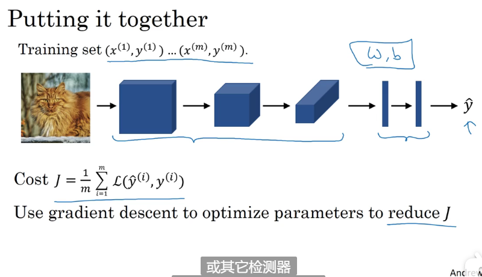

### 第一周

- 计算机视觉的问题

  - 图片分类，判断图片的内容
  - 目标检测，勾画出图片中物体的轮廓\

- 过滤器（filter）

  首先过滤器是一个矩阵，在进行卷积运算时使用到，过滤器的维数一般都是奇数，常见的维数是3，有时也会有5和7维的

  一个用于边缘检测中垂直检测的3*3的过滤器长这样：

  

  - 过滤器有很多种，而且不一定要使用现有的过滤器，可以让这9个数字当成参数，使用神经网络学习一个比较适合自己的过滤器 

    

- 卷积运算（ convolutional operation）

  - 边缘检测

    - 垂直检测

    - 水平检测

      垂直检测和水平检测的结果如下：

      

  - 如何做卷积运算：

    以图像的垂直检测为例：使用一张6*6的灰度图片进行卷积运算

    

    

- 正边和负边：就是图像从明到暗和从暗到明

- padding：

  ​	目前有两个问题：

    		1. 在做卷积运算时，图像从6*6变成了4*4 , 图像在慢慢变小
    		2. 卷积运算使得图像的边缘像素点的利用率变小

  为了解决这两个问题，我们就需要用到padding，具体做法就是在原图的周围在填充p层的填充像素，例如6*6的图片填充一层就变成8\*8的图片，在与3\*3的过滤器卷积运算就得到了6\*6的结果，图片大小没发生变化，且边缘的像素点利用率也高了。

  至于p值的大小取决于你用的卷积种类

  - valid卷积：p = 0
  - same卷积： 有 n+2p - f +1 = n  得 p = （f-1）/2 ;  n是图像的维数，f是过滤器的维数。

  

- 卷积步长（Strided convolutions）:

  步长使用stride表示，意思是在卷积运算时，图片与过滤器相乘不是顺序移动的，而是间隔stride个像素在相乘。

  

  

  

- 三维卷积

  所谓三维卷积，就是一张RGB图，有三个通道，与一个三维的过滤器卷积运算，得到一个二维的图像，根据过滤器的不同，我们可以做水平检测、垂直检测和一些其他特征的检测，把得到的二维图像堆叠在一起就得到了最终的检测值。

  - 
  - 

- 6\*6\*3中的3，被称为通道数也可以称为深度。

- 卷积神经网络（CNN）中的单层卷积网络

  

  对照着之前学习的神经网络的一层来看卷积神经网络中的一层

  - 一个过滤器相当于一个节点，过滤器的元素值相当于W，卷积运算后，把得到的4*4（以图中为例）的图片再加上b，就相当于Z

  - 卷积神经网络有一个特点，一旦一层中的过滤器的个数确定，那么该层的参数个数就确定了，与输入值无关，这也是CNN的一个特征，叫做 “避免过拟合”

  - 一层中各个数据的维数

    

- 卷积神经网络一个需要注意的现象：

  随着神经网络计算深度不断加深，图片的高度和宽度会在开始的一段时间基本保持一致，而后会逐渐减小，而channel（通道）的数量会逐渐增加

- 一个典型的CNN通常有三层

  - Convolution（卷积层）-conv
  - Pooling （池化层）- POOL
  - Fully connected （全连接层）- FC

  虽然只用卷积层也能构建很好的神经网络，但是很多架构师依然会加上池化层和全连接层。

- 池化层

  - 什么是池化层

    首先池化层的位置在卷积层之后，全连接层之前；池化层的操作与卷基层的操作基本一致，就是计算时用的函数不一样。

  - 池化层的作用

    1. 保持特征不变性，意思就是把一张图片缩小了，这张图片的主要特征还在，和大照片看着还一样。
    2. 特征降维，意思是通过降低维度，把一些冗余的、没用的特征值去掉，只保留重要特征，简化操作。

  - 池化层的种类，常见的有两种：

    1. 最大池化：和卷积层操作基本一致，对于单通道图片来说，把卷积运算中的求和变成求最大值。最大池化常用的参数有 p：池化的大小，和过滤器的大小类似；s：步长。
    2. 平均池化：把最大池化中的运算变成求平均值。

  - 池化层中的常用参数：

    p：池化的大小；

    s:  步长

    其他还有，像 padding，只不过不常用。

    p和s的值最常用的值都是2

  - 对于多通道图像，池化后输出的图像和输出后的图像通道数不变，池化是对每一层分别池化。

    一个$n_H*n_w*n_c$的图像池化后得到一个$(\frac{n_H-f}{s}+1 )* (\frac{n_w-f}{s}+1 )*n_c$的图像

  - 池化过程中没有要学习的参数，所以在执行反向传播时，不会更新池化层的参数（池化层也没有参数，只有超参数），但是池化层会影响反向传播的计算。

  

  

- 计算卷积神经网络有多少层时有两种方式，一是把一层卷积层和一层池化层看做为一层，另一种方式是把卷积层和池化层各看做为一层。在本课中我们采用第一种。

- 关于超级参数的设置，一般来说不要自己设置，而是要查阅相关文献中较好的架构看看别人设置的是什么值，你用就行了。

- CNN常见的两种模式

  1. 一层conv + 一层pool + 一层conv + 一层pool  +……… +一层conv + 一层pool  + 多层全连接层 +(softmax、sigmoid等等) 
  2. 多层conv + 一层pool + 多层conv + 一层pool  +……… +多层conv + 一层pool  + 多层全连接层 +(softmax、sigmoid等等) 

- 多分类cnn的例子：

  

  

  

- 什么是全连接层：全连接层其实就是我们第1、2节课学习到的神经网络层。

  卷积层和池化层类似于将原始数据分化为多个小的特征，而全连接层相当于给这些小的特征加上权重（个人理解）

- 为什么要用卷积

  卷积的优势：

  1. parameter sharing 参数共享

     参数共享带来的优势是cnn相比直使用全连接层构建的神经网络参数量大大降低。使用卷积来提取某一个特征时，如垂直边缘检测，使用的过滤器可以应用到图片的各个部分，这就是参数共享。

  2.  sparsity of connections 稀疏连接

     稀疏连接的意思是：输出的每一个值只与输入值的一小部分相关联，与大部分的输入值是无关的。例如在单通道图片中，我们使用3*3的过滤器，得到的每一个输出值只与9个输入值有关。

     

- 如何整合卷积

- 如何训练cnn

  

### 第二周

- 几个经典的网络

  -  LeNet-5：该网络可以识别图片（灰度图像）中的手写数字

    

  - AlexNet

    

    - 局部相应归一化层（LRN）：在AlexNet中使用但是没有太大作用的一层，如今一般也不会使用。

  - VGG-16：这是一种只需要专注于构建卷积层的简单网络，没有过多的超参数，它的一大优点是：它简化了神经网络结构。

    - 这里VGG-16中的16指的是这个网络包含了16个卷基层和全连接层

    - 它的参数数量达到1.38亿，所以需要训练的参数数量非常巨大。

      

      

- 残差网络（Residual Networks）：ResNets

  

  - 残差网路解决了什么问题？

    理论上我们认为神经网络的深度越深，训练的模型也就越精确，但是实际显示：当神经网络达到一定的深度后，再增加深度就会起到相反的效果。也就是说太深的神经网络往往不会达到好的效果。而残差网络的出现则是解决了这一问题，使得更深的网络也也能达到一个好的效果。它是怎么做的呢？接着看：

  - 残差网络是由残差块构成的，那什么是残差块呢？

    首先在一般网络中从$a^{[l]}$得到$a^{[l+2]}$需要经过如下步骤：
  
    
  
    但是在残差网路中有一点变化：
  
    
  
    也就是说在计算当前层的线性激活后和计算当前层的激活函数之前，让z加上上一层的激活值再来计算本层的激活值。图中就是一个残差块。
  
    图中是一个由五个残差块构成的残差网络：
  
    
  
- 1*1卷积，也被称为network in network 

  1*1卷积对于单信道（channel）的输入来说没有太大作用，但是对于多信道输入，当我们想要压缩、保持或增加信道数时，1\*1卷积及起了作用。

  

- Inception网络

  当我们构建卷基层时，我们往往需要考虑过滤器的大小以及要不要加池化层，而Inception网络则可以代替我们做这些决定，同时网络的复杂程度也因此增加，但是网络表现非常好。

  -   Inception网络的基本思想是它不需要决定使用哪一种过滤器或者是否需要池化，它先把所有的可能用的过滤器或池化都计算一遍，然后把得到的结果拼接成一个大的结果，让网络自行学习它需要什么样的参数。

    这样做有一个缺点，就是把所有的情况都计算一遍，计算成本就会比较大，那么怎么降低这个成本呢，这里就用到了1*1卷积，举个例子一个28\*28\*192的表示层使用 5\*5\*32的过滤器得到一个28\*28\*32的结果，这个过程光乘法运算就达到了1.2亿次，计算成本很高。 那么我们改进一下：还是28\*28\*192的表示层，我们先使用1\*1\*16的过滤器，得到一个28\*28\*16的结果，然后在使用一个5\*5\*32的过滤器再进行卷积，最终得到了28\*28\*32的结果，那么这种方式的乘法运算的计算成本为0.124亿次，相比常规运算，减少了十倍。

    

    

    

- 瓶颈层：各个层中最小的层，那么问题来了，如果大幅度缩小输入值（表示层）的规模，会不会影响网络的性能呢，事实证明，只要合理构建瓶颈层，既可以显著缩小表示层的规模，又不会降低网络性能，从而节省了大量的计算。

- 一个Inception模块的具体实现

  

- 一个Inception网络由多个Inception模块构成

  

- 一个特殊的Inception网络

  

  

  图中三个红框都是输出，这实际上是softmax的不同的输出值，这表明了即便是隐藏单元或者是中间层也参与了特征计算，它们也能预测图片的分类，且能防止发生过拟合。

- 数据迁移

  当我们想要做一个新项目时，比如我们想做一个识别猫的系统，那么我们最好的办法是先在网上找一个相似的且已经训练好的模型，在该模型的基础上进行修改，进而变成符合我们要求的模型。

  如何对一个现有的模型进行修改，最好的方法是值修改最后一层，把之前层的参数进行冻结。

  其次，当我们数据集较小时，一个提高训练速度的办法是，先舍去现有模型的最后一层，然后把各个样本输入到模型中，保存输出的值，然后把输出的值当做样本来训练最后一层，这样就能大大节约时间。

  如果我们有较多的数据集，那么我们最好冻结较少的层，重新训练较多的层。

  特别地，当我们的训练数据足够多时，我们可以把现有模型的参数值当做初始化值，重新来训练所有的参数值。

- data augmentation 数据扩充

  训练计算机视觉模型往往需要很多数据，当我们数据不足时，数据扩充就很有必要

  数据扩充的方法：

  1. 镜像扩充

  2. 数据裁剪

  3. 数据旋转

  4. 数据扭曲

     

  5. 色彩转换

### 第三周

- 目标检测

  之前我们已经学习了图片分类，相对于图片分类是判断一张图片中是否有特定目标，比如一辆车，目标检测不仅要判断图片中有没有车，而且要把车的位置给圈出来。

- 如何把目标给标记出来（目前我们只考虑图片中最多存在一个目标）？

  以无人驾驶汽车图片识别为例，我们首先要检测出图片中是否存在特定目标，比如行人、汽车等，这其实就是图片分类问题，其次我们要把图片中存在的目标标记出来，所以输出值应该增加4个值，用于标记目标的位置，分别是$b_x, b_y, b_h, b_w$ ; 并且我们规定，图片的右上角坐标为（0,0），左下角坐标为（1,1）； （$b_x,b_y$）表示目标的中心点，$b_h$表示目标的高度，$b_w$表示目标的宽度。

  $b_x,b_y,b_h,b_w$的值是参考图片的坐标（0,0）和（1,1）而定的

  

- 如何定义标签y

  举个例子：现在是一个四分类问题：

  

  

  先给出格式：y = $[p_c,b_x,b_y,b_h,b_w,c1,c2,c3]^T$;  这是一个四分类问题的标签y，其中：$p_c$表示了图片中是否存在目标，1：存在，0：不存在；当目标存在时，$b_x,b_y,b_h,b_w$ 代表了目标的轮廓，而$c_1,c_2,c_3$代表了是哪个中目标，比如图中有一个汽车，那么$c_1,c_2,c_3$的值为：0,1,0；如果$p_c$= 0，这其他参数值则没有意义。

- 如何定义损失函数

  - 如果采用平方误差形式的损失函数：

    - 当$P_c = 1$时：我们需要计算输出值所有元素的准确度

      

    - 当$P_c = 0$时：我们只需计算输出值第一个元素（$P_c$）的准确度。

      

  - 当然在实际的目标定位应用中，我们可以使用更好的方式是：

    - 对 $c_1,c_2,c_3$和 softmax 使用对数似然损失函数；
    - 对边界框的四个值应用平方误差或者类似的方法；
    - 对$P_c$应用 logistic regression 损失函数，或者平方预测误差。

-  特征点检测：

-  现在我们已经学会了如何定位并标记图片中的目标，那么我们可以把这个方法也用到特征点检测上来，比如我们想识别人的右眼角，那么我们只需在神经网络的最后一层，也就是更改输出值y，在y上添加一个坐标（$l_{1x},l_{1y}$）来表示右眼角的位置，当然我们在训练的时候，我们的样本也要进行标记。

  然后我们在把这个方法进行推广，我们就可以增加多个坐标来检测不同的特征点，进而可以检测整个人脸或者是整个身体动作。

  

-  目标检测算法

  目标检测就是检测图片中的目标并把它标记出来，一张图片中可能会有多个目标。

  - 滑动窗口目标检测算法

    举个例子，假设我们要检测一个图片中是否有车，并把车标记出来。

    使用该算法，我们要做的是：

    1. 把图片中的汽车按照固定的大小裁剪出来作为小样本，同时也要裁剪一些没有汽车的小样本
    2. 利用这些小样本训练一个分类神经网络
    3. 开始检测图片：首先把图片从上到下，从左到右，按照一定的步幅和按照小样本的大小（窗口）依次 扣取出小样本并放入到训练好的神经网络中，如果输出结果是1，就把这个小样本在大图片中标记出来。
    4. 继续选取一个更大的窗口进行检测，这样可以保证每个位置都能被检测到。
  
  - 这样做做虽然有效，但是计算成本太大。
  
- 使用卷积层代替全连接层实现目标检测

  由于上一节说的滑动窗口目标检测算法虽然有效，但是计算成本太大，原因就在于我们要把一张大的图片裁剪成很多小的窗口依次输入到神经网络中。这个神经网络的结构是卷积层+全连接层构成。

  现在有一种方法可以通过改变这个神经网络的结构来实现一次性全部把小窗口检测完从而提高效率

  具体的做法就是把神经网络中的全连接层全部改成卷积层。举个例子如图：

  

  改成卷积层后有什么好处呢？先看一下改完后的效果（图中展示的是正视图）

  

  ​	我们以上面训练好的模型，输入一个16x16x3大小的整幅图片，图中蓝色部分代表滑动窗口的大小。我们以 2为大小的步幅滑动窗口，分别与卷积核进行卷积运算，最后得到4幅10×10×16大小的特征图，然而因为在滑动窗口的操作时，输入部分有大量的重叠，也就是有很多重复的运算，导致在下一层中的特征图值也存在大量的重叠，所以最后得到的第二层激活值（特征图）构成一副12×12×16大小的特征图。对于后面的池化层和全连接层也是同样的过程。

  那么由此可知，滑动窗口在整幅图片上进行滑动卷积的操作过程，就等同于在该图片上直接进行卷积运算的过程。所以卷积层实现滑动窗口的这个过程，我们不需要把输入图片分割成四个子集分别执行前向传播，而是把他们作为一张图片输入到卷积神经网络中进行计算，其中的重叠部分（公共区域）可以共享大量的计算。

  现在我们无需再利用滑动窗口分割图片，只需一次前向传播，我们就可以同时得到所有图片子集的预测值，大大提升了检测效率！

   

  但是这样做还有一个缺点：就是不能够精确地“圈住”目标。

- t通过我们的改进，我们的效率变高了，但是我们还不能得到目标的精确的边界框，我们如何得到精确的边界框（bounding box）呢？

  在滑动窗口算法中，我们取的一些离散的图片子集的位置，在这种情况下，有可能我们没有得到一个能够完美匹配汽车位置的窗口，也有可能真实汽车的边界框为一个长方形。所以我们需要寻找更加精确的边界框。

  YOLO算法可以解决这个问题，具体步骤如下：

  1. 处理训练集: 我们将训练图片加上一个网格，将图片分割成n*n个小图片，让每个小图片都有一个y，y的格式是$[p_c,b_x,b_y,b_h,b_w,c1,c2,c3]^T$（四分类），

     如果一个目标出现在多个网格中呢，那这个目标属于哪一个网格呢？解决方法是：取目标的中心点，中心点在哪个网格，目标就属于哪个网格的。

  2. 将这些y合并到一起，就形成了一个Y：n\*n\*8 

  3. 通过处理后的训练集训练神经网络 得到目标探测的卷积网络模型。我们利用训练好的模型，将与模型输入相同大小的图片输入到训练好的网络中，得到大小为n×n×8的预测输出。通过观察n×n不同位置的输出值，我们就能知道这些位置中是否存在目标物体，然后也能由存在物体的输出向量得到目标物体的更加精准的边界框。

- YOLO的特点：

  - YOLO显式地输出边界框，使得其可以具有任意宽高比，并且能输出更精确的坐标，不受滑动窗口算法滑动步幅大小的限制；
  - YOLO是一次卷积实现，算法实现效率高，运行速度快，可以实现实时识别。

- 如何确定$b_x,b_y,b_h,b_w$的值？

  - 对于每个网格，以左上角为(0,0)，以右下角为(1,1)；

  - 目标中心点bx、by表示坐标值，在0~1之间；

  - 宽高bh、bw表示比例值，存在>1的情况。

    

-  交并比函数（loU）可以用来评价对象检测算法，假设我们有一张图片，图片中有一个实际目标的边界框，你的神经网络也得到了一个边界框，这两个边界框的交集和并集之比就是交并比。一般约定在计算机检测任务中lou>=0.5就认为检测正确，当然lou值越高越好。

- 非极大值抑制（NMS）

  假设我们现在已经使用训练集训练了一个目标检测模型，如果我们输如一张图片，图片中包含了多辆车，那么我得到的结果是一个n\*n\*8的矩阵结果，这代表了n\*n个网格的预测结果，每一个网格的$p_c$值都是0~1的小数，代表了这个网格出现车的概率，那么如果我们把这些结果在反馈到图片中，可能一辆车的周围会有多个边界框，但是我们实际想要的是每个车周围只有一个最准确的边界框，怎么办呢？NMS可以解决这个问题。

  **非最大值抑制**可以确保我们的算法对每个对象只保留准确率最高的那个预测。

  具体做法：

  1. 首先我们去掉p_c较小的结果，例如p_c<0.6的都去掉
  2. 在剩余的结果中，我们选取一个p_c值最大的结果，记作T
  3. 让剩余结果的边界框分别于T的边界框做交并比，并去掉交并比比较高的结果，比如如果一个结果与T的交并比>0.6，就把这个结果删去
  4. 重复步骤2和3.

  注意：这个做法式单对象的检测，如果是多对象检测，那么需要对每个对象都执行一次NMS，具体手法就是 让p_c分别乘以c_1、c_2、c_3（3个对象）

- Anchor boxes

  如果我们想让一个网格中检测多个对象，我们就可以使用Anchor boxes

  当两个对象的中点都落在了一个网格中，如果我们使用传统的结果表示方法（n\*n\*8）则不能正确地表示对象的位置，这时我们引用Anchor box，

  首先说明一点，Anchor box擅长处理一个网格中有两个对象的情况，且这两个对象的边界框的区分度要很高，比如一个瘦长，一个扁宽，假如有多个目标的中点（大于两个）都落在了一个网格里，那么就需要其他的处理方式；假如有两个非常相似的目标的中点落在了同一个边界框里，比如两个目标都是瘦长的，那么也需要其他的处理方式。为什么呢？个人理解：两个相似的边界框在使用非最大值抑制时，会把其中一个边界框误删除。不过这两种情况出现的概率很小。

  具体做法：首先人为地定义两个边界框，比如一个瘦长（box1），一个扁宽（box2）。

  然后把输出值改为n\*n\*16，每一个结果的前八位代表box1，后8位代表box2。这样我们就可以正确标注两个目标了。

  

- YOLO算法就是在原来的基础上把 交并比、非最大值抑制、Anchor boxes都加上。

- 候选区域（使用频率不高）：

  R-CNN算法：带区域的卷积网络

  在一张图片上有很多区域是空白的，或者说是不存在有价值的东西的，所以我们在使用传统的滑动窗口目标检测算法时，会对大量的无用区域做无用的运算，以至于浪费了时间。现在我们使用R-CNN算法可以改善这种情况，具体做法是：先运用图像分割算法（现成的算法，直接拿来用），将图片分割成许多不同颜色的色块，然后在这些色块上放置窗口，将窗口中的内容输入网络，从而减小需要处理的窗口数量。但是这样做虽然有提升，但是也很慢，于是就有了一些改进的算法

  - Fast R-CNN：使用图像分割算法得出候选区域，使用滑动窗口的卷积实现去分类所有的候选区域，但得到候选区的聚类步骤仍然非常慢；
  - Faster R-CNN：使用卷积网络给出候选区域。

- 目前来看，即便是faster R-CNN，相对于YOLO算法依旧是比较慢，Ng个人目前更倾向于YOLO算法，其直接将图像进入前馈输入进行判别，一步到位。

### 第四周

-  人脸识别的相关术语

  - 人脸验证(face verification)

    输入一张图片和个人信息，验证图片中的人是否是本人，这个问题也被称作1对1问题

  - 人脸识别（face recognition）：一对多的匹配问题

    比验证问题要难得多，人脸识别是在拥有一个具有K条人的信息的数据库的情况下，输出一张图片，判断该图片是K个人的哪一位。人脸识别难度在于，如果我们把一个拥有99%精确度的人脸验证系统应用到拥有K条数据的人脸识别系统中，那么这个人脸识别系统的犯错率就会上升K倍，如果想要降低犯错率，那么人脸验证的精确度要远大于99%。

- one-shot learning(一次学习)

  对于一个人脸识别系统，我们需要仅仅通过先前的一张人脸的图片或者说一个人脸的样例，就能够实现该人的识别，那么这样的问题就是one shot 问题。对于存在于数据库中的人脸图片，系统能够识别到对应的人；而对于不在数据库中的人脸图片，则系统给出无法识别的结果。对于one shot learning 问题，因为只有单个样本，是不足以训练一个稳健的卷积神经网络来进行不同人的识别过程。而且，在有新的样本成员加入的时候，往往还需要对网络进行重新训练。所以我们不能以传统的方法来实现识别系统。

-  Similarity函数

  为了解决上述问题，我们可以创建一个函数，输入两张图片，判断两张图片是否是同一个人，如果两张图片的人很相似，那就输出一个很小的数，如果两张图片的人物不相似，那就输出一个很大的数。总的来说：输入两张图片，输出差异值，如果d(img1,img2)<=$\tau$,那么就认定两张图片是同一个人，反之，如果d(img1,img2)>$\tau$,则说明两张图片不是一个人，而$\tau$是一个超参数，代表一个阀值。

-  Siamese网络

  它是指这样的一个神经网络，我们输入一张图片（x_1），就可以得到一个多维的向量（课中该向量是128维），记作f(x_1)。

  那我们怎么用Siamese网络来实现人脸识别呢？步骤是：1.我们拿到一张图片作为x_1，通过Siamese网络得到一个多维向量f(x_1)，然后我们再拿一张图片作为x_2，通过同一个Siamese网络得到一个多维向量f(x_2)，然后我们定义Similarity函数：
  $$
  d(x_1,x_2) = ||f(x_1)-f(x_2)||_2^2
  $$
  如果d<=$\tau$，则说明两个图片是同一个人，反之则不是同一人。

  

- triplet loss（三元组损失函数）

   现在我们已经知道怎么构建一个神经网络模型了，那么我们怎样训练这个模型呢，我们就需要有个针对这个模型的损失函数，看看我们是如何定义的。首先我们我们的目的是如果我们分别输入了同一个人的两张照片，我们想让结果非常小，而如果我们输入了两张不同人的照片，我们想让结果非常大，至少前一种的结果要比后一种的结果要小，于是就有了一个这样的条件(看图片)：

  

  图片中，Anchor指的是目标图片，Positive指的是 与A是同一个人的照片，Negative指的是与A不是同一个人的照片。

  

我们分析这个条件，发现这个条件可能还不够精确，因为如果两个结果都是0的话也会满足这个条件，于是我们就需要在加一个超参数来增大两个结果的差距：

我们加入了一个超参数$\alpha$，这个参数叫做间隔（margin）参数，这个超参数拉大了两个结果之间的距离。

另外，如果这两个值相减为负的情况下也是满足条件的，所以我们再一次改进三元损失函数，并给出成本函数（如下图）：

- 现在已经得到了成本函数，下一步就可以训练这个模型了，但是在训练之前，我们如何构造我们的训练集呢？

  首先我们的训练数据要满足以下条件：

  A和P要是同一个人的照片，N是不同人的照片，那么N的照片是不是可以随意取呢，当然可以，但是不建议随意取，我们要尽量让N和A看起来也相似一些，这样可以让神经网络更强大，相反，如果N和A差距很大，那么神经网络轻易就能搞定，这样的话最后得到的神经网络会很弱。

  

- 对于大型的人脸识别系统，常常具有上百万甚至上亿的训练数据集，我们并不容易得到。所以对于该领域，我们常常是下载别人在网上上传的预训练模型，而不是从头开始。

-  脸部验证和二分类

  除了利用刚学的Triplet 损失函数来学习人脸识别卷积网络参数的方法外，还有其他的方式构建神经网络。我们可以将人脸识别问题利用Siamese网络当成一个二分类问题，同样可以实现参数的学习。

  也就是说我们使用两个Siamese网咯+一个逻辑回归构建一个神经网络，同时输入两张图片，如果是两张图片是一个人就输出1，否则就输出0，这样就转化成了一个二分类问题。

  

  那么逻辑回归的的激活函数我们可以选择sigmoid函数公式如下：

  

  当然，我们也可以换成其他的函数，比如sigmoid函数的输出值换成

  

- 另一个改进的地方

  在实际的人脸验证系统中，我们可以对**数据库的人脸图片进行预计算，存储卷积网络得到的编码**。当有图片进行识别时，运用卷积网络计算新图片的编码，与预计算保存好的编码输入到逻辑回归单元中进行预测。这样可以提高我们系统预测的效率，节省计算时间。如果不存储图片，同时还能节省空间（对于大型数据集）。

  不管是利用Siamese网络进行编码+triplet损失函数，还是采用Siamese网络编码+logistic regression二分类，其最重要的是学到一个有效的Siamese网络，即对同一个人照片之间的编码近似（距离较近），不同人之间的编码差异较大（距离较远）。
  
- 深度卷积网络

  我们知道深度卷积神经网络有很多层，那么每一层都干了什么呢，我们举个例子：

  

  对于在第一层的隐藏单元中，其只能看到卷积网络的小部分内容，也就是最后我们找到的那些最大化激活第一层隐层单元的是一些小的图片块。我们可以这样理解，神经网络的第一层通常会识别出一些简单的特征，比如说：边缘、颜色阴影等

  第一层是在识别一些简单的特征，更深的层呢？

  

  通过这些结果我们得知，随着层数的增加，每一层识别的特征也就越来越复杂。

- 神经风格迁移系统

  如图所示：

  

  使用C图当做内容和S图当做风格来生成G图，这样叫做风格转化，我们现在要做一个神经风格转换系统。

  那么我们如何通过C和S得到G呢？

  具体做法是：首先，我们需要定义一个代价函数：
  $$
  J(G) = \alpha*J_{content}(C,G)+\beta*J_{style}(S,G)
  $$
  其中$J_{content}(C,G)和J_{style}(S,G)$分别代表 C和G的相似代价  和  S和G的相似代价；其中$\alpha和\beta$是超参数（其实一个超参数就够了，但是原创作者写了两个，我们也就遵从原创），代表权重。

  接下来我们随机初始化一张图像G，然后把G带入代价函数，并使用梯度下降法将J(G)最小化：
  $$
  G = G - \frac{dJ(G)}{dG}
  $$

  

  对于上图的内容图片C和风格图片S，通过梯度下降算法一次次的训练，我们可以由初始的噪声图片得到最终的风格迁移图片G。

- 训练一个神经风格转换系统是监督学习吗？

  不是，监督学习的样本需要有标签，这里的样本图像没有标签。

- 内容代价函数

  $J_{content}(C,G)$是内容代价函数，我们该如何定义它呢？

  首先我们去一个神经网络，可以是VGG网络，也可以是其他适合的网络，我们已经知道，深度神经网络的每一层都在识别图片的某个特征，而且是由简单逐渐到复杂，如果我们把C和G分别输入到神经网络中，拿最后的结果相比较作为J，那么我们最后会得到一张与C相同的G，而我们拿网络的第一层的结果相比较作为J，那么可能任何两个图片都差不多可以满足J，这是两个极端的条件，所以我们需要取中间的某一层进行比较最为J，那么就会得到一张与C差不多又不相同的G，至于是哪一层，这个根据直觉而定，假设我们取的是第l层，那么就是拿第l层的a来进行计算，具体公式如下：
  $$
  J_{content}(C,G) = ||a^{[l](C)}-a^{[l](G)}||_2^2
  $$
  

  

  在对代价函数运行梯度下降算法时，会激励这里的内容代价函数，努力使得生成图片G隐含层 l 的激活值和内容图片C隐含层l 的激活值相似。

- 风格代价函数

  风格代价函数怎么求呢？我们先理解一下什么情况下风格代价函数值会达到最低，就是当S和G图片风格相似的时候，那么如何判断两个图片的风格相似呢？课中提到了一个词：相关性。相关性指的是一个地方与另一个地方的关系。

  与求内容代价函数相似，我们同样取神经网络的某一层 ：l层来比较两个图片的风格是否相似。

  风格相似也就是说如果一张图片的A与B点有一定的关系，而在另一张图片中相同位置的A点和B点也有相同的关系，那么就说这两张图片的相同位置是相似的，也就是说，我们需要分别要获取两张图片各个部分的关系，也就是一张图片各个部分的相关性，我们使用一个矩阵来表示一张图片的各个部分的相关性，那么我们就得到了两个矩阵，如果这两个矩阵各个元素的值很相近，那么我们就可以说这两个图片的风格是一样的。

  

  我们该如何获取这样的一个矩阵呢？现在直接说获取该矩阵的规则。

  首先我们把一张图片输入到卷积神经网络模型中，取l层，l层对应的是一个$n_H*n_w*n_C$的卷积模块。

  我们求一张图片各个部分之间的相关性就转化为求该卷积模块各个通道之间的联系，所以我们设一个矩阵的shape为$n_c*n_c$

  在该矩阵的第k行第$k^‘$列的元素的值等于该卷积模块第k层通道和第$k^‘$层通道中各个对应位置的值相乘后再相加。所以我们就可以求得这样的一个矩阵。

  

  

  我们设S图片在卷积神经网络的第l层的矩阵为$G^{[l](S)}$，则：
  $$
  G^{[l](S)}_{k{k^{'}}} = \sum_{i=1}^{n_H^{[l]}}\sum_{j=1}^{n_W^{[l]}}a^{[l](S)}_{ijk}a^{[l](S)}_{ijk^{'}}
  $$
  同样地G图片的矩阵$G^{[l](G)}$
  $$
  G^{[l](G)}_{k{k^{'}}} = \sum_{i=1}^{n_H^{[l]}}\sum_{j=1}^{n_W^{[l]}}a^{[l](G)}_{ijk}a^{[l](G)}_{ijk^{'}}
  $$
  那么第l层的神经网络层的代价函数$J^{[l]}_{style}(S,G)$：
  $$
  J^{[l]}_{style}(S,G) = \frac{1}{(2n^{[l]}_Hn^{[l]}_Wn^{[l]}_C)^2}\sum_{k}\sum_{k^{'}}(G^{[l](S)}_{k{k^{'}}}-G^{[l](G)}_{k{k^{'}}})
  $$
  

  事实表明：如果我们把卷积神经网络的每一层的风格代价函数都加在一起作为两个图片最后的风格代价函数 效果会更好，于是就有:
  $$
  J_{style}(S,G) = \sum_l\lambda^{[l]}J^{[l]}_{style}(S,G) 
  $$
  其中$\lambda$是超参数，代表每一层的权重。

  

- 从二维到一维、三维的推广

  到目前为止，我们学习的卷积神经网络都是在处理二维的图片，其实我们可以使用同样的方法来处理一维数据可三维数据。

  在实际应用场景中，例如心电图就是一个一维数据，我们同样可以对其使用卷积神经网络，处理方式也是一样的。

同样地，医疗CT扫描可得到身体的3维数据，CT影片中一个图片代表的是3维数据的一个通道。我们同样也可以对其使用卷积神经网络。

- 

- 

- 

- 

  

  

  

  

  

  

  

  

  

  

  

  