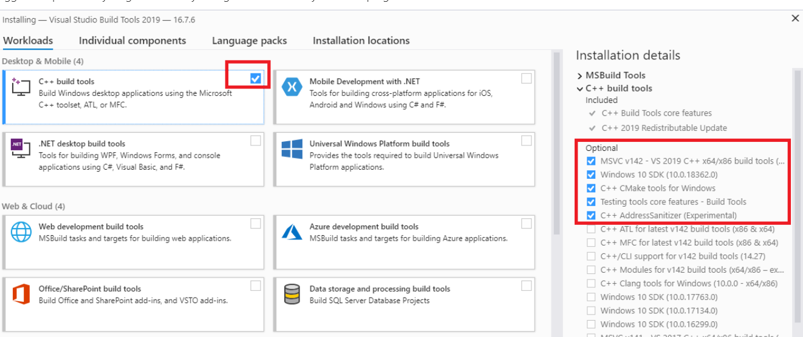

- 问题：UserWarning: mkl-service package failed to import, therefore Intel(R) MKL initialization ensuring its correct out-of-the box operation under condition when Gnu OpenMP had already been loaded by Python process is not assured. Please install mkl-service package, see http://github.com/IntelPython/mkl-service
  - 问题的根源在于环境变量
  - 问题产生的原因：正常情况下安装Anaconda会添加环境变量，但是这个环境变量是默认环境，如果我们在Anaconda创建了虚拟环境，那么我们需要把虚拟环境也要加到环境变量中，我出现这个问题就是因为没有吧虚拟环境的地址添加到环境变量中。
  
- 问题：error: Microsoft Visual C++ 14.0 is required. Get it with "Build Tools for Visual Studio": https://visualstudio.microsoft.com/downloads/ Tools":

  - 出现这个问题的原因是缺少c++的一个高版本的运行环境，我们只要把这个环境装上问题就解决了。

  - 网上解决办法大多都是推荐安装一个简易版本的Microsoft Visual C++ Build Tools，优点是这个体积小，节省空间，但是网上提供的安装包大多都是损坏的，安装不了。

  - 最终解决办法：解决办法就在问题当中

    1. 访问：访问  https://visualstudio.microsoft.com/visual-cpp-build-tools/， 下载生成工具。

       

    2. 下载完成后安装，只勾选下图中的选项

       

    3. 安装完成后一般问题就能解决

       

       

- 问题：当一个第三方库安装失败时，我们可以在网上查找这个库的.whl文件来进行离线安装，推荐网站地址：

  https://www.lfd.uci.edu/~gohlke/pythonlibs/

  ​           whl包和targz包的区别理解:在使用python时，经常会找这样的libs

  ​			whl包，是指已经编译的，类似于exe文件。

  ​			targz，是指源文件，还没有编译的。

  ​            所以：如果环境挺充足，可以用targz包，但想要快速稳定好用，最好还是whl包，直接安装。

  ​			注意：使用whl包时要注意改包要与python的版本号相对应

  ​			

  ​			

  

- 

- 

   

   

  ​	

  