### 赋范空间

#### 3.1 赋范空间

- 赋范空间 = 线性空间 + 范数。 学习赋范空间的目的就是让一个线性空间里的元素映射一个具体的数（实数或复数），比如一个数列映射成一个数、把一个矩阵映射成一个数。

  - 为什么要让线性空间中的元素映射成一个数呢？意义何在呢？

    有一个简单的应用，如果让你求两个数之间的距离，你可能会知道是两个数的绝对值相减，那如果让你求线性空间中两个元素之间的距离呢？显然我们没有办法求，所以为了让这个距离有办法求，我们就把每个元素映射成一个数，然后两个数相减也就得到了这两个元素之间的距离。

    那我们如何把元素映射成数呢？这显然需要一定的规则，这个规则就叫做范数。显然规则不是唯一的，不同的情况可以制定不同的规则，也就是说每一个线性空间可以对应很多规则，也就是对应很多范数。

- 什么是范数呢？

  就是把线性空间中的元素映射成一个数的规则，这个规则可以任意指定，但需要满足一些基本的条件，一个有三个基本条件，简称$N_1,N_2,N_3$.  这要满足这三个条件的规则，就称得上是一个范数。

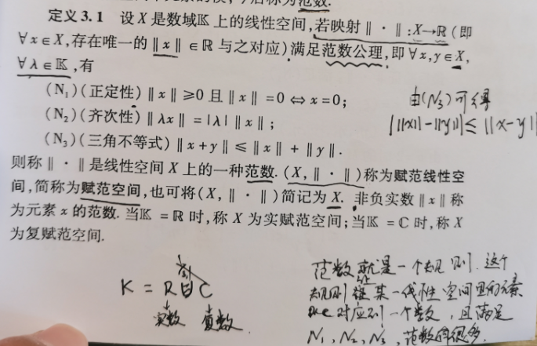

- 什么是赋范空间？

  就是一个范数加上线性空间就叫做赋范空间符号表示为：（X, ||·||）。根据线性空间X是实数还是复数可把赋范空间分为实赋范空间和复赋范空间。

- 常见的线性空间中一些常见的赋范空间

  - 最常用的一个赋范空间（深度学习中使用过）：

    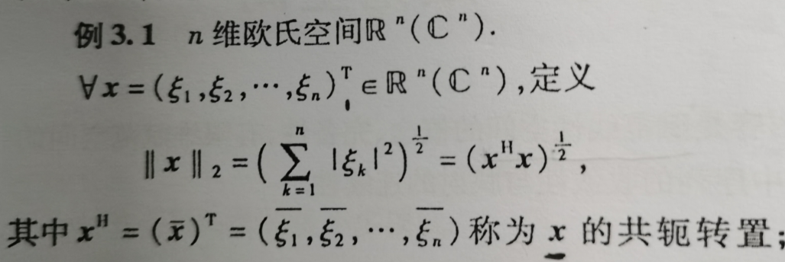

    - 2-范数，也叫欧几里得范数

  - 对于连续函数空间C[a,b]，常见的有4种赋范空间：（不同的四个范数构成了不同的四个赋范空间）

    - 无穷-范数：$||f||_\infin = \underset{a \le x \le b}{max} |f(x)| 　　　　 (\forall f \in C[a,b])$

    - 1-范数：

    - 2-范数：

    - p-范数：

      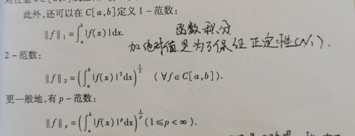

  - 对于有界数列空间 $l^\infin$，有一种常用的赋范空间

    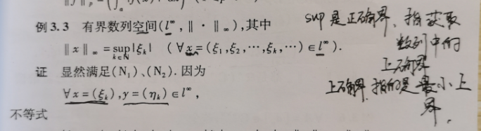

    - ps：数列空间中的元素是一个个数列，该赋范空间是把一个数列映射成一个数。

  - 还有很多不同的线性空间的赋范空间，看课本例子。

- 有一个习惯约定，也就是默认值。

  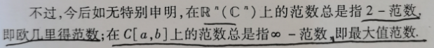

- 什么叫做度量？

  从字面意思理解一下，就是测量的意思。用一句通俗的话来讲：用于测量线性空间中两个元素的距离的方法就叫做度量，这个方法显然是一个公式，所以度量也被称为距离函数。

  特别地，如果我们有一个赋范空间，我们用范数来定义这个距离函数用于求该线性空间中的元素的距离，那么该度量就被称为由范数导出的度量，此时该赋范空间也有了一个新的名字，叫做度量空间。

- 度量公理

  通过刚才的表述，我们知道并不是所有的度量都是有范数导出的，换句话说，只要一个二元泛函满足一定的规则就可以称得上是一个度量，这个规则就是度量公理。

  ​	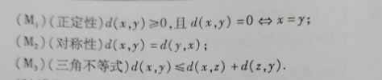

  - 需要注意的是，由范数导出的度量一定满足度量公理，除此之外，由范数导出的度量还满足两个性质，叫做平移不变性和齐次性。

    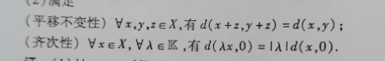

- 现在我们已经会求线性空间中两个元素之间的距离了，请思考一下三个问题：

  - 如何求两个线性空间子集（包含很多元素）的距离呢？
  - 如何求一个元素到一个子集之间的距离呢？
  - 如何求一个自己的直径呢？什么叫有界集，什么叫无界集？

  肯定有一定的规则来求，我们直接给出规则：

  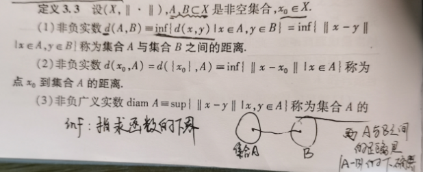

  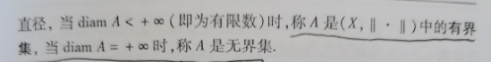

  

- 现在再给出一个赋范空间子集为有界集的充要条件：

  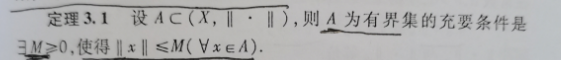

- 在三维空间中，又有一个新的概念：开球、闭球、球面，这也是针对于赋范空间的子集来说的，并且这里所说的求并不一定是圆的，直接给定义：

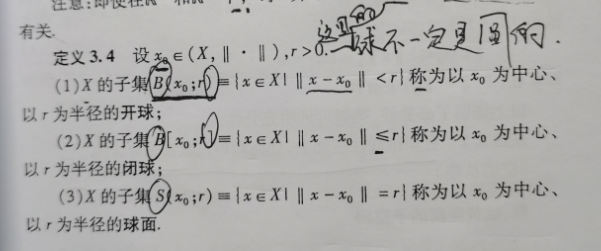

- 什么是等价范数？

  首先有个前提：因为范数是把线性空间中一个元素映射成一个数的规则，那么不同范数之间要想等价，就必须是在同一线性空间中的范数。其次，我们知道两个规则等价，并不是相等的意思，而是满足一定的比例（“比例”这一词用的不太恰当，差不多就是这个意思。），下面给出定义：

  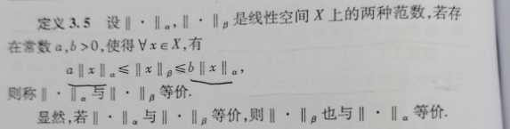

- 通过定义，我们也可以得到一个规律，这是前人总结的，记着就行：

  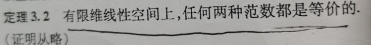

- 刚才我们提到了赋范空间的子集，这个子集可不是赋范空间的子空间，那什么叫做赋范空间的子空间呢？

  我们考虑一下，赋范空间有两部分组成，一个是线性空间，一个是范数。直接上定义：

  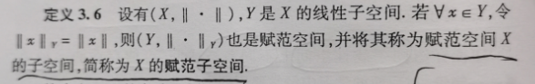

  也就是说取一个线性空间的子空间，再加上该范数，就可以组成赋范空间的子空间。

#### 3.2 收敛序列与连续映射

- 序列的收敛性

  - 我们先看一下在R上的数列的收敛性：

  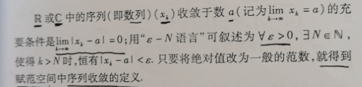

  - 那么在赋范空间上的序列的收敛性就是R上数列的收敛性的推广。

    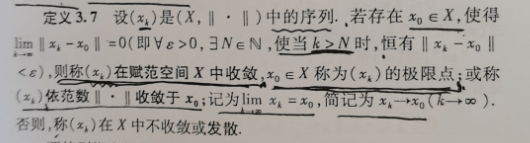

    - 注意事项：

    - $x_k \in X,而（x_k）是由X中的元素组成的序列，同时，x_0也是X中的元素$,

    - $为什么叫依范数||·||收敛于x_0呢？因为求极限时用到了该范数，所以就是依靠范数||·||才能收敛于x_0，换句话说，换了范数，这个序列就不一定收敛了$ 

    - 需要注意两点：

      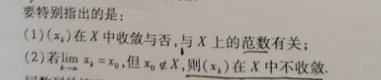

    - 如果$（x_k）$是（X,||·||）中的收敛序列，则它有两个性质：

      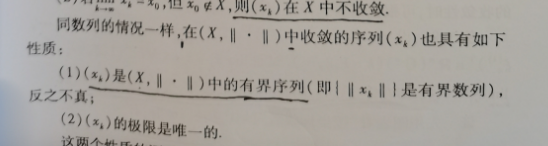

- 现在有一个规律要说明，就是一个序列在等价的范数上具有相同的收敛性：

  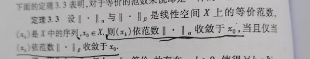

  - 上节课我们知道，有限维的线性空间上的任何两种范数都是等价的，所以在有限维赋范空间中讨论序列的收敛性时，我们可以任选一种范数来讨论。

- 接下来是一些总结性定理

  - 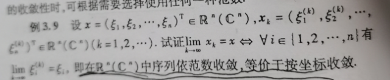
  - 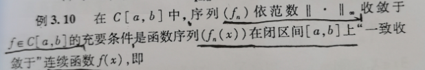
  - 总结一下就是一个元素序列收敛于一个元素，那么元素内部相同位置的数据也会收敛。

- 赋范空间中的无穷级数是什么？直接上定义：

  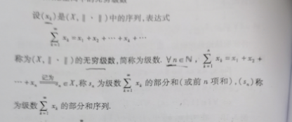

  - 注意：$x_k是X的元素，（x_k）是由X的元素组成的序列$
  - $级数的部分和s_n在一起构成了 部分和序列。$

  

- 我们通过探讨级数的部分和序列的收敛性来判断级数是否收敛

  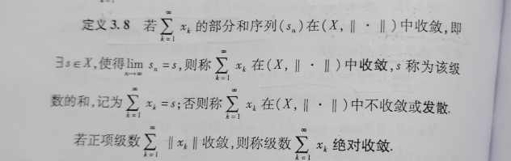

  - 需要注意的是：此时部分和序列的收敛性与范数有关吗？显然是无关的。

  - 现在有一个定义：绝对收敛，看图。

  - 我们需要注意绝对收敛的级数不一定是收敛的（绝对收敛$\not=$收敛）

    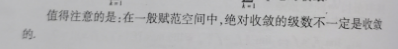

  - 只有一种情况，就是当赋范空间是完备的时候，绝对收敛才能推出收敛，这在下一节会学到。

- 映射的连续性

  首先要说明的是，这里的映射指的是赋范空间到赋范空间上的映射，就像R到R上的映射一样。

  - 在说映射的连续性之前，先讨论一下高等数学中普通映射的连续性：

    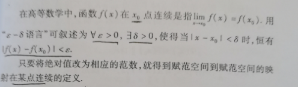

  - 由上面的连续性就可以推广到赋范空间的映射在某点的连续性

    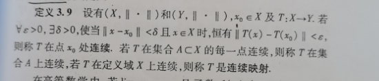

  - 我们再由高等数学中的一个函数连续性的充要条件推广到赋范空间映射连续性的充要条件：

    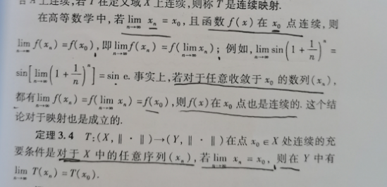

- 知道赋范空间的映射的连续性后，我们可以得到两个结论：

  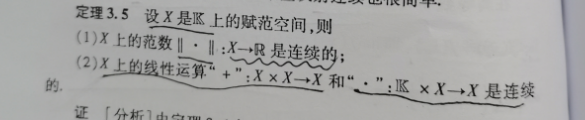

  - 简单来说，范数也是一种映射，它是连续的；赋范空间的线性运算+ 和 数乘 也是一种映射，同样是连续的。

- 

