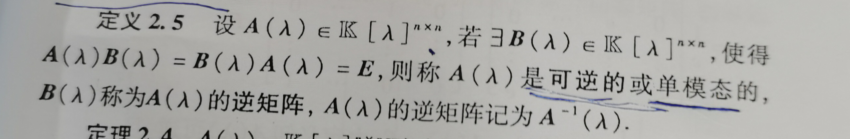
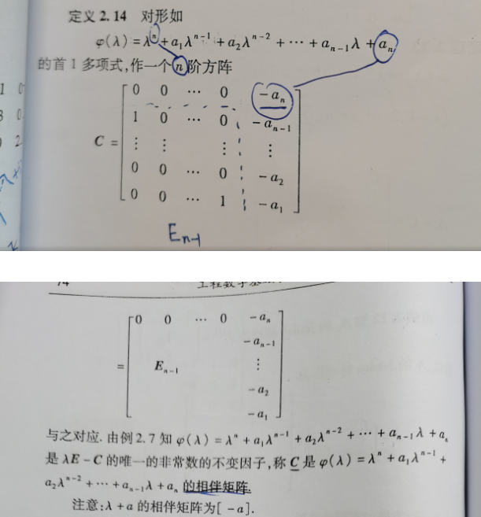

### 矩阵的相似标准型

#### 前提

- 首先你要明白，这一章的重点是在学习矩阵的相似标准型。我们之前学过矩阵的特征值和特征向量，矩阵的相似对角化，从这些入手，学习矩阵的相似标准型，我们将学习两种相似标准型，一种是Jordan（若当）标准型，一种是有理标准型。

#### 2.1 复习方阵的特征值和特征向量

- 什么叫特征值，什么叫特征向量

  首先得是方阵，然后满足一个公式：$Ax = \lambda x$,   $\lambda$ 就是A的特征值，x就是A的对应于$\lambda$ 的一个特征向量

- 什么叫特征矩阵

  由公式：$Ax = \lambda x$ 变换得  $(\lambda E-A)x = 0$，其中$\lambda E-A$ 就是特征矩阵

- 什么叫特征多项式

  特征矩阵的行列式就是特征多项式，A的特征多项式表示为：det($\lambda E-A$)，它是首1的n次多项式（最高次幂函是n，最高次项的系数是1）

- 什么叫基础解系

  从一个方程组中，找到一组非零解，该组非零解线性无关，且其线性组合能表示任意一个非零解，这这组解就是方程组的基础解系。例如Ax = 0，A为n*n的方阵，如果r(A) = n ,则该方程组没有基础解系，如果r(A)<n，则该方程组有基础解系，基础解系中解的个数为n-r(A)

- 有关结论

  - n阶方阵必有n个特征值
  - 所以特征值乘在一起，等于方阵行列式的值。
  - 所有特征值加在一起得到的值称为方阵的迹。
  - 不同特征值对应的特征向量线性无关

- adjA称为A的伴随矩阵，A·A* = |A|E

- 

#### 2.2 复习相似矩阵

- 如果存在可逆矩阵P，是的 $P^{-1}AP = B$, 则A~B

- 

- 方阵的相似对角形
  - 首先明确一点，并不是所有的方阵都有相似对角形，只有满足一个条件：这个n阶方阵有n个线性无关的特征向量才会有相似对角形。

#### 2.3-1 多项式矩阵

- 什么是多项式呢？

  多项式，也就是有多个项的方程式，每个项都不同，不同的点在于未知数x的次数 例如：$p(x) = a_0x^n +a_1x^{n-1}+...+a_n$

- 什么是n次多项式呢？

  就是在方程式的所有项中找x的最高次幂项，如果该项的x的最高次幂为n，则该多项式称为n次多项式。

  我们如何表达一个多项式是几次多项式呢？有个符号：deg p(x) = n，代表p(x)是n次多项式。（degree的缩写）

- 什么叫首1多项式？

  就是多项式的最高次项的系数是1。

  

- 下面说一下多项式与多项式之间的关系

  - 多项式的因式（儿子）

    

  - 余式（就相当于数中的余数）

    

  - 商式（因为有余式的存在，所以商式就是变不成了儿子）

    

  - 公因式（多个多项式中相同的儿子）

    

  - 最高公因式（次数最高的的公因式）

    

  - ps：任何非零常数都是多项式的公因式

- 多项式的零点

  - 什么叫多项式的零点呢？

    也就是令多项式等于0，然后求出x的解，该解就称为多项式的零点。

  - 关于零点的几个结论

    - n次多项式，必定有n个零点

    - 多项式的零点可以为实数，也可以为复数。

    - 由于实系数多项式（各个系数都是实数）的复数零点都是成对出现的，所以奇次多项式必有一个实数零点，简称实零点。

    - 还有一个重要的：

      

- 什么叫做多项式矩阵

  之前我们学习的都是在R的范围内的矩阵，也就是说矩阵中的元素都是数字，这叫数字矩阵。现在推广一下，令矩阵中各个元素是多项式，那么这个矩阵就是多项式矩阵，记着一个变化，在上面我们讨论的多项式的未知数都是x，现在要把未知数换成$\lambda$，所以多项式矩阵也叫$\lambda - 矩阵，通常记为A(\lambda)$.

  - 引入几个标志符号

    

    ps：K代表的是R或C，也就是实数或复数

  - 多项式矩阵的运算、行列式、子式、余子式、代数余子式和数字矩阵的规则都一样

  - 多项式矩阵和数字矩阵一样，也能进行分块，分完块的多项式有了两个新的名字：分块对角形矩阵和准对角形矩阵。

    

  - 与数字矩阵不同点之一（其实也差不多相同）：秩

    

    - 如何判断r阶子式是否为零多项式：求该子式的行列式，如果为零，则该子式就是零多项式。
    
  - 与数字矩阵不同点之二：逆矩阵
  
    
  
  - 多项式矩阵可逆的充要条件（从伴随角度上讲）
  
    
  
  - 若$A(\lambda)$可逆，则其必然满秩，也叫作非奇异的

- 多项式矩阵也可以进行初等变换（和数字矩阵差不多）

  

- 什么叫做初等矩阵呢？就是单位矩阵进行一次初等变换得到的矩阵。一共有三种。（课本p51）

- 和数字矩阵一样，对多项式矩阵进行一次初等变换相当于乘以一个初等矩阵，初等变化不改变矩阵的秩。

#### 2.3-2 多项式矩阵的Smith标准形

- 先来研究一下多项式矩阵中的等价

  

  - 等价矩阵的秩相等，等价具有自反性，对称性和传递性。

- 在一个多项式集合中，我们可以按照等价关系，把各个矩阵进行分类，相互等价的矩阵统称为一类，这样分类后，当我们研究他们的共同性质时，比如研究秩时，只需对其中一个矩阵进行研究即可。这就是分类的好处。那么我们为每一类选择一个相对简单的矩阵最为代表，这个代表就被称为等价标准形

- 一种等价标准形------Smith标准形，也被称为法对角形

  

- 每一个多项式矩阵都对应着一个唯一的Smith标准形，简称$S(\lambda)$

- 如果是一个数字矩阵A，它对应的特征矩阵$\lambda E-A$是一个多项式矩阵，我们可以求它的Smith标准形。

- 如何求Smith标准形呢？答案就是对多项式矩阵进行初等变换。

#### 2.4-1 多项式矩阵的不变因子

- 先学习一下多项式矩阵的行列式因子：

  

  这里的k阶子式指的是k阶行列式，已就是一个多项式，求出所有的k阶子式，然后再求公因式，例如一个多项式矩阵的秩为3，那么就会求出一阶行列式因子，二阶行列式因子，三阶行列式因子。

- 举个例子：

  

- 对于数字矩阵A，A的特征矩阵$\lambda E-A$ 的行列式因子也可以简称为A的行列式因子，A的n阶行列式因子是其特征多项式。

- 初等变换不改变多项式矩阵的行列式因子。

- 相互等价的矩阵行列式因子相同，如果一个多项式矩阵的行列式因子不好求，那么可以找一个与之等价的矩阵进行求。特别地，Smith标准形的行列式因子就非常好求，那么如果我们想求一个矩阵的行列式因子，一个方法就是先求出它的Smith标准形，然后在求行列式因子。

  

  - 由Smith标准形求行列式因子可知，k阶行列式因子是k+1阶行列式因子的因子（儿子），所以可得：

    

- 求行列式因子的三个技巧：

  1. 在求k阶行列式因子时，如果能找到两个k阶子式互质，那么该k阶行列式因子=1
  2. 如果k阶行列式因子 = 1，那么k-1阶行列式因子也 = 1
  3. 如果k+1阶行列式因子与一个k阶子式互质，那么，k阶行列式因子等于1.

- 不变因子

  

- 一些不变因子的性质

  

- 我们可以通过行列式因子和不变因子的关系来求不变因子。也可以通过不变因子来求得Smith标准形。

#### 2.4-2 多项式矩阵的初等因子

- 首先明白一点，初等因子是由不变因子生成的（但是，求初等因子组不一定非得求出不变因子）

- 初等因子的定义

  

- 举个例子

  

- 几个注意的点：

  

- 如何求多项式矩阵的初等因子组呢？

  1. 正常的角度，先求Smith标准形，再求不变因子，最后得到初等因子组。

  2. 如果Smith标准形不好求

     2.1 找与多项式矩阵等价的对角形（不一定是Smith标准形）

     

     2.2 找与多项式矩阵等价的准对角形（分块矩阵）

     

     

- 多项式矩阵等价的充要条件

  

- 数字矩阵的特征矩阵等价的充要条件（为下一节求相似做准备）

  

#### 2.5-1矩阵的Jordan标准形

- 前提：在2.5所讲述的矩阵均为数字矩阵

- 先给一个两个矩阵相似的充要条件：

  

- 联系上一节讲述的，可得：

  

- Jordan块

  一个特殊的多项式对应了一个特殊的矩阵，这个矩阵就叫做属于这个多项式的若当块。

  

- Jordan标准形

  它是相似对角形的拓广，一个矩阵不应有相似对角形，但是一定有Jordan标准形。

  

  

  

- 任意矩阵A的Jordan标准形

  

- 由若当标准形的特殊情况推出一个矩阵可相似对角化的充要条件

  

- 求矩阵的Jordan标准形

  

#### 2.5-2 方阵的有理标准形

- 为啥要学习有理标准形呢？

  因为虽然任何方阵都有Jordan标准形，但是Jordan标准形可能是复数的，使用起来不方便，所以在介绍一个其他类型的标准形，叫做有理标准形。

- 介绍一个概念：相伴矩阵（和Jordan块性质类似）

  

- 什么是有理标准形呢？（也叫自然法式）

  

- 怎样求有理标准形呢？

  

#### 2.6-1 方阵的零化多项式

- 什么是零化多项式呢？

  

  通俗来讲，就是一个多项式，如果把一个非零矩阵带入该多项式，则该多项式等于0，那么这个多项式就称为这个矩阵的零化多项式。

- 任何非零方阵都存在零化多项式，且不唯一。

- 典型的，一个非零方阵的特征多项式就是该方阵的一个零化多项式。

  

- 方阵的零化多项式有什么用呢？

  零化多项式可以使方阵的多项式（以方阵为变量的多项式）降次数，从而简化计算。

  

#### 2.6-2 方阵的最小多项式

- 为什么要学习最小多项式呢？

  因为零化多项式不唯一，我们给零化多项式加上条件，则就产生了唯一的最小多项式。

- 什么是最小多项式

  

- 有关最小多项式的几个性质

  

- 如何求最小多项式呢？

  1. “分解--检验法”，适用于不超过3阶的方阵

     

  2. “不变因子”法

     利用性质（3），求出A的最后一个不变因子。

- 最小多项式的应用

  1. 简化方阵多项式的计算，可以把一个复杂的多项式化简为一个简单的多项式。

  2. 可作为矩阵A可对角化的充要条件。

     

