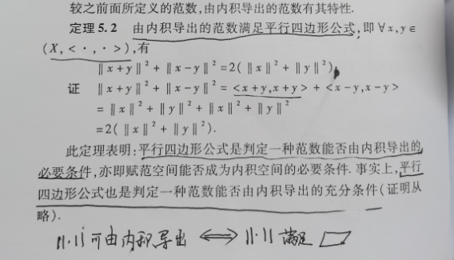
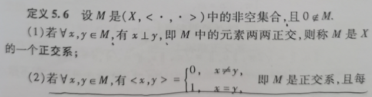
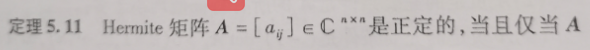

#### 5.1 内积空间

- 我们先看一下几何向量，也就是二维或三维向量的内积的定义：

  

- 几何向量的内积具有如下性质：

- 

- 然后我们现在根据几何向量的内积的性质定义线性空间的内积：

  

  - 解释一下这个定义:通俗地说就是两个向量空间中的元素的内积得到一个数，那么肯定是有一定的规则可以让两个元素得到一个数，那么这么这个规则只要满足这三个条件就可以称之为是内积，规则有很多种，也就意味着内积有很多种。

- 以后我们默认讨论的都是复内积空间

  

- 几种常见的内积

  - $R^n$中

    

  - 复线性空间中的内积

    

  - 

- 内积的三条性质：

  

- 由内积导出的范数

  

  通俗来讲，两个元素的内积是一个数，同样两个元素的范数也是一个数，那么我们就可以把内积当做一种范数，这种范数就叫做由内积导出的范数。

  - 只要是这个形式的范数都可以使内积空间转换为赋范空间

    

  - 注意：内积空间和赋范空间是两个东西，二者在一定条件下可以转换。

- 内积空间转换成赋范空间后，这个赋范空间有一定的特殊性

- 内积空间和赋范空间的关系

  

- 如果内积空间导出的赋范空间是完备的，那么这个内积空间也是完备的，叫做Hilbert空间。

- 内积空间的子空间

  和赋范空间一样，内积空间也有子空间，什么是内积空间的子空间呢？它需要满足什么条件呢？

  

  如何证明一个内积空间是另一个内积空间的子空间呢？

  

#### 5.2 正交与正交系

- 对于两个普通的向量a和b，a和b正交就意味着a·b = 0 , 同样地，在一般的内积空间中，两个元素之间也有正交关系，看下面的定义

  

- 正交有如下性质

  

- 正交系和标准正交系的定义

- 标准正交基

- 正交系的性质

  

- 正交化定理：任何一组线性无关的列总存在一组与之对应的正交列

  

- Schimidt标准正交化

  先正交化，后标准化（单位化）

  

#### 5.3 正规矩阵及其酉对角化

- 共轭转置

  $A^H = (\overline{A})^T$

- 正规矩阵、酉矩阵、正交矩阵、Hermite矩阵、实对称矩阵

- 酉矩阵的等价条件

  

  

- 酉矩阵的性质

  

- 一个矩阵是正规矩阵的充要条件

  

- 一个正规矩阵是酉矩阵的充要条件

#### 5.4 正定矩阵

- Hermite矩阵的性质

  

- 什么情况下正规矩阵是酉矩阵，什么情况下正规矩阵是hermite矩阵

  

- 给出一个Hermite矩阵，求解其对应的酉矩阵第五章如果考大题就考这个

  - 求该矩阵的特征值

  - 求特征值对应的特征向量

  - 特征向量正交化和单位化

  - 写出相应的酉矩阵

    

  

- Hermite矩阵的分类

  

- 正定矩阵的充要条件

  

  

- 有关正定、负定矩阵的性质

  

  

  