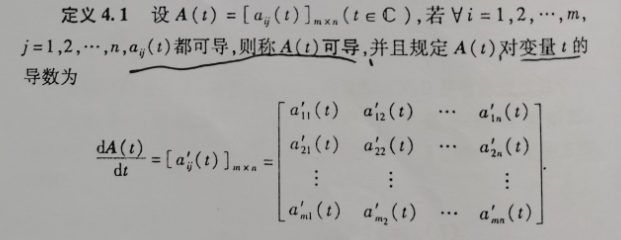
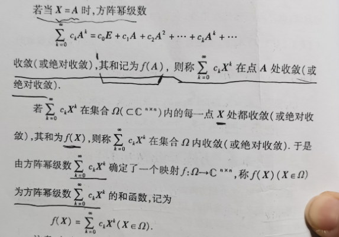
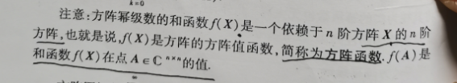
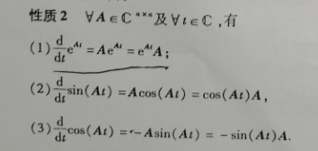

#### 4.1向量和矩阵的微分和积分

- 首先来学一个新东西：单元函数矩阵，也叫作一元函数矩阵，就是有一个未知数的矩阵，矩阵可写作：A(t)

  

- 一元函数矩阵是一个带一个未知数的矩阵，那么它能和以前学习的矩阵一样进行矩阵运算吗？答案是肯定的。

  

- 一元函数矩阵也是一个函数，是函数就可以求导数（微分），它是如何求微分呢？答案是：就各个元素的导数。

  

- 那么一元函数求导有什么性质呢？

  它具有和普通函数的非常相似的性质，当然它也有自己独特的，比如对逆矩阵求导。

  

- 值得注意的是：在矩阵运算中两个矩阵相乘不能随意互换位置：AB != BA

- 那么一元函数矩阵的积分有该如何球呢？当然是和求微分的套路一致。

  

- 一元函数矩阵的积分有什么性质呢？

  - 特别地,  转置的积分 == 积分的转置

    

  - 其他性质都很顺理成章。

    

    

- 特殊地，我们知道向量也是一个n*1（列向量）的矩阵，那么单元函数矩阵如果是一个单元向量值函数，则意义上性质同样适用于单元向量值函数

  

- 接下来我们学习多元向量值函数

  我们已经知道了单元向量值函数，它其实也是一个单元函数矩阵；那么多元向量值函数呢？就是有多个未知数的向量的性质又如何呢？ 

- 如果把单元向量值函数中的未知数x改成一个x向量，即$x = （x_1,x_2,···，x_n）^T$, 那么单元向量值函数就变成了多元向量值函数。准确地讲是n元m维向量值函数。

  

- 多元向量值函数的x和y都是多元的，都是向量。

- 那多元向量值函数如何求导呢？

  

- 多元向量值函数的导函数变成了m*n的矩阵，该导函数也叫作Jacobi（雅可比）矩阵。如果求二阶导呢？二阶导则是一个m\*n\*n的三维矩阵。
- 由于三维矩阵不好表示，我们令m = 1来求二阶导

- 多元向量值函数的二阶导也叫作黑塞矩阵。

#### 4.2 方阵序列与方阵级数收敛的充要条件

- 什么是方阵序列？

  有方阵为元素组成的序列，想数列那样。

- 方阵序列收敛的定义：

  

  - 也就是序列中，越往后，两个矩阵的距离越小

- 方阵序列收敛 等价于  方阵中的元素按坐标收敛

  

  ​									

- 收敛的方阵序列有什么性质呢？

  

- 什么是方阵级数呢？

  首先要有一个方阵序列，然后把序列中所有的方阵相加得到的结果就是方阵级数。

- 怎样判断方阵级数是否收敛呢？

  - 首先了解一下级数的  和方阵，和方阵是一个极限，级数的极限

  

  

  

  - 方阵级数收敛  等价于 方阵元素的级数收敛

    

  

- 再看一个方阵级数绝对收敛的充要条件

  

- 级数收敛和绝对收敛有什么性质呢？

  

#### 4.3 方阵幂级数和方阵函数

- 什么是方阵幂级数？直接上定义：

  

  

- 什么叫做方阵幂级数的和函数

  首先要明确一点，并不是所有的方阵幂级数都有和函数，方阵幂级数要满足一定的条件，才会有和函数，看定义：

  

- 方阵函数怎么来的呢？其实就是方阵幂级数的和函数的简称：

  

- 方阵幂级数的收敛性是满足一定范围的，也就是在一定的区域内才收敛，才会有和函数，我们使用收敛半径R来表示这个收敛区域，看定义：

  

  

  - 注意：这里的 z 如果看不懂就不要管他。

- 如何求收敛半径呢？

- 关于方阵幂级数的收敛性的几条性质

  前提先了解一下复数幂级数的有关概念：

  

  - 复数幂级数收敛 可得 方阵幂级数收敛

    

  - 推论二

    

    

  - 推论三：

    

- 方阵函数指的是方阵幂级数的和函数，需要解释一点的是：方阵幂级数是一个实实在在的结果，我们按照方阵幂级数的形式把具体的矩阵A变成了变量X，就变成了方阵幂级数的和函数。

- 我们通过普通函数来定义几个常见的方阵函数：

  - 普通函数

    

  - 方阵函数

    

    

    - 不常用的

      

      

  - 观察发现：把普通函数的未知数换成未知矩阵，把数字1换成单位矩阵E，普通函数就变成了方阵函数。

  - 方阵函数有哪些性质呢？

  - 基本性质1

    

  - 性质2

    

  - 性质3

    

  - 性质4

    

    

  - 性质5

    

  - 性质6

    

  - 性质7

    

  - 性质8：

    

#### 4.4 方阵函数值的计算

- 这一节比较难懂，但也是考试的重点，重点要掌握两种解题的方法，来求方阵函数的函数值。

- 方法一：根据Jordan标准形来求f(A)

  

  注意：f(A)这样写的依据如下：

  

  - 如果A的特征值不一样，或者不是三角矩阵，那么就不一定这样写了，可能要划分Jordan块儿，每个Jordan块儿在分别这样解一下，我也不太确定。

  - 其他题：

    

    

-  方法二：将f(A)表示为A的多项式

  - 先了解一下什么是矩阵的最小多项式

    我们在一个矩阵A的数域里可以找到若干多项式f(x)， 是的f(A) = 0, 这样的多项式有很多，那么我们令这些多项式中次数最低的首项系数为1的以A为根的多项式称为A的最小多项式。

    - 最小多项式是唯一的，

    - 矩阵A的最小多项式是A的特征多项式的一个因式

      

    如何求最小多项式：

    

- 解题步骤

  

  

  

- 记住一个等式：

​                                    

#### 4.5 方阵函数的一个应用

- 该小节主要掌握一个题型，即利用方阵函数$e^{At}$求解一阶线性常系数微分方程

  首先给一个一阶线性常系数微分方程组：

  

  然后用x(t)向量表示所有未知函数，使用q(t)代表已知函数，使用A代表所有系数

​		然后我们可以把微分方程组写为下面的矩阵形式

​		注意一点：

​		然后我们就得到了一个初值问题的解

- 求解该问题的步骤：

  第一步：写出A、C、x(t)

  第二步：通过$|\lambda E-A|$求得各阶的行列式因子，然后在通过行列式因子写出最大阶（k阶）的不变因子$d_k$，因为方阵的最小多项式等于$d_k$,所以我们求得到了最小多项式，令其为0得到各个解$\lambda _i$。

  第三步：设$e^{At}$，得到一个方程式，然后把$\lambda _i$替换A得到一个方程组，注意：如果$\lambda _i$是k重根，那么需要对$e^{At}$方程式求导，然后再带入进去值。然后求解各个系数。

  第四步：分别写出：EC（这个也可以忽略）、AC，$A^2C$

  第五步：x(t) = $e^{At}$C , 求得x(t)

  

  

