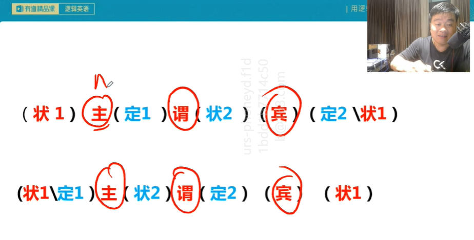

## 1. 公式

###                  偏正短语 

​                              形容词+名词 ，偏正短语一般可以作为一个整体充当主语。

### 中文找主干

四大金刚律：

  + 补全主语
  + 补全系（中文的系动词经常会被省略）
  + 补充关联词
  + 补充被

拿到一个中文句子，先补全以上四条，再进行翻译。

 ### 英文找主干

+ 主语

  句首第一个独立名词，所谓独立，即是不被短语所包含。the + 名词，a + 名词，大写，代词（代名词），分词（动名词，to do），句子当主语（主语从句），It（形式主语，符合英文的厚重审美）

+ 谓语

  独立的动词，所谓独立，就是不在短语，状语，从句中，动词会有时态的变化。

+ 宾语

  谓语后的第一个独立名词，同主语。

## 英译中

在定1、定2、状1、状2中如有多个小部分，则在英译中时要倒叙。

并列不变序：如果多个小部分有并列词连接则不用倒叙。

## 双黄蛋

所谓双黄蛋有两方面的意思，一方面，一个句子有两个句子构成，中间加连词连接，另一方面是句子的主干有两个，用连词连接。 

## 宾无定，状后置

通常情况下，谓语的状语可以放在谓语和宾语之前或者放在整个句子后，但是有一种特殊情况只能放在句子后，就是当宾语无定语时，谓语的状语必须放在句子后，这样做的目的是为了满足英文中的后重审美。

## 双宾语

当中文句子中有“把”，“使”等字时，往往会出现双宾语的情况，语法上也称之为直接宾语（内容）和间接宾语（对象）。例：请你给我一本书，please give me a book.

## 为什么中文的定状补和英文的位置不一样。

从文化的角度上解释：中国是农耕文明，生活节奏比较缓慢，靠天吃饭，所以在表达方面不着急，往往先说修饰，再说主题。而西方是一种商业文明，商业文明的前身是航海文明，这就对效率要求比较高，人们漂洋过海做贸易不是说废话的，所以西方人表达比较单刀直入，先说重要的主题，在逐渐加上了修饰。这也叫作后重原则。

## 为什么需要定语

定语的作用就是为了限制主题的范围。通俗来讲，我们讲到一个主体，这个主体如果不加限定，它指代的对象往往会很多，而加上了限定词之后，主体的范围就会缩小，进而将表达的主题更加地精确。

## 为什么需要状语

状语，即是表达状态的语句，如果没有状语，那我们的表达将会死气沉沉，比如：我在跑步。单看这句话，他只是表达了一个信息，而表达者想表达更多与他跑步相关的信息时，就需要用到状语，比如：我在大马路上非常开心地跑步。这句话就表达出了更多跑步的信息。

