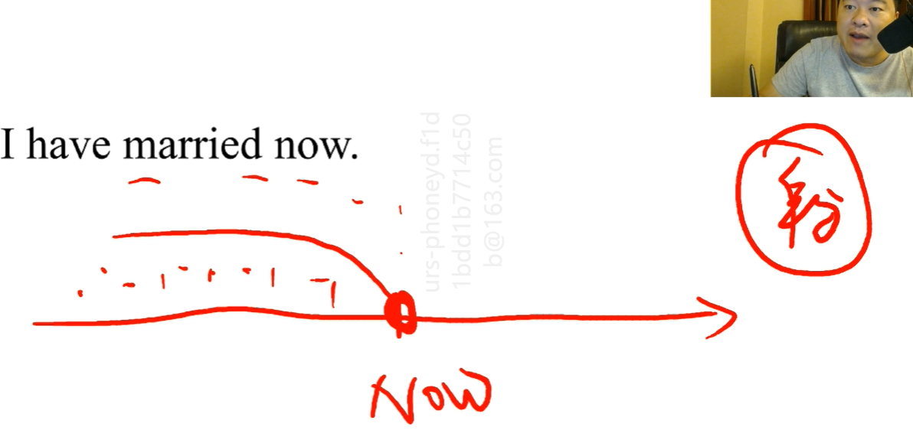
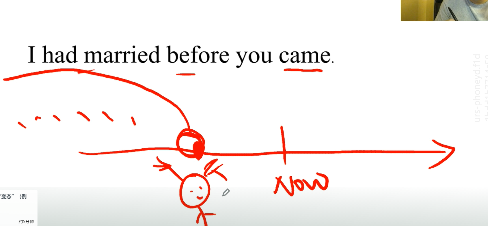
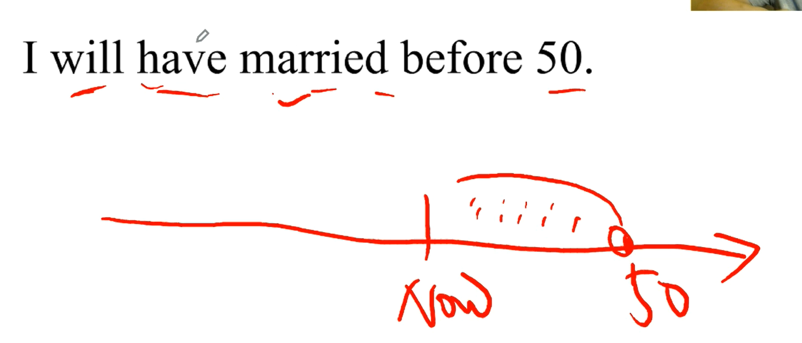
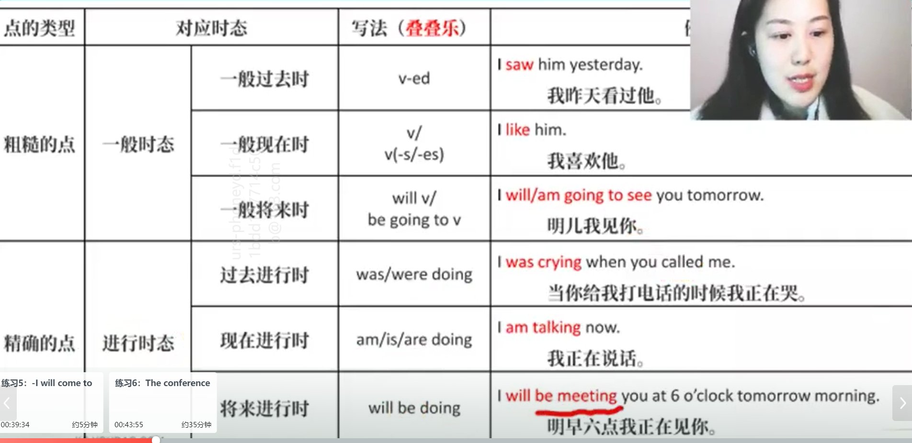
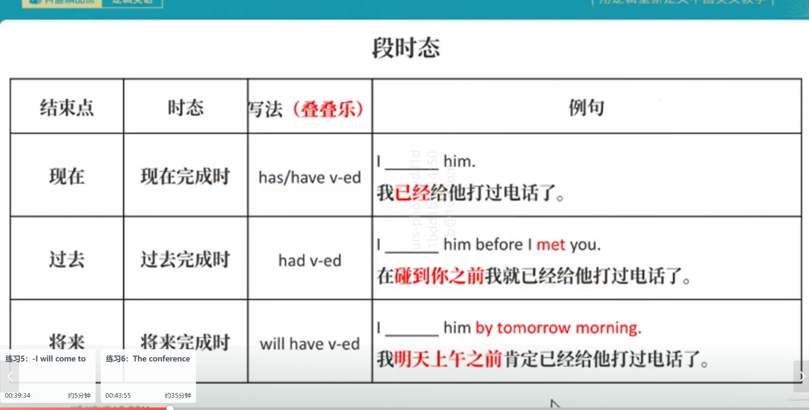

## 语法的作用就是用来提高语言的效率，一个东西的规则越多，那么它表达的就越精确。

## 时态分为段时态和点时态

+ ### 段时态

  1. 现在完成时：立足现在说，到目前为止，某事儿已经做过，至于什么时间点做的不关心。have done

     

  2. 过去完成时：立足现在说，在过去某个时间点之前，某事儿就已经做过，至于什么时间点做的不关心。had done

     

  3. 将来完成时：立足现在说，在将来某个时间点之前，某事儿将会已经做过，至于什么时间点做的不关心  will have done

     

+ ### 点时态

  + #### 粗点

    1. 一般现在时：当下正在存在的事情或者一直存在的事情 do
    2. 一般过去时：强调过去的一个大致时间干了一件事儿。did
    3. 一般将来时：强调将来某个大致时间点要干一件事儿。will / be going to do

  +  #### 精点

    1. 现在进行时：强调此时此刻在做某事儿。be doing
    2. 过去进行时：强调过去某个时间点发生了某事儿。was/were doing
    3. 将来进行时：强调将来某个时间点要发生某事儿。will be doing

+ ### 点和段的杂交

  1. 现在完成进行时：到目前为止一直在做的事儿，下个时间点做不做不一定。	have been doing
  2. 过去完成进行时：到过去某个时间点为止一直在做的事儿 ，下个时间点做不做不一定。 had been doing
  3. 将来完成进行时：到将来某个时间点为止一直会做的事儿，下个时间点做不做不一定。will have been doing 

+ ### 过去+将来  =》 曾打算  

  1. 过去将来时： was/were going to |  would 

  2. 过去将来完成进行时：以前曾打算到将来某个时间点为止一直会做的事儿，下个时间点做不做不一定。would  have been doing 
  3. 过去将来进行时：以前曾打算将来某个时间点要发生某事儿。will be doing

   

  ​	

1. 过去式和过去分词的区别：在形态上 规则的动词都一样，不规则的动词各有不同；在用法上，过去式直接可以构成一般过去时，过去分词则必须加上助动词（have）构成完成时或者加上be动词构成被动。
