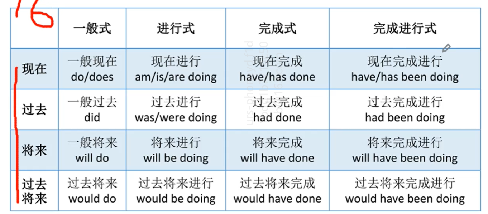
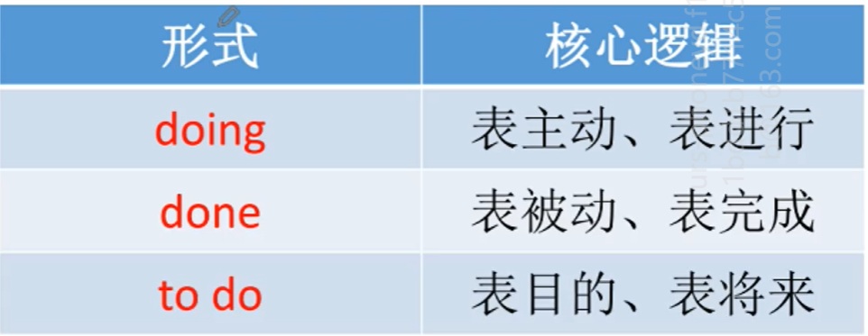

- 啥是分词？

  - 首先要搞明白，哪个词性会有分词呢？没错，是动词。说白了分词它就是动词的分身，就像孙悟空的猴毛。

  - 分词有啥用呢？

    1. 构成时态或语态

       我们知道英语是一门非常严谨的语言，在形式上英语非常严谨。在中文中，过去、现在、将来这种时间状态，往往是通过语义来表达，说白了就是揣摩。而英文中，我们要在形式上把这种时间状态也表示出来，这就是时态，哪个词能表示时态呢？当然是动词。

       同样地，英语中在形式上怎样表达被动呢？同样是通过动词的分词形式。

    2. 做非谓语动词

       我们知道英语中一个句子，他只能有一个谓语，充当谓语的是动词，也就是主语的动作，但是有时主语会同时做出好几个动作，比如这句话：我端着饭坐下和他一起讨论问题。这句话有三个动作，也就是有三个动词，但是只有一个动词能做谓语，当然，哪一个做谓语都行，其他的两个怎么办呢，为了与谓语做区分，我们需要使用动词的分词，也就是非谓语动词，来标记这个不是谓语的动词。例子中的那句话可以翻译为：I took the meal sitting down to discuss with him. 也可以翻成：I, taking the meal, sat down to discuss with him. 也可以翻译成I, taking the meal, sitting down, discussed with him.

  - 分词都长啥样呢？

    -  doing - 现在分词
    - done - 过去分词

  - 使用动词的分词做谓语来表示16种时态

    

  - 过去分词可以表示被动语态 be done

  - 非谓语动词的三种形式

    

  - 非谓语动词都能做啥成分呢，除了不能做谓语，啥都能做。

    - 非谓语（doing 和 to do）充当名词作宾语或主语
    - 非谓语做形容词
      - boring  无聊的事物   指一件事儿主动地让人无聊
      - bored    无聊的     指 sth bored me 

