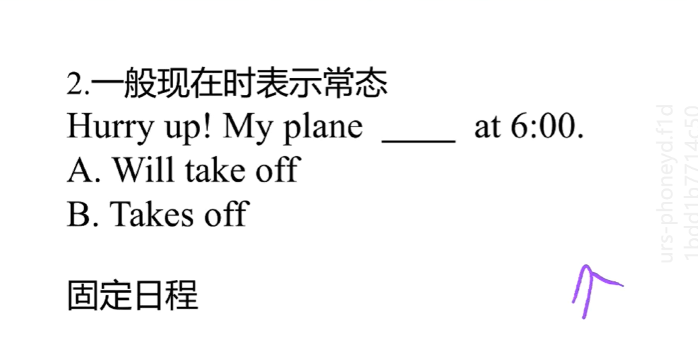
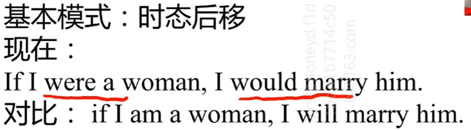
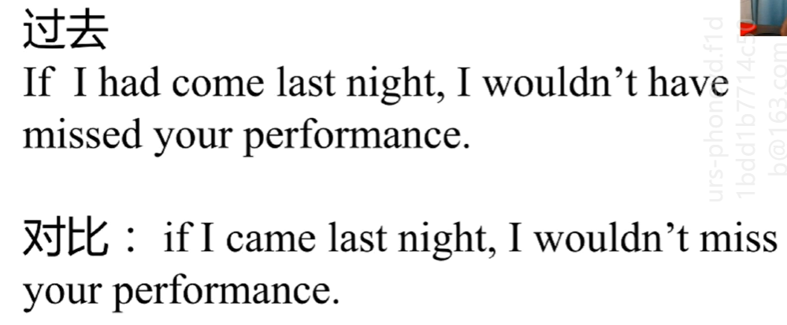

前提：要明白一点：时间逻辑大于规则，于是就出现了不符合正常规则的情况。

​			中文在说一句话的时候，怎样突出自己的情感呢？我们往往会使用语气、声调、表情等非文字方面表达；而英文则是一种比较严谨的语言，它会把这种感情也体现在文字上，怎么体现呢？就是使用非正常的语法形式的变化来体现。

- 情况一：“主将从现”

  其实这个说法不太准确，他仅仅是代表了一种情况。

  举例子：如果明年你和我结婚我将给你钱。

  I will give you my money if you marry me next year.

  看一下另一种情况：

  You need to work harder if you are going to win next time!

  在第一个例子中常规的按照正常的语法来说应该是

  ​	I will give you my money if you will marry me next year.

  但是为什么会去掉，我们先看一下这个句子，主句和从句有什么联系，是不是存在前后次序呀，只有先结婚才会有后来的给钱，如果都加了will，前后顺序在形式上就表现不出来了，所以就打破了从句的语法，把前提条件的时间往前提，就变成了现在时，主将从现，只仅限于这种具有前后时间次序的语句。

  在第二个句子中，主句是前提，用一般现在时，从句是结果，用将来时。

- 一般现在时表示常态

  

  ​	如果这句话是我说的就应该选择B,因为我坐的是固定航班，如果是马云说的，就有可能选择A，因为他可能坐私人飞机。

  ​	再说一种情况：Hurry up，my plane will take off in 10 minutes! 这种情况就一定用一般将来时，因为他表示的不是一种固定的时间。

- 如果我们想表达一种马上就要发生的事情的话，该如何表述呢？使用一般将来时吗？一般将来时突出不了马上就要发生的这种状态。习惯上，我们使用现在进行时来表示马上就要发生的事情，而且这个动作往往是瞬间性动作，比如说死，到达等动作

  he is dying。    I am arriving.

- 如果我们想表达一种常态的事情，我们往往使用一般现在时，但是如果我们想表达一种根深蒂固，印象深刻的常态呢？一般现在时现在不能突出这种情感。我们就在一般现在时的基础上加上现在进行时。

  He is always sleeping in class.

- 虚拟语气

  首先只有说与不可能发生的事情的时候才会用到虚拟语气， 虚拟不虚拟是通过上下文来体现出来的。

  - 基本模式：时态后移，就是使用过去的时态。

    

  - 最常见的是：对过去的虚拟，就是后悔

    就是在正常的时态下加个完成时。

    

  - 